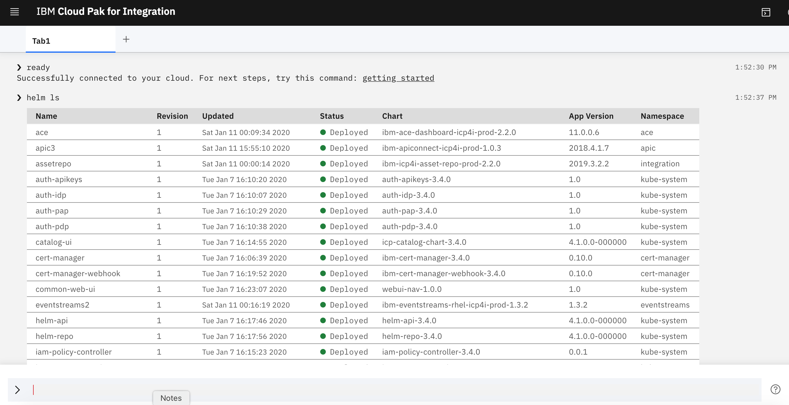
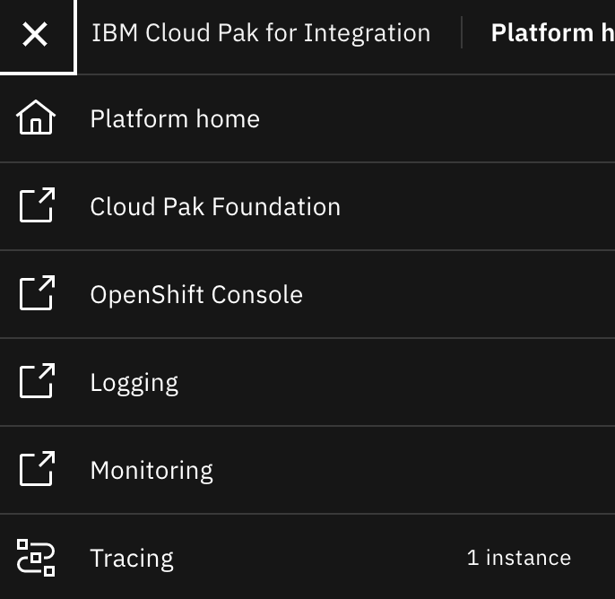
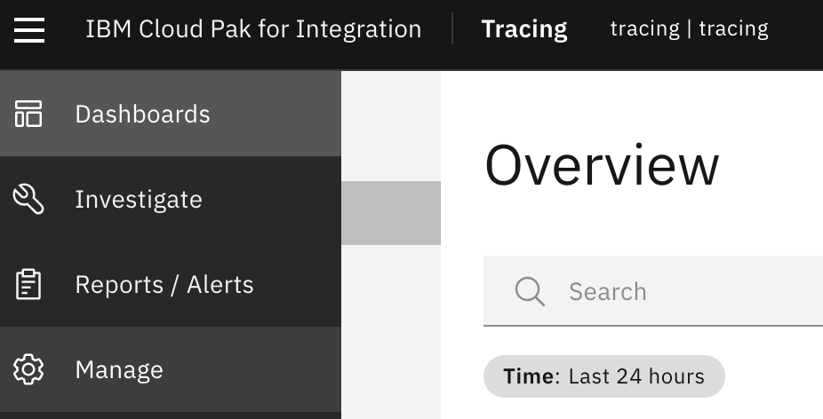

This page contains guidance on how to configure the APIC release for both on-prem and ROKS.

### Prepare endpoints

We have to define the endpoint for each of the APIC subsystems. We can "construct" the endpoints by adding descriptive "prefixes" to the proxy URL. In the sample described here, the proxy URL was `icp-proxy.icp4i-6550a99fb8cff23207ccecc2183787a9-0001.us-east.containers.appdomain.cloud` so we defined the endpoints as follows:

Management - all endpoints:
```
mgmt.icp-proxy.icp4i-6550a99fb8cff23207ccecc2183787a9-0001.us-east.containers.appdomain.cloud
```

Gateway - API:
```
gw.icp-proxy.icp4i-6550a99fb8cff23207ccecc2183787a9-0001.us-east.containers.appdomain.cloud
```

Gateway - service:
```
gwd.icp-proxy.icp4i-6550a99fb8cff23207ccecc2183787a9-0001.us-east.containers.appdomain.cloud
```

Analytics - ingestion:
```
ai.icp-proxy.icp4i-6550a99fb8cff23207ccecc2183787a9-0001.us-east.containers.appdomain.cloud
```

Analytics - client:
```
ac.icp-proxy.icp4i-6550a99fb8cff23207ccecc2183787a9-0001.us-east.containers.appdomain.cloud
```

Portal - web
```
portal.icp-proxy.icp4i-6550a99fb8cff23207ccecc2183787a9-0001.us-east.containers.appdomain.cloud
```

Portal - director:
```
padmin.icp-proxy.icp4i-6550a99fb8cff23207ccecc2183787a9-0001.us-east.containers.appdomain.cloud
```

### Obtain the pull secret

To obtain the secret for pulling the image login to the OCP CLI and run:
```
oc get secrets -n apic
```
For Offline Installs - The pull secret starts with **deployer-dockercfg**, in our case it was:
```
deployer-dockercfg-7mlqd
```
For Online/entitled Registry Installs - use the `ibm-entitlement-key` pull secret

### Create the TLS secret.

The easiest way to accomplish this is to create the TLS Secret using the Visual Web Terminal inside of the Cloud Pak Foundation window.  To access this window do the following

1. Via the Platform Navigator. Select the Hamburger menu, top left and then select **Cloud Pak Foundation**

2. Select the Visual Web Terminal icon.  2nd Icon from the right (looks like the box)

3. The Visual Web Terminal will start and then once it connects to your cluster you can enter in commands.  Try to enter a command like `helm ls`.  You should see output like the following:

4. Now you can run the following command to create the TLS secret:
```
oc create secret generic apic-ent-helm-tls --from-file=cert.pem=$HOME/.helm/cert.pem --from-file=ca.pem=$HOME/.helm/ca.pem --from-file=key.pem=$HOME/.helm/key.pem -n apic
```
where **apic-ent-helm-tls** is the name of the secret.

### Increase vm.max_map_count

To check and increase `vm.max_map_count` we would need an *ssh* access to each of the cluster nodes.

The alternative is to create a DaemonSet which will do that for us. Prepare the yaml file with the following content:
```yaml
apiVersion: extensions/v1beta1
kind: DaemonSet
metadata:
  labels:
    k8s-app: sysctl-conf
  name: sysctl-conf
  namespace: kube-system
spec:
  template:
    metadata:
      labels:
        k8s-app: sysctl-conf
    spec:
      containers:
      - command:
        - sh
        - -c
        - sysctl -w vm.max_map_count=262144 && while true; do sleep 86400; done
        image: busybox:1.26.2
        name: sysctl-conf
        resources:
          limits:
            cpu: 10m
            memory: 50Mi
          requests:
            cpu: 10m
            memory: 50Mi
        securityContext:
          privileged: true
      terminationGracePeriodSeconds: 1
```

and run apply it with:

```
oc apply -f sysctl-conf.yaml
```
*Note* if you have done something similar for eventstreams, note that the required value of vm.max_map_count is higher than what was required

### Storage class

The **block storage class** is needed for APIC.
You can obtain the class names with
```
oc get storageclass
```

The follwing classes are available on ROKS:
```
NAME                          PROVISIONER         AGE
default                       ibm.io/ibmc-file    9d
ibmc-block-bronze (default)   ibm.io/ibmc-block   9d
ibmc-block-custom             ibm.io/ibmc-block   9d
ibmc-block-gold               ibm.io/ibmc-block   9d
ibmc-block-retain-bronze      ibm.io/ibmc-block   9d
ibmc-block-retain-custom      ibm.io/ibmc-block   9d
ibmc-block-retain-gold        ibm.io/ibmc-block   9d
ibmc-block-retain-silver      ibm.io/ibmc-block   9d
ibmc-block-silver             ibm.io/ibmc-block   9d
ibmc-file-bronze              ibm.io/ibmc-file    9d
ibmc-file-custom              ibm.io/ibmc-file    9d
ibmc-file-gold                ibm.io/ibmc-file    9d
ibmc-file-retain-bronze       ibm.io/ibmc-file    9d
ibmc-file-retain-custom       ibm.io/ibmc-file    9d
ibmc-file-retain-gold         ibm.io/ibmc-file    9d
ibmc-file-retain-silver       ibm.io/ibmc-file    9d
ibmc-file-silver              ibm.io/ibmc-file    9d
```

In our case, we decided to use `ibmc-block-gold`.  This will work with IBM Cloud based installs.  Offline Installs Require Ceph.  Other Clouds like AWS have their own block storage.  Be sure to check their documentation.


### Create an instance

- Open platform navigator and select **API Connect** / **Create instance**

- Click *Continue*
- Define the helm release name, select **apic** namespace and the local-cluster.

- Enter the registry secret name, helm TLS secret name and select storage class:

- Enter the management and portal endpoints:


- Scroll enter the analytics and gateway endpoints:


- If not already, switch the view to show all parameters


- Find the *Routing Type* parameter. For running on OpenShift, the type must be **Route** instead of the default *Ingress*.


- For the non-production installation, you may switch the mode to **dev**


- and the number of gateway replicas to **1**


- Click on **Install**, the confirmation message will appear:


- You can check the status of the pods with the command:
```
oc get pods -n apic
```
- When deployment is completed, all pods must be in **Running** or **Completed** state.  This entire process could take over an hour to complete.  The list of pods should look similar to this one:
```
### Configure APIC to work with Tracing

1. Near the end of the install of APIC, a job will be created that has the name `odtracing.registration`.  This job will not complete until the Registration is completed inside of the Tracing capability.
2. What will happen is that a request will be created inside of tracing that you need to act upon.  Navigate to the Platform Navigator and via the Hamburger menu select Tracing and then when the window pops out select the name of your tracing instance which should be called `tracing`

3. Within tracing, select the `Manage` icon from the menu.  Looks like a cog wheel.

4. Click on the `Registration Requests` icon.
5. You should see a new registration request for your APIC install.  Click the `approve` link
6. You will see a pop up window with some lines to copy to your clipboard.  Click the 2 boxes icon in the top right icon to copy the commands required.

7. Ensuring you have an active `oc` session and in the `apic` project.  Paste the commands to the window and it will run then and finish the processing.
8. If you are slow in doing the steps above.  It is possible you might see the `odtracing.registration` job fail.  No worries.  Once you complete the pasting of the commands to create your secret, the job will re-create itself.


### SMTP server

In order to configure the API Connect, we need a SMTP server. If we don't have one, we can run a developer type SMTP Service.  `mailtrap.io` is a good one.


### Configuring the API Connect

- You can access your new install by starting from the Platform Navigator

- Select IBM Cloud Private user, default username and password in this case are admin/admin


- Under **Resources/Notifications** define the SMTP server


- For our Mailhog server enter ClusterIP address and port:


- Under **Settings/Notifications** edit the sender email server:


- And select the SMTP server defined under resources:


- Start with the **Topology** configuration


- Register service:


- Start with the Gateway, select the version that you defined under the Helm release properties when you started creating the instance. In our case it was V5 compatible version:


- Give some name to the service (e.g. **gateway1**) enter the **endpoints** and click on **Save**:


- The confirmation message should appear:


- Click on *Register service* again and select Analytics:


- Give some name to the service, enter Management endpoint (the one that you defined for **analytics client**) and click **Save**


- The confirmation appears:


- Repeat the same with portal:


- The confirmation appears again:


- Click on **Associate Analytics Service** to associate analytics with the gateway:


- Select the analytics service:


- Click on **Provider organizations** and add new organization:


- Give some name to the organization:


- Define the owner


- After you submit the organization will appear on the list:


- Navigate to the API Manager, in our case the endpoint was:
https://mgmt.icp-proxy.icp4i-6550a99fb8cff23207ccecc2183787a9-0001.us-east.containers.appdomain.cloud/manage

- Login as the owner (defined in the previous step), the API Manager page should open:


- You can navigate to the catalog:


- and create portal


- You can also assign the gateway to the catalog


With that, your API Connect instance is ready for usage. 


---
