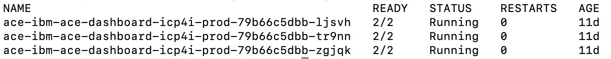

- [Introduction](#introduction)
- [Prepare Installation](#prepare-installation)
- [Begin Installation](#begin-installation)
- [Validate installation](#validate-installation)

### Introduction
This page contains guidance on how to configure the App Connect Enterprise (ACE) on the Cloud Pak for Integration.

### Prepare Installation

1. Ensure you have followed all of the steps in the [onprem-online](../onprem-online) or [onprem-offline](../onprem-offile)
2. Ensure permissions are set in your `ace` namespace
```
oc adm policy add-scc-to-group ibm-anyuid-scc system:serviceaccounts:ace
oc adm policy add-scc-to-group anyuid system:serviceaccounts:ace
```

### Begin Installation
1. Go to CP4I Platform Home. Click **Create instance** inside the **App Connect** tile.    
1. A window will pop up with a description of the requirements for installing. Click **Continue** to the helm chart deployment configuration.
  2. Click **Overview** to view the chart information and pre-reqs that were covered in [Prepare Installation](#prepare-installation).
3. Click **Configure**
4. Enter the Helm release name. In our example, **ace**
5. Enter Target Namespace - **ace**
6. Select a Cluster - **local-cluster**.
7. Check the license agreement.
8. Under Parameters -> Quick start
   1. Ingress - icp-proxy address defined during installation   
9.  Click All Parameters
10. Under Server Chart Repository - make sure it is set to the right one for your install (local registry or IBM Entitled Registry)
10. Uncheck production usage
11. Name of the namespace that ICP4I is installed into - this is where your Platform Navigator is installed
12. Image Pull Secret -> Set to `ibm-entitlement-key` if using entitled registry or if offline use the `deployer-dockercfg-XX` secret in your ace namespace.  Use `oc get secrets` to get the exact value for your environment.
13. Further down, find the section on Persistence. You can uncheck this or leave checked and refer to an existing pvc or storageclass.  Make sure you put the values in the appropriate spot.  If unsure of what is available, use `oc get sc` or `oc get pvc` respectively.
14. Click Install to complete.  Once the pods are up you can then deploy integration .bar files.  See [here](https://www.ibm.com/support/knowledgecenter/SSTTDS_11.0.0/com.ibm.ace.icp.doc/icp0015_.htm) for more info on this topic.

### Validate installation    

1. View all pods running
    

