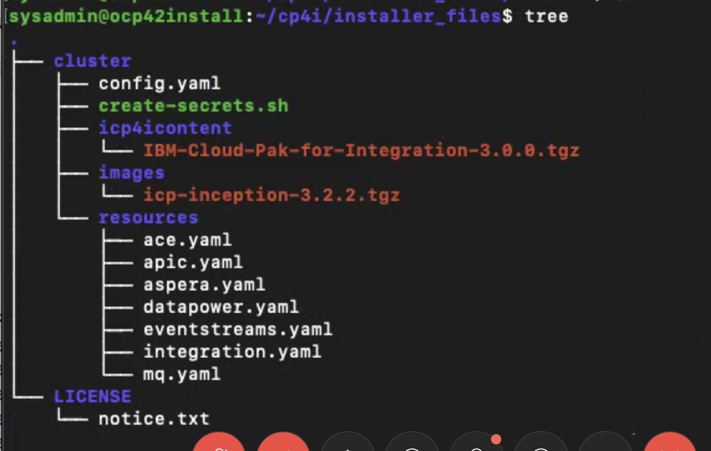

- [Introduction](#introduction)
- [Prepare For Installation](#prepare-for-installation)
- [Run the Integration Cloud Pak install](#run-the-integration-cloud-pak-install)
- [Deploy Capabilities](#deploy-capabilities)
- [Example files](#example-files)
  - [config.yaml](#configyaml)

## Introduction

This page describes all the steps on how to deploy the Integration Cloud Pak to a VMWARE onprem environment using the IBM Entitled registry. The steps below includes instructions to:

1. Prepare the bastion/installation node for the installation
2. Run the Integration Cloud Pak installer to deploy to an existing OpenShift cluster

## Prepare For Installation

In many production scenarios the master nodes may not be accessed via SSH, in which case we have to create or choose a bastion node in order to proceed with the installation. This can be a worker node within the cluster or a VM set up specifically for this task.

**Installer Node requirements:**

- Sufficient resources of `4cpu 16GB ram ~120 GB Diskspace`
- OpenShift CLI, which can be installed following the instructions [here on IBM Cloud](https://cloud.ibm.com/docs/openshift?topic=openshift-openshift-cli).
- Docker (v2.2 is compliant and works with Openshift)
- Kubernetes CLI kubectl

Once the CLIs are installed, check if you can login to your openshift environment:

  1. Get login token from openshift console
  2. Run the `oc login` command from a terminal shell.
  3. You should see the cluster logged in message along with list of projects.
  
**Installing on Master or Infra node:**  
The value of the master, proxy, and management parameters is an array and can have multiple nodes. Due to a limitation from OpenShift, if you want to deploy IBM Cloud Private on any OpenShift master or infrastructure node, you must label the node as an OpenShift compute node with the following command:

```bash
oc label node <master node host name/infrastructure node host name> node-role.kubernetes.io/compute=true
```

## Run the Integration Cloud Pak install

IBM Cloud Pak for Integration provides a single installer that installs ICP as well loads all the helm charts for integration capabilities. In this example CP4I will be installed on the master node.

1. Download the Cloud Pak and extract the contents onto the bastion node. See [Pre-requisites](../pre-reqs) for guidance. It is a general recommendation to create a directory in /opt and extract into that directory:

    ```bash
    tar xf ibm-cp-int-2019.4.1-online.tar.gz --directory /opt/cp4i
    ```

    Once untarred, you can navigate to the directory where the packages was untarred to and type `tree`.  It will look like the below
    

2. Load the images onto your local docker registry:

    ```bash
    sudo docker load -i installer_files/cluster/images/icp-inception-3.2.2.tgz
    ```

3. Change to the `installer_files/cluster/` directory. Place the cluster configuration files (kubeconfig) in the `installer_files/cluster/` directory. You can also use the following command after using oc login as admin.  Make sure your file only has one cluster context defined with in it, and that context is the location of your target cluster.

    ```bash
    oc config view > kubeconfig
    ```

4. Note down the IP addresses of OpenShift worker nodes. To get the IP addresses of the worker nodes, run:

    ```bash
    oc get nodes -o wide
    ```

5. Navigate to your cluster directory `/opt/cp4i/installer_files/cluster`.
6. Edit the config.yaml with the information you have collected above. See the example at the [end of the page](#configyaml) for guidance.  
Here are the fields to update with your respective values based on your environment:

    - under cluster_nodes heading -> set the hostnames for `Master`, `Proxy` and `Management`.  For non-prdoduction systems, setting and proxy to the same host is fine. Use the short name for your nodes (e.g. compute1, compute2 etc)
    - under storage_class -> choose your default storage class here - use `oc get sc` to get a list of available storageclasses.
    - docker_user -> `ekey`
    - docker_password -> set this to your entitlement key

    Instructions to get your entitlement key can be found [here](https://github.ibm.com/CloudPakOpenContent/cloudpak-entitlement) if you are an IBM employee.

7. Run the installer with:

    ```bash
    sudo docker run -t --net=host -e LICENSE=accept -v $(pwd):/installer/cluster:z -v /var/run:/var/run:z -v /etc/docker:/etc/docker:z --security-opt label:disable ibmcom/icp-inception-amd64:3.2.2 addon -vvv | tee install.log
    ```

8. If the namespaces for the different capabilities did not create you can create them manually using the scripts in `installer_files/cluster/resources` e.g. ace.yaml, apic.yaml.  Simply run each script using this syntax:

    ```bash
    oc create -f <scriptname>.yaml
    ```

9. Once the process is complete, you will need to create your `ibm_entitlement_key` secrets in all of the main component namespaces.  You can accomplish this by running the `create_secrets.sh` script. Before doing so, export these two variables:

    ```bash
    export DOCKER_REGISTRY_USER=ekey
    export DOCKER_REGISTRY_PASS=<your entitlement key>
    ```

10. It will be helpful to understand what your proxy node address is, as it will be referenced several time when deploying the individual capabilities.  Run this command and take note of its output:

    ```bash
    oc get configmap -n kube-public ibmcloud-cluster-info -o=jsonpath="{.data.proxy_address}"`
    ```

## Deploy Capabilities

It is recommended that you install the Tracing capability first

- [Tracing](../deploy-tracing)
- [App Connect](../deploy-integration)
- [API Connect](../deploy-api-mgmt)
- [MQ](../deploy-queue-manager)
- [Event Streams](../deploy-eventstreams)
- [Aspera](../deploy-fast-file-transfer)
- [DataPower](../deploy-secure-gateway)
- [Asset Repository](../deploy-asset-repo)

## Example files

This section contains examples of files you will be using throughout the installation. Refer to them for guidance on how to populate your own version of the files.

### config.yaml

```yaml
# Nodes selected to run common services components.
#
# The value of the master, proxy, and management parameters is an array,
# by providing multiple nodes the common services will be configured in
# a high availability configuration.
#
# It is recommended to install the components onto one or more openshift
# worker nodes. The master, proxy, and management components can all share
# the same node or set of nodes.
cluster_nodes:
  master:
    - compute1
  proxy:
    - compute1
  management:
    - compute2

# This storage class is used to store persistent data for the common services
# components
storage_class: csi-cephfs

## You can set a different storage class for storing log data.
## By default it will use the value of storage_class.
# elasticsearch_storage_class:

# These settings enable the installer to install common services from the IBM
# Entitled Registry. You will need to supply your entitlement key as described
# at https://github.com/ibm/charts
private_registry_enabled: true
image_repo: cp.icr.io/cp/icp-foundation
docker_username: ekey
docker_password: <your_entitlement_key>
default_admin_password: admin
password_rules:
  - '(.*)'

management_services:
  # Common services
  iam-policy-controller: enabled
  metering: enabled
  licensing: disabled
  monitoring: enabled
  nginx-ingress: enabled
  common-web-ui: enabled
  catalog-ui: enabled
  mcm-kui: enabled
  logging: enabled
  audit-logging: disabled
  system-healthcheck-service: disabled
  multitenancy-enforcement: disabled
  configmap-watcher: disabled
# This section installs the IBM Cloud Pak for Integration Platform Navigator.
# The navigator will be available after installation at:
# https://ibm-icp4i-prod-integration.<openshift apps domain>/
archive_addons:
  icp4i:
    namespace: integration
    repo: local-charts
    path: icp4icontent/IBM-Cloud-Pak-for-Integration-3.0.0.tgz
    charts:
      - name: ibm-icp4i-prod
        values: {}
```
