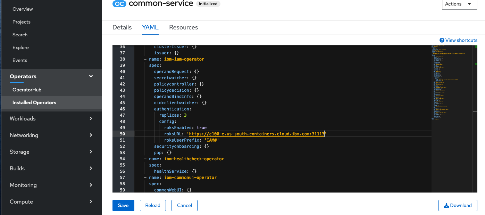

<PageDescription>

In this section we will walk through the **Online** installation of 
IBM Common Services, used to support IBM Cloud Paks. This 
document is specifically written for installations on Red Hat 
OpenShift 4.x running on an x86 architecture. 

</PageDescription>

<AnchorLinks>
  <AnchorLink>Adding Operator Source to OpenShift Catalog</AnchorLink>
  <AnchorLink>Customizing the installation</AnchorLink>
  <AnchorLink>Login to common services</AnchorLink>
  <AnchorLink>Uninstall</AnchorLink>
</AnchorLinks>

## Prerequisites

This document does not describe how to install or configure the 
underlying OpenShift platform. Prior to installing, make sure you have 
a working OpenShift cluster with the required capacity.

- Check the requirements documentation in the 
[IBM Knowledge Center](https://www.ibm.com/support/knowledgecenter/SSHKN6/installer/3.x.x/preparation.html) 
to make sure you have sized your cluster 
appropriately and have sufficient capacity.

## Adding CatalogSource to OpenShift Catalog

1. Login to your OpenShift cluster console.

2. Apply the YAML below by clicking on the **+** icon in the upper-right 
corner.

   ```yaml
   apiVersion: operators.coreos.com/v1alpha1
   kind: CatalogSource
   metadata:
     name: opencloud-operators
     namespace: openshift-marketplace
   spec:
     displayName: IBMCS Operators
     publisher: IBM
     sourceType: grpc
     image: docker.io/ibmcom/ibm-common-service-catalog:latest
   updateStrategy:
     registryPoll:
       interval: 45m
   ```

3. Copy the YAML, paste it into the editor and click **Create**. 

    

4. Next create a new project for the `common-services` operator.

    ```
    oc new-project common-services
    ```

5. From the navigation pane, click **Operators** > **OperatorHub**. 
The **OperatorHub** page is displayed.

6. In the **All Items** field, enter `IBM Common Service Operator`. 
The **IBM Common Service Operator** is displayed.

7. Click the **IBM Common Service Operator** tile. 
The **IBM Common Service Operator** window is displayed.

   

8. Click **Install**. You see the **Create Operator Subscription** page.

9. Set **Installation Mode** to the specific namespace that you created 
for the `IBM Common Service Operator`. For example, `common-service`.

10. Set **Update Channel** to the `stable-v1` version.

11. Set **Approval Strategy** to `Automatic`.

12. Click **Subscribe**. 

    

13. After a few minutes, the **IBM Common Service Operator** and the 
**Operand Deployment Lifecycle Manager Operator** are installed, 
and you can see these operators on the **Installed Operators** page.

   

## Customizing the installation
Here we walk through an example of how you can customize the installation configuration. This is just an example. A complete list of 
customizations can be found at this 
[IBM Knowledge Center](https://www.ibm.com/support/knowledgecenter/SSHKN6/installer/1.x.x/config_operand.html)
link.

In this section we customize the installation by modifying the 
`OperandConfig` to add the ROKS installation config. We also remove the 
`elasticsearch` component from the `OperandRequest` to prevent it from 
being installed. 

1. From the **Project** drop-down list, select the **ibm-common-services** 
namespace. You see the **Operand Deployment Lifecycle Manager** Operator.

2. Click the **OperandConfig** and then select the existing 
`common-services` OperandConfig.
Select the **YAML** Tab.

3. Add the following parameters to the 
`ibm-iam-operator.spec.authentication.config` section.

   ```
     authentication:
     replicas: 3
     config:
       roksEnabled: true
       roksURL: 'https://c100-e.containers.test.cloud.ibm.com:31099'
       roksUserPrefix: 'IAM#'
   ```

   

4. Click **Save**.

5. Select the **OperandRequest** tab and click **Create Operand Request**. Paste the following content in the YAML editor (overwrite the existing content):

```yaml
apiVersion: operator.ibm.com/v1alpha1
kind: OperandRequest
metadata:
  name: common-service
  namespace: ibm-common-services
spec:
  requests:
    - operands:
        - name: ibm-cert-manager-operator
        - name: ibm-mongodb-operator
        - name: ibm-iam-operator
        - name: ibm-monitoring-exporters-operator
        - name: ibm-monitoring-prometheusext-operator
        - name: ibm-monitoring-grafana-operator
        - name: ibm-healthcheck-operator
        - name: ibm-management-ingress-operator
        - name: ibm-licensing-operator
        - name: ibm-metering-operator
        - name: ibm-commonui-operator
        - name: ibm-elastic-stack-operator
        - name: ibm-ingress-nginx-operator
        - name: ibm-auditlogging-operator
        - name: ibm-platform-api-operator
        - name: ibm-helm-api-operator
        - name: ibm-helm-repo-operator
        - name: ibm-catalog-ui-operator
      registry: common-service
```

    

6. Click **Create** to start the installaton.

Note: If you see pods in the `ibm-common-services` namespaces stuck in `CreateContainerConfigError` status and are running OpenShift Container Platfrom 4.4.x check the workaround here:
https://www.ibm.com/support/knowledgecenter/SSHKN6/installer/3.x.x/troubleshoot/op_pending.html

## Login to common services


1. To verify the installation, check whether all the pods in the 
`ibm-common-services` namespace are running. Use the following 
command:

   ```
   oc get pods -n ibm-common-services
   ```

   You can also use the following command to verify whether the common services are successfully installed:

   ```
   oc -n ibm-common-services get csv
   ```

2. Use the following command to get the URL to access the console:
    
   ```
   oc get route -n ibm-common-services cp-console -o jsonpath=‘{.spec.host}’
   ```

3. You can get the password for the `admin` username by running the 
following command:

   ```
   oc -n ibm-common-services get secret platform-auth-idp-credentials -o jsonpath='{.data.admin_password}' | base64 -d
   ```
   
4. Open the route in a web browser and login using `admin` and the password from the previous step.

    

## Uninstall

To uninstall the Common Services, follow the instructions for **Uninstalling all services** [here](https://www.ibm.com/support/knowledgecenter/SSHKN6/installer/3.x.x/uninstallation.html).  Skip the step for deleting the CRDs (will be covered later).

To complete the process simply run this script:  

```bash <(curl -s https://raw.githubusercontent.com/IBM/ibm-common-service-operator/master/common/scripts/force-uninstall.sh)```

## Additional Resources
* <a href="https://www.ibm.com/support/knowledgecenter/SSHKN6/kc_welcome_cs.html">Knowledge Center - IBM Cloud Platform Common Services documentation</a>
