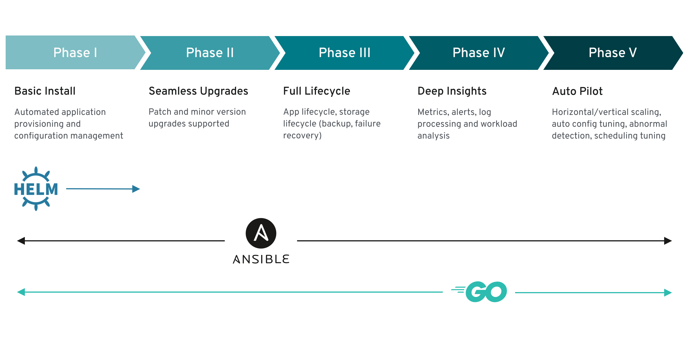

## Catalog Management Overview

[Merriam-Webster Dictionary](https://www.merriam-webster.com/dictionary/catalog) defines catalog as:
> a complete enumeration of items arranged systematically with descriptive details.

For OpenShift, there are two types of catalogs: **Developer catalog** and **OperatorHub catalog**.  As the name implied Developer catalog is geared towards the developer. It lists installed assets that the developer can use, and is managed by the cluster administrator.  OperatorHub catalog is a catalog of operator similar to the one available at Operatorhub.io. The OperatorHub catalog is targetted for the cluster administrator.  Once the operator is installed, it becomes `installed operator`, which can be made available in the developer catalog by the cluster administrator.

Even though it is not currently available, Red Hat is discussing about the possibility of adding [the Helm 3 into OpenShift developer console](https://blog.openshift.com/openshift-4-3-deploy-applications-with-helm-3). It is mentioned here as in the past, IBM Cloud Private made heavy use of helm, and several IBM application may still be available as a helm chart.  Note OpenShift expects helm 3 format.

## Operator Hub Management Overview

Conceptually, Operators take human operational knowledge and encode it into software that is more easily shared with consumers.

Operators are pieces of software that ease the operational complexity of running another piece of software. They act like an extension of the software vendor’s engineering team, watching over a Kubernetes environment (such as OpenShift Container Platform) and using its current state to make decisions in real time. Advanced Operators are designed to handle upgrades seamlessly, react to failures automatically, and not take shortcuts, like skipping a software backup process to save time.

Operators are a method of packaging, deploying, and managing a Kubernetes application.

A Kubernetes application is an app that is both deployed on Kubernetes and managed using the Kubernetes APIs and **kubectl** or **oc** tooling. Think of Operators as the runtime that manages this type of app on Kubernetes.

### Operator maturity model

The level of sophistication of the management logic encapsulated within an Operator can vary. This logic is also in general highly dependent on the type of the service represented by the Operator.  One can  generalize a maturity of an Operator’s encapsulated operations, for certain set of capabilities that most Operators can include. To this end, the following Operator Maturity model defines five phases of maturity for generic day two operations of an Operator:

Operator Maturity Model: 



https://docs.openshift.com/container-platform/4.3/operators/olm-what-operators-are.html#olm-maturity-model_olm-what-operators-are

### OperatorHub

Now that we have the concepts of Operators defined, how they are integrated and exposed within the platform is via the "OperatorHub".  The OperatorHubs is a web console for cluster administrators to discover and select Operators to install on their cluster. It is deployed by default in OpenShift Container Platform.


The OperatorHub is available via the OpenShift Container Platform web console and is the interface that cluster administrators use to discover and install Operators. With one click, an Operator can be pulled from their off-cluster source, installed and subscribed on the cluster, and made ready for engineering teams to self-service manage the product across deploymed environments, using the Operator Lifecycle Manager (OLM).

Cluster administrators can choose from OperatorSources grouped into the following categories:

| Category | Description |
|----------|-------------|
| Red Hat Operators | Red Hat products packaged and shipped by Red Hat. Supported by Red Hat. |
| Certified Operators | Products from leading independent software vendors (ISVs). Red Hat partners with ISVs to package and ship. Supported by the ISV. |
| Community Operators | Optionally-visible software maintained by relevant representatives in the operator-framework/community-operators GitHub repository. No official support. |
| Custom Operators | Operators you add to the cluster yourself. If you have not added any Custom Operators, the Custom category does not appear in the web console on your OperatorHub. |

 
https://docs.openshift.com/container-platform/4.3/operators/olm-understanding-operatorhub.html#olm-operatorhub-overview_olm-understanding-operatorhub   

The following is a an example of the OperatorHub User Interface in OpenShift 4.3.  Note that the `community` versions of the Operator is labelled appropriately.


## OperatorHub architecture

The OperatorHub UI component is driven by the Marketplace Operator by default on OpenShift Container Platform in the openshift-marketplace namespace. The Marketplace Operator manages OperatorHub and OperatorSource Custom Resource Definitions (CRDs).

Although some OperatorSource information is exposed through the OperatorHub user interface, it is only used directly by those who are creating their own Operators.
	
While OperatorHub no longer uses CatalogSourceConfig resources, they are still supported in OpenShift Container Platform.

## OperatorHub CRD

You can use the OperatorHub CRD to change the state of the default OperatorSources provided with OperatorHub on the cluster between enabled and disabled. This capability is useful when configuring OpenShift Container Platform in restricted network environments.

### Example OperatorHub Custom Resource

```
apiVersion: config.openshift.io/v1
kind: OperatorHub
metadata:
  name: cluster
spec:
  disableAllDefaultSources: true 
  sources: [ 
    {
      name: "community-operators",
      disabled: false
    }
  ]
```

* disableAllDefaultSources is an override that controls availability of all default OperatorSources that are configured by default during an OpenShift Container Platform installation.
* Disable default OperatorSources individually by changing the disabled parameter value per source.
* OperatorSource CRD

For each Operator, the OperatorSource CRD is used to define the external data store used to store Operator bundles.
### Example OperatorSource Custom Resource
```
apiVersion: operators.coreos.com/v1
kind: OperatorSource
metadata:
  name: community-operators
  namespace: marketplace
spec:
  type: appregistry 
  endpoint: https://quay.io/cnr 
  registryNamespace: community-operators 
  displayName: "Community Operators" 
  publisher: "Red Hat" 
```

* To identify the data store as an application registry, type is set to appregistry.
* Currently, Quay is the external data store used by the OperatorHub, so the endpoint is set to https://quay.io/cnr for the Quay.io appregistry.
* For a Community Operator, registryNamespace is set to community-operator.
* Optionally, set displayName to a name that appears for the Operator in the OperatorHub UI.
* Optionally, set publisher to the person or organization publishing the Operator that appears in the OperatorHub UI.


https://docs.openshift.com/container-platform/4.3/operators/olm-understanding-operatorhub.html


### Operator Metering

Operator Metering collects operational metrics about Operators on the cluster for Day 2 management and aggregating usage metrics.

https://docs.openshift.com/container-platform/4.3/operators/olm-what-operators-are.html#olm-maturity-model_olm-what-operators-are

## Developer Catalog Management Overview
The developer catalog lists all the assets that is available to the developer in the developer web console. The content is managed by the cluster administrator, so only approved catalog items are available to the developer.  Each catalog item is classified into categories.  The following shows the screenshot of the developer catalog:

<a href="https://github.com/ibm-cloud-architecture/cloudpak8s/tree/master/src/pages/day2/Catalog/images/developer_catalog.png"></a>

Note that the user `installed operator` is available as one of the types in the developer catalog.


## Day 1 Platform
During Day 0 (design), it is assumed that the business and technical rules for which OperatorSources will be integrated into the platform (if remote, it is a connection, if local it is an OperatorSource defined and populated).  During Day 1 (build/installation), it is assumed that all work needed to obtain and install certificates has been performed and the OperatorHub populated and ready for platform use.  

Note:  OpenShift 4.3 is heavily Operator based and as such it is normal for key Operators to be installed and available as part of install.

However, there may be cases where design decisions are changed, or new OperatorHub sources need to be installed post platform build.  For that reason, we touch about adding Operator OperatorHub sources as a “Day 2” action.  So, from a Day 1 perspective, the following should be assumed to be in place or also handled in Day 2 Operations:

| Activity | Day 1 | Day 2 |
| ----------- | -------- | ---------- |
| Install Operator Hub Sources (including certificates) | X | X |
| Configure RBAC | X | X |
| Manage Certificates | | X |
| Manage Operators | | X |


The selection of sources should have been defined in the design phase (what sources), and the initial configuration of RBAC is instantiated.  Note:  At Day 1 (prior to the onboarding of any applications), the RBAC will normal default to Cluster Admins (Platform SREs), as the key personas able to select, expose, and utilize operators.  As Applications teams are onboarded, their requirements for access to specific Operators or even self-service (i.e. giving the Development leader control of what operators their teams need to see and expose them), are a common model used within OpenShift.  

However, this does not alleviate or remove the role of the Platform SRE in managing the Operator Hub in adding new sources and giving out "Roles" (via the RBAC), to allow Application team to utilize them.


## Day 2 Platform

From a Platform perspective, the following are the key Day 2 operational activities that need to take place.  A more detailed writeup is included herein:  

* [Adding Operators to a Cluster](#add)
* [Deleting Operators from a Cluster](#delete)
* [Creating Applications from an Installed Operator](#create)
* [Viewing Operator Status](#view)
* [Creating a Policy for Operator Installation and Upgrades](#policy)
* [Using OLM on a Restricted Network](#olm)
* [Using the Developer Catalog](#developer_catalog)
  - [Installed Operator](#installed_operator)
  - [Source to Image](#s2i_catalog)
  - [Template/Shared Application](#template_catalog)
  - [service catalog](#service_catalog)
  


## Day 1 Application

From a Day 1 Application perspective, the selection and integration of the correct OperatorSources is the primary action.  During Day 0 (design), the sources for the required Operators should be defined. It is integrated and tested during Day 1 Platform install.  Other than the selection of Operator Sources (done as part of the Platform Day 1), until the first application is onboarded, there is little to no Day 1 Application work.  

Note:  Developer input is definitely needed to ensure that the correct Operators (and their sources, both within RedHat and Open Source Community), are chosen during the initial install.  While not a major effort to add additional sources post install, the proper planning and selection is assumed.


## Day 2 Application

From an Application perspective, Day 2 actions should be focused on **the exposure, use and update policy, for any used Operators (i.e. manual or automatic)**.  Once a project/namespace administrator has been chosen, they will expose particular access to the DevOps Engineers, including which Operators and functions are available.  Of note however, is that the SRE Engineers may require specific Operators not to be made available to the DevOps Engineers, as they may be performing Platform specific.

As stated above, a primary focal are is the use of usage and update policies.  Depending upon the Operators lifecycle capabilities, it is possible to have an operator to allow for a manual or automated upgrade.  In some cases an automated upgrade may be benign or it could have an application impact.  For that reason, as part of the Operator deployment, consideration must be taken as to how upgrades will be performed.  Normal recommendation is that any application component (or the application itself is the Operator is the sole entity), formalize an upgrade and testing process via the normal Dev -> Test -> UAT -> Production rollout.  The issue (as you can envision), is a database "Operator", upgrade could deprecate a feature, require changes to an API or other items such as these.  

So, in summary, while Operators provide extremely powerful features; one click installation, and if they have full lifecycle capabilities, they can do upgrades, backups, Etc.  However, standard testing is always recommended to ensure stability between versions.  


## Mapping to Personas

| Persona | task |
| --- | --- |
| SRE | Adding Operators to a Cluster
| SRE | Deleting Operators from a Cluster
| SRE | Creating Applications from an Installed Operator
| SRE | Viewing Operator Status
| SRE | Using OLM on a Restricted Network
| SRE, DevOps Engineer | Creating a Policy for Operator Installation and Upgrades
| DevOps Engineer | Using the Developer Catalog
| SRE | Expose, use and update policy, for any used Operators |


<a name="add"></a>

## [Adding Operators to a Cluster](https://docs.openshift.com/container-platform/4.3/operators/olm-adding-operators-to-cluster.html) : [ SRE ]

Assuming the OperatorSources have been previously configured, the Installation of an Operator to a namespace consists of the following primary actions:

* Select the **Installation Mode**:  This defines what projects/namespaces that the operator will be seen/made available to.  This can be the SRE or a DevOps Engineer with the assigned RBAC role to perform this action.  Note:  This follows the OpenShift model of "self-Service".  Give the development teams the ability to move at the velocity they need without having to have the Platform SRE involved in day-to-day actions.  The Platform SRE is focused on ensuring the platform is stable, not acting as a gate for Application teams to involve for normal actions.
* Select the **Update Channel**:  If the Operator is available from multiple sources, choose which source is utilized to detect and download a newer version of the operator.  
* Select the **Approval Strategy**:  The strategy to determine either manual or automatic updates. You can choose **Manual** or **Automatic**.  Care must be take with this selection to ensure than an Application Operator (i.e. Couchbase), does not automatically update without proper testing.

If, during phase 2, a new Operator Source needs to be added.
  
I.e. It's now six months down the road we need now add additional operators into the cluster, so you will have to go through and do the installation and configuration the new operator source. You can do so via the command line or by navigating to the "Operators" section in the Administrator view and configuring a new source along with any needed configuration items (URL, Certificates, etc.)


<a name="delete"></a>

## [Deleting Operators from a Cluster](https://docs.openshift.com/container-platform/4.3/operators/olm-deleting-operators-from-cluster.html) : [ SRE ]

Deleting an Operator from a project/namespace can be partial (i.e. only the subscription/CatalogHub visibility), to completely removing it from any/all projects/namespaces along with any Pods, CRD, Etc.  In other words, it will make the Operator no longer functional anywhere in the Cluster.

The primary actions to perform this include:

* From the OperatorHub web UI or CLI search for the Operator you wish to remove
* Select "Uninstall" as the action you wish to perform
* Select "Remove Subscription" and you will be prompted with "Remove Completely from the selected NameSpace" which will terminate any pods or references to it along with the OperatorHub catalog view
* Select the "Remove" button to complete the action

Note:  Any applications currently using this Operator will be impacted (i.e. CouchDB pod destroyed) so Operator Usage must be checked prior to any destructive removal actions.  The metering application and/or the CLI can be utilized to list any applications (including the platform), to determine the impact and work with any needed teams to perform a graceful removal

To delete (uninstall) an Operator from your cluster, you can simply delete the subscription to remove it from the subscribed namespace. If you want a clean slate, you can also remove the operator CSV and deployment, then delete Operator’s entry in the CatalogSourceConfig. 

The primary reasons for removing Operators are scenarios such as:

- The Operator is no longer supported in the development environment (i.e. a mandate not to use)
- There are multiple versions of the Operator (i.e. a "Community" and a "Red Hat" version)
- The Operator should not be used/nor visible within the environment due to business rules (i.e. using external build tools)

The URL provided at the top of this section provides full examples on how to use either the GUI or CLI to perform these actions


<a name="create"></a>

## [Creating Applications from an Installed Operator](https://docs.openshift.com/container-platform/4.3/operators/olm-creating-apps-from-installed-operators.html) : [ SRE ]

As long as the user has "edit" role within a project/namespace, and the Operator has been exposed via RBAC, the selection and creation of an application using an Operator as a key component (i.e. a Database Operator, Prometheus Operator or any others), via the OperatorHub is a simple task. Once selected, the installation is almost a one click or single CLI command.  However, as stated multiple times within this document, post installation configuration of the update channels, and the update method (manual or automatic), must be determined and configured.


<a name="view"></a>

## [Viewing Operator Status](https://docs.openshift.com/container-platform/4.3/operators/olm-status.html) : [ SRE ]

Understanding the state of the system in Operator Lifecycle Manager (OLM) is important for making decisions about and debugging problems with installed Operators. OLM provides insight into Subscriptions and related Catalog Source resources regarding their state and actions performed. This helps users better understand the health of their Operators.

| Condition | Description |
| --------- | ----------- |
| CatalogSourcesUnhealthy | Some or all of the Catalog Sources to be used in resolution are unhealthy. |
| InstallPlanMissing | A Subscription’s InstallPlan is missing. |
| InstallPlanPending | A Subscription’s InstallPlan is pending installation. |
| InstallPlanFailed | A Subscription’s InstallPlan has failed. |

The status of any Operator can be found via the web GUI or using the CLI.  Please see the link above for the exact commands to be used.  

### **To Bob. Please take a look at the following lines and make appropriate changes for the readers**  

**START HERE**  

>how do you view the operator status  
>Is it deployed properly?  
>Is it operating properly?  
>is it made visible across the environment that you want to? 
>so understanding how you look at the operator in this current state doesn't need an upgrade things like that so this is something that you'll see in the documentation in the GitHub  

**END HERE**  


<a name="olm"></a>

## [Using OLM on a Restricted Network](https://docs.openshift.com/container-platform/4.3/operators/olm-restricted-networks.html) : [ SRE ]

When the OpenShift platform is on a restricted network (also known as a disconnected cluster or Air-Gapped), a mirror export of the RedHat (and other) Operator registries is created and then exposed to the platform for use. The only major difficulty in this exercise is that it is a point-in-time export and the only upgrade functions are to create a standard process for continuing the updates.  I.e. a weekly snapshot, a daily snapshot, Etc. The full documentation for the process and commands is in [here](https://docs.openshift.com/container-platform/4.3/operators/olm-restricted-networks.html).  In this instance, the Mirror acts as a proxy for the original source (i.e. RedHat, the Community, Etc.).  The term mirror and proxy are used interchangeably within this and RedHat documentation.


<a name="policy"></a>

## [Creating a Policy for Operator Installation and Upgrades](https://docs.openshift.com/container-platform/4.3/operators/olm-creating-policy.html) : [ SRE, DevOps Engineer ]

Protecting the platform from unexpected privilege escalations via Operators is a key and core Day 2 function.  For that reason, this section will include specific RedHat OpenShift warnings and documentation on patterns and practices to be utilized.  The full documentation is provided via the above link.  However, please ensure that a full acceptance and testing plan is in place to ensure security and cross project/namespace issues are ensured.

Operators can require wide privileges to run, and the required privileges can change between versions. Operator Lifecycle Manager (OLM) runs with cluster-admin privileges. By default, Operator authors can specify any set of permissions in the ClusterServiceVersion (CSV) and OLM will consequently grant it to the Operator.

Cluster administrators should take measures to ensure that an Operator cannot achieve cluster-scoped privileges and that users cannot escalate privileges using OLM. One method for locking this down requires cluster administrators auditing Operators before they are added to the cluster. Cluster administrators are also provided tools for determining and constraining which actions are allowed during an Operator installation or upgrade using service accounts.

By associating an OperatorGroup with a service account that has a set of privileges granted to it, cluster administrators can set policy on Operators to ensure they operate only within predetermined boundaries using RBAC rules. The Operator is unable to do anything that is not explicitly permitted by those rules.

Limited scope installation of Operators by non-cluster administrators means that more of the Operator Framework tools can safely be made available to more users, providing a richer experience for building applications with Operators.  

In all cases, the use of RBAC and minimal privilege grants should be used to ensure that none of the above issues are encountered.  
Operators by themselves support a full lifecycle, so its important to understand how to upgrade each Operator successfully, and then test any new/upgraded Operators with your application. It is important to ensure you have the correct polices in place regarding installing new Operators and upgrading existing Operators as new versions come out.  
For Example. You will use your normal upgrade procedures for upgrading Operator throughout the environment, as Operators should be tested in a dev, test, and UAT environment.   


### Installation scenarios

When determining whether an Operator can be installed or upgraded on a cluster, OLM considers the following scenarios:

* A cluster administrator creates a new OperatorGroup and specifies a service account. All Operator(s) associated with this OperatorGroup are installed and run against the privileges granted to the service account.
* A cluster administrator creates a new OperatorGroup and does not specify any service account. OpenShift Container Platform maintains backward compatibility, so the default behavior remains and Operator installs and upgrades are permitted.
* For existing OperatorGroups that do not specify a service account, the default behavior remains and Operator installs and upgrades are permitted.
* A cluster administrator updates an existing OperatorGroup and specifies a service account. OLM allows the existing Operator to continue to run with their current privileges. When such an existing Operator is going through an upgrade, it is reinstalled and run against the privileges granted to the service account like any new Operator.
* A service account specified by an OperatorGroup changes by adding or removing permissions, or the existing service account is swapped with a new one. When existing Operators go through an upgrade, it is reinstalled and run against the privileges granted to the updated service account like any new Operator.
* A cluster administrator removes the service account from an OperatorGroup. The default behavior remains and Operator installs and upgrades are permitted.

https://docs.openshift.com/container-platform/4.3/operators/olm-creating-policy.html

Further detail can be found at the above web page however, this section has been expanded to prevent Operator Escalation when initially installed or upgraded.


<a name="developer_catalog"></a>

## Using the Developer Catalog: [ DevOps Engineer ]
OpenShift 4.3 Web Console provides two perspectives or views: the administrator and developer perspective.  Depending on your permission, you can switch from one to the other by selecting the one you want from the Web Console itself.

Once you are in the Developer Perspective of the web console, you can select the `add` menu that starts the application deployment process.

One of the options, after you select the add menu, is to use the template.  If you choose the template, then you will be presented by the developer catalog.  The catalog items in the developer catalog are divided into four classifications. They are:
- installed user operator.
- source-to-image(S2I).
- template of the shared application.
- service class, as provided by the service broker.  

These features and capabilities are controlled via RBAC.  This ensures and minimizes (least privilege grant), the ability for developers to introduce unwanted components, out of date versions or capabilities that do not follow the DevOps guidelines.  
For Example new Operators will appear in the developer catalog, it is possible to then select any new operators, e.g. Cassandra database, or Couch DB database, and with one click instantiate them.  


<a name="installed_operator"></a>

### Installed Operator
Earlier in this chapter, we have seen that the cluster administrator installs the operator.  Once installed, the cluster administrator can make the operator available to the developer.

The developer will be able to see the installed operator as the catalog items in the developer catalog.

<a name="s2i_catalog"></a>

### Source to Image
Source-to-Image (S2I) is a framework that allows the developer to build container images from source code.  S2I packages the source code into a certain directory of the specified container image.  The container process then transforms that source code into the appropriate runnable setup.  As part of the container process, the new image entry point is set to start the source code's runnable. The new container is then committed. 

The catalog items of S2I types list the container images that can be used by the developer to build their source code into the new container image.

<a name="template_catalog"></a>

### Template/Shared Application 
Shared application catalog items allow you to view and install applications that are packaged as a template.  This is discussed in more detail in the [Build and Deploy](../BuildDeploy) chapters of this repository.  

<a name="service_catalog"></a>

### service class catalog
The service catalog is no longer installed by default in OpenShift 4.3 installation.  The functionality that used to be provided by the service catalog is now replaced by the operator.   If by any chance, you need to use the service provided by OpenShift Ansible Broker or Template Service Broker, then you need to install the service catalog.  Service broker and the steps to install the service catalog is detailed in [Installing the service catalog](https://docs.openshift.com/container-platform/4.3/applications/service_brokers/installing-service-catalog.html) of the OpenShift 4.3 documentation.


## Implementing Operator and OperatorHub

The OperatorHub is a specific feature of OpenShift.  While Kubernetes supports Operators, to emulate the functions of the OperatorHub would be a significant development, maintenance and there currently exists no Open Source alternative with the same functionality.

## Kubernetes

While Kubernetes (the native installation), supports the use of Operators, it does not yet have the concept of an OperatorHub or automated management.  This leaves the native Kubernetes team with managing the installation, configuration and management of Operators as a significant area of investment to emulate the embedded capabilities of OpenShift


## OpenShift

The OperatorHub and the management of Operator sources and Operators themselves is a first class function of OpenShift.  As such, all major functionality (other than what an Operator is and how it is used), is native an intrinsic to OpenShift.


## Managed OpenShift on IBM Cloud 

In the IBM Managed OpenShift offering, IBM manages the master nodes, and will not make platform specific Operators will not  be available to customers.

From an application perspective the function of managing, deploying and exposing Operators and the OperatorHub is delegated via RBAC to the namespace/project owner.  


## Others

This functionality (the OperatorHub), is specific to OpenShift and is not available via any third party solutions or applications.


