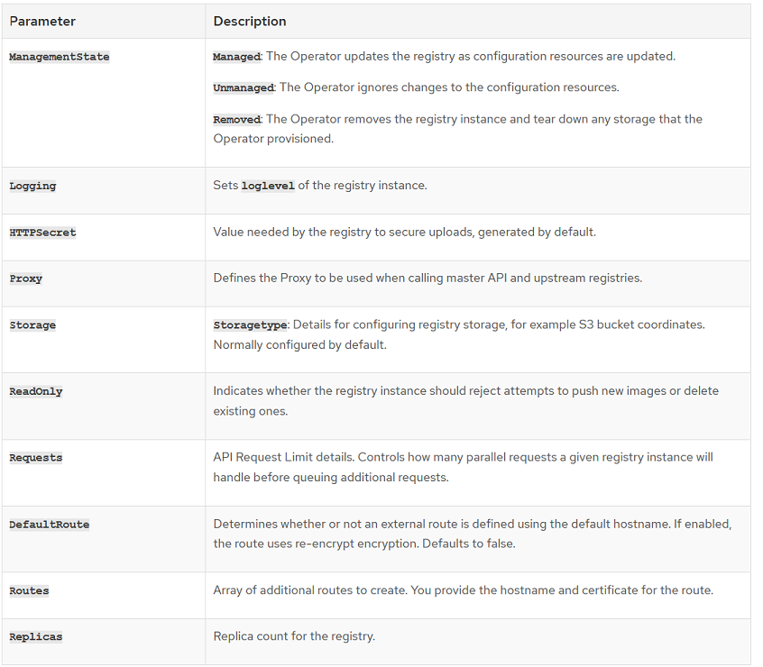

## Registry, Images, OperatorHub, and Developer Catalog

There are a few terms that are frequently used interchanging, but in an OpenShift environment have very specific meaning. We need to clarify these terms:

| Term | Description |
| -------- | --------- |
| OperatorHub | This is the name of the repository (exposed via the GUI or the CLI), where Operators are exposed to the SRE of DevOps Engineer.  |
| Registry | This is the name of the repository (exposed via the GUI or CLI), hosting Images available to the SRE or DevOps Engineer.   OpenShift  provides a built in container image registry which runs as a standard workload on the cluster. The registry provides an out of the box solution for users to manage the images that run their workloads, and runs on top of the existing cluster infrastructure.  |
| Images | Containers in OpenShift Container Platform are based on OCI- or Docker-formatted container images. An image is a binary that includes all of the requirements for running a single container, as well as metadata describing its needs and capabilities.  Once built, an Image is loaded into the Registry to be exposed to the SRE or DevOps Engineer |
| Developer Catalog | The "Developer View", provides a "Developer Catalog" into those Images and Operators that have been exposed to their login/project via RBAC. |  


## Registry Overview

Not to be confused with the "OperatorHub" (which manages and displays Operators), the Registry provides a system wide storage option for the capture and use of "images" developed, imported and then become available to be deployed on the platform.  The use of images allows an enterprise to consolidate, curate and ensure that only approved images are used for application development or deployment.  

The Red Hat OpenShift Container Platform provides an out-of-the box image registry that can be utilized by DevOps teams in a multi-tenant environment (i.e. the registry allows for RBAC to define who can upload, view and utilize images on a project/namespace level).  This allows for the reuse of code, preventing the duplication of effort along with the ability to notify DevOps teams of upgraded/changed images and the associated automation hooks to create a true Continuous Integration/Continuous Deployment (CI/CD) development.  In addition, the use of a registry ensures that updates and rollbacks can be easily enabled via the tagging of images as the platform will (if configured), automatically update containers with the latest image.

Finally, as part of industry best practices, it is the norm to use an image registry to perform security and other scans to ensure that any new image meets business rules before usage (i.e. a deprecated library, known security vulnerability, Etc.).  While security scanning is not provided with the out-of-the-box registry provided by OpenShift, Red Hat does provide an add-on solution **Quay** which contains all of the base and additional features [Red Hat Quay](https://www.redhat.com/en/technologies/cloud-computing/quay).


## OpenShift Built In Registry Key Features

The built in container image registry (which runs as a standard workload on the cluster), is configured and managed by an infrastructure operator. It provides an out of the box solution for users to manage the images that run their workloads, and runs on top of the existing cluster infrastructure. This registry can be scaled up or down like any other cluster workload and does not require specific infrastructure provisioning. In addition, it is integrated into the cluster user authentication and authorization system which means that access to create and retrieve images is controlled by defining user permissions on the image resources.

The registry is typically used as a publication target for images built on the cluster or downloaded from curated sources.  The Registry is the definitive source of images for workloads running on the cluster. When a new image is pushed to the registry, the cluster is notified of the new image and other components can react to and consume the updated image.

Image data is stored in two locations. The actual image data is stored in a configurable storage location such as cloud storage or a Persistent Volume. The image metadata, which is exposed by the standard cluster APIs and is used to perform access control, is stored as standard API resources, specifically images and imagestreams.

The Image Registry Operator installs a single instance of the OpenShift Container Platform registry, and manages all registry configuration, including setting up registry storage.  Storage is only automatically configured when you install an installer-provisioned infrastructure cluster on AWS, GCP, Azure, or OpenStack.  

For bare metal Clusters (i.e. local or IaaS hosted private instances), the installer will not define storage.  Post installation, a Persistent Volume can be defined and the configuration modified to make use of the define storage.

After the control plane deploys, the Operator will create a default **configs.imageregistry.operator.openshift.io** resource instance based on configuration detected in the cluster.  If insufficient information is available to define a complete configs.imageregistry.operator.openshift.io resource, the incomplete resource will be defined and the operator will update the resource status with information about what is missing. The **Image Registry Operator** runs in the **openshift-image-registry** namespace, and manages the registry instance in that location as well. All configuration and workload resources for the registry reside in that namespace.

On platforms that do not provide shareable object storage such as VMware, the OpenShift Image Registry Operator bootstraps itself as Removed. This allows openshift-installer to complete installations on these platform types and further configuration is performed post install by the Platform Operator/SRE.  After you perform a new storage class configuration for shareable object storage, you must edit the Image Registry Operator configuration to switch the ManagementState from Removed to Managed. Then, the Image Registry Operator will configure the repository with the newly configured the storage class. This is a new feature in OpenShift 4.3.
	
Another feature of the default Registry is that Prometheus console provides full visibility of the Registry and its state.  In the previous paragraphs, if not enough information is available to complete the installation, an ImageRegistryRemoved alert would be thrown and made visible, for example of the error message:

* "Image Registry has been removed. ImageStreamTags, BuildConfigs and DeploymentConfigs which reference ImageStreamTags may not work as expected. Please configure storage and update the config to Managed state by editing configs.imageregistry.operator.openshift.io."

The basic configuration options for the Registry include: 

Registry Options: 


https://docs.openshift.com/container-platform/4.3/registry/configuring-registry-operator.html


### Enable the Image Registry default route with the Custom Resource Definition

In OpenShift Container Platform, the Image Registry Operator controls the registry feature. The Operator is defined by the **configs.imageregistry.operator.openshift.io** Custom Resource Definition (CRD).  If you need to automatically enable the Image Registry default route, patch the Image Registry Operator CRD.

Procedure
```
    Patch the Image Registry Operator CRD:

    $ oc patch configs.imageregistry.operator.openshift.io/cluster --type merge -p '{"spec":{"defaultRoute":true}}
```


https://docs.openshift.com/container-platform/4.3/registry/configuring-registry-operator.html

## Day 1 Platform

From a Day 1 (Install), perspective, the Registry and its associated storage should be configured to verify the platform is healthy and can support applications (without images, the platform cannot perform work).  As part of Day 0 (Design), the decisions on whether to use the OpenShift default Registry, Quay, amount of storage (a minimum of 100GB is required) should be made and instantiated as part of Day 0 and 1.  

| Task | Day 0 | Day 1 |
| ---- | ----- | ----- |
| Decide on Registry Option | X | |
| Decide on storage size | X | |
| Deploy Registry Operator | | X |
| Configure Specific Options | X | X |
| Test Registry Functionality | | X |
| Verify Platform Monitors | | X |

During Day 1, you will be deploying the Registry Operator which will create an initial registry for you and will configure specific options for the registry such as storage sizes, location of the persistent volumes where it goes and role based access control.
As part of the Day 1; testing of the Registry (i.e. checking images in and out, ensuring that monitors are firing and that any needed dashboards are created to properly monitor and react to Registry changes/issues).  However, during Day 1 you will be limited in that you will not have applications to test or exercise the full features (i.e. ImageStreams), so these should be deferred until at least a test application can be deployed.

The type and configuration of Storage is extremely important for the Registry.  Certain storage types are not supported, performance and failures have been seen when using NFS and multiple access requests can have a negative impact on the Registry performance.  For that reason Red Hat recommends (and in some cases, requires), Object Storage as the first option.  See the following table for supported and recommended Registry Storage requirements and types:


https://docs.openshift.com/container-platform/4.3/scalability_and_performance/optimizing-storage.html


## Day 2 Platform

From a Day 2 (Operate Perspective), the Registry is used by the DevOps teams, but is primarily managed by the Platform Operators/SREs.  The key Day 2 operations tasks to be implemented and performed are:

* [Storage management](#Storage-management)
* [Access control (authentication)](#Access-control)
* [Registry logs management](#Registry-logs-management)
* [Registry Monitoring](#Registry-Monitoring)
* [Pruning](#Pruning)
* [Image Management](#Image-Management)


## Day 1 Application

From an Application Day 1 (build) perspective, the key and primary function is to determine how much storage will be required.  This is a combination of items such as:

* Average Image size and quantity
* Number of versions to be kept
* Whether Images are project/namespace specific or are global images used throughout the enterprise (i.e. a global function used by multiple disparate applications)

While normal platform operations will catch registry capacity issues (and a process to determine what steps to take such as adding storage, pruning, etc.), these processes will drive items such as the pruning process, how the registry will be configured for access and which alerts/monitors to be deployed, you should still have a good idea of what you're going to need and build as part of your Day 1 planning. 

For Example: If you intend to keep a several of copies of particular image or have multiple development teams requiring different versions on an Image, you will need initially establish the size of your persistent volume, which you can then grow and maintain over time.


## Day 2 Application

While this document focuses primarily on the **Registry**, a brief overview and key concepts of images is provided to help understand the importance of the Registry and how the DevOps teams utilize it to build and run applications.  

## Understanding containers, images, and imagestreams   

Containers, images, and imagestreams are important concepts to understand when you set out to create and manage containerized software. An image holds a set of software that is ready to run, while a container is a running instance of a container image. An imagestream provides a way of storing different versions of the same basic image. Those different versions are represented by different tags on the same image name.  

https://docs.openshift.com/container-platform/4.3/openshift_images/images-understand.html  

## Images   

Containers in OpenShift Container Platform are based on OCI- or Docker-formatted container images. An image is a binary that includes all of the requirements for running a single container, as well as metadata describing its needs and capabilities.  You can think of it as a packaging technology. Containers only have access to resources defined in the image unless you give the container additional access when creating it. By deploying the same image in multiple containers across multiple hosts and load balancing between them, OpenShift Container Platform can provide redundancy and horizontal scaling for a service packaged into an image.

You can use the **podman** or **docker** CLI directly to build images, but OpenShift Container Platform also supplies builder images that assist with creating new images by adding your code or configuration to existing images.  Because applications develop over time, a single image name can actually refer to many different versions of the same image. Each different image is referred to uniquely by its hash (a long hexadecimal number e.g., fd44297e2ddb050ec4f…​) which is usually shortened to 12 characters (e.g., fd44297e2ddb).  

With OpenShift Container Platform you can interact with images and set up imagestreams, depending on where the images' registries are located, any authentication requirements around those registries, and how you want your builds and deployments to behave.  An imagestream comprises any number of container images identified by tags. It presents a single virtual view of related images, similar to a container image repository.  By watching an imagestream, builds and deployments can receive notifications when new images are added or modified and react by performing a build or deployment, respectively.  

The primary key actions to be taken by the application teams are the development and publication of Images into the Registry.  This is controlled by the RBAC for a DevOps Engineer and includes versioning such that Applications can perform upgrades and/or rollbacks using the Image versions.  
- [Creating images](#Creating-Images)
- [Configuring image settings](#Configuring-Image-Settings)
- [Tagging images](#Tagging-Images)
- [Configuring Image pull policy](#Configuring-Image-Pull-Policies)
- [Using image pull secrets](#Using-Image-Pull-Secrets)
- [Managing imagestreams](#Managing-Imagestreams)


https://docs.openshift.com/container-platform/4.3/openshift_images/images-understand.html  
https://docs.openshift.com/container-platform/4.3/openshift_images/managing-images/managing-images-overview.html  
https://docs.openshift.com/container-platform/4.3/openshift_images/image-streams-manage.html  
https://docs.openshift.com/container-platform/4.3/openshift_images/image-configuration.html   


## Mapping to Personas

| Persona | Task |
| --- | --- |
| DevOps Engineer | Creating Images |
| DevOps Engineer | Configuring Image Settings |
| DevOps Engineer | Tagging Images |
| DevOps Engineer | Configuring Image Pull Policies |
| DevOps Engineer | Using Image Pull Secrets |
| DevOps Engineer | Managing Imagestreams |
| DevOps Engineer | Publish Images |
| DevOps Engineer | Consume Images |
| DevOps Engineer | Maintain Images |
| SRE | Storage management|
| SRE | Access control|
| SRE | Registry logs management|
| SRE | Registry Monitoring|
| SRE | Pruning| 
| DevOps Engineer, SRE| Image Management |


<a name="Creating-Images"></a>

## [Creating Images](https://docs.openshift.com/container-platform/4.3/openshift_images/create-images.html): [ DevOps Engineer ]

Detailed guidelines on standard patterns can be found at the link below.  As explained elsewhere (in this document and the OpenShift Documentation), using curated images as a starting point, a common naming scheme and incorporating any needed libraries to ease development are only some of the steps recommended for image creation.
Please see [Creating Images](https://docs.openshift.com/container-platform/4.3/openshift_images/create-images.html) for details.     

Note:  Images can be built (as in the URLs provided), by building on existing images (i.e. taking a base image and adding your business logic), by using external tools (i.e. using a build tool such as Jenkins to create an image and publish it to the Registry), or even downloading it directly from an allowed source (i.e. Docker Hub.).  However, for the latter (Docker Hub), this is not normally recommended since there is a risk of using an image that contains security holes or issues.

Once built (via any mechanism), the Image can be uploaded into the native Red Hat Registry or used directly from the source in the build process (i.e. pulling an image directly from an Enterprise Github).

<a name="Configuring-Image-Settings"></a>

## [Configuring Image Settings](https://docs.openshift.com/container-platform/4.3/openshift_images/image-configuration.html): [ DevOps Engineer ]

Image settings define how the cluster handles the input of an image, detects the change and what the cluster does when a new or revisited image is published.  Detailed documentation on how and what settings are available can be found at [Configuring Image Settings](https://docs.openshift.com/container-platform/4.3/openshift_images/image-configuration.html).  

Image names can be of any form, but there are of course recommendations for a standard naming convention to be used within the Enterprise.  As stated, Images may be stored in the internal Registry, an external source or any supported source OpenShift supports (GitHub, external Registries, DockerHub, Etc.).  

Finally, as discussed via the section URL.  ImageStreams allow for the automatic detection and deployment of updated images using the Builds deployment descriptor (rolling, A/B, Etc.).  Image Streams are extremely powerful and enable you to move away from directly maintaining and updating version numbers in images such as "OnlineBankingV0.1" and onwards.  An Image Stream allows you to detect, react and process updates to the "OnlineBanking" image as any update is made and it is pushed into a release state.

<a name="Tagging-Images"></a>

## [Tagging Images](https://docs.openshift.com/container-platform/4.3/openshift_images/managing-images/tagging-images.html): [ DevOps Engineer ]

An image tag is a label applied to a container image in a repository that distinguishes a specific image from other images in an imagestream. Typically, the tag represents a version number of some sort. For example, here v3.11.59-2 is the tag:
registry.access.redhat.com/openshift3/jenkins-2-rhel7:v3.11.59-2.  
You can add additional tags to an image. For example, an image might be assigned the tags :v3.11.59-2 and :latest.
OpenShift Container Platform provides the **oc tag** command, which is similar to the **docker tag** command, but operates on imagestreams instead of directly on images.  Detailed documentation on how and what settings are available can be found at [Tagging Images](https://docs.openshift.com/container-platform/4.3/openshift_images/managing-images/tagging-images.html).   


<a name="Configuring-Image-Pull-Policies"></a>

## [Configuring Image Pull Policies](https://docs.openshift.com/container-platform/4.3/openshift_images/managing-images/image-pull-policy.html): [ DevOps Engineer ]

When OpenShift Container Platform creates containers, it uses the container’s **imagePullPolicy** to determine if the image should be pulled prior to starting the container. There are three possible values for imagePullPolicy:

### imagePullPolicy 
| Value | Description |
| --- | --- |
| Always | Always pull the image |
| IfNotPresent | Only pull the image if it does not already exist on the node |
| Never | Never pull the image |

If a container’s imagePullPolicy parameter is not specified, OpenShift Container Platform sets it based on the image’s tag:
- If the tag is latest, OpenShift Container Platform defaults imagePullPolicy to **Always**.
- Otherwise, OpenShift Container Platform defaults imagePullPolicy to **IfNotPresent**.

This pull policy determines what the platform is to do if the image does not exist on the node itself.  It is defined as part of the deployment descriptor and requires the RBAC role to write, define and deploy this policy.

Detailed documentation on how and what settings are available can be found at [Configuring Image Pull Policy](https://docs.openshift.com/container-platform/4.3/openshift_images/managing-images/image-pull-policy.html).   


<a name="Using-Image-Pull-Secrets"></a>

## [Using Image Pull Secrets](https://docs.openshift.com/container-platform/4.3/openshift_images/managing-images/using-image-pull-secrets.html): [ DevOps Engineer ]

If you are using OpenShift Container Platform’s internal registry and are pulling from imagestreams located in the same project, then your Pod’s service account should already have the correct permissions and no additional action should be required.

However, for other scenarios, such as referencing images across OpenShift Container Platform projects or from secured registries, then additional configuration steps are required.
Detailed documentation on how and what settings are available can be found at [Using Image Pull Secrets](https://docs.openshift.com/container-platform/4.3/openshift_images/managing-images/using-image-pull-secrets.html).   


<a name="Managing-Imagestreams"></a>

## [Managing Imagestreams](https://docs.openshift.com/container-platform/4.3/openshift_images/image-streams-manage.html): [ DevOps Engineer ]

An imagestream and its associated tags provide an abstraction for referencing container images from within OpenShift Container Platform. The imagestream and its tags allow you to see what images are available and ensure that you are using the specific image you need even if the image in the repository changes.

Imagestreams do not contain actual image data, but present a single virtual view of related images, similar to an image repository.
You can configure Builds and Deployments to watch an imagestream for notifications when new images are added and react by performing a Build or Deployment, respectively.

For example, if a Deployment is using a certain image and a new version of that image is created, a Deployment could be automatically performed to pick up the new version of the image. However, if the imagestreamtag used by the Deployment or Build is not updated, then even if the container image in the container image registry is updated, the Build or Deployment will continue using the previous, presumably known good image.

The source images can be stored in any of the following:

- OpenShift Container Platform’s integrated registry.
- An external registry, for example **registry.redhat.io** or **hub.docker.com**.
- Other imagestreams in the OpenShift Container Platform cluster.

When you define an object that references an imagestreamtag (such as a Build or Deployment configuration), you point to an imagestreamtag, not the Docker repository. When you Build or Deploy your application, OpenShift Container Platform queries the Docker repository using the imagestreamtag to locate the associated ID of the image and uses that exact image.

Detailed documentation on how and what settings are available can be found at [Managing Imagestreams](https://docs.openshift.com/container-platform/4.3/openshift_images/image-streams-manage.html).   


<a name="Publish-Images"></a>

## Publish Images: [ DevOps Engineer ]

Images can be pushed or pulled from the Registry as part of any DevOps automation tool or they can be directly pushed or pulled using the CLI provided.  Images can be built via the docker **build** or OpenShift **podman** command which will build the image.  Specific guidelines and full documentation can be found at [Best Practices for Building Images](https://docs.openshift.com/container-platform/4.3/openshift_images/create-images.html) and [Manually Deploy Images via the CLI](https://docs.openshift.com/container-platform/4.3/registry/accessing-the-registry.html).  

<a name="Consume-Images"></a>

## Consume Images: [ DevOps Engineer ]

Images may be used directly (i.e. as part of a build you may decide to base it upon an existing image), or you can select and run an image from the CLI or Developer Console as part of your application topology.  
Please see the following documentation for details:  
[Best Practices for Building from Existing Images](https://docs.openshift.com/container-platform/4.3/openshift_images/create-images.html)  
[Manually Accessing Images via the CLI](https://docs.openshift.com/container-platform/4.3/registry/accessing-the-registry.html)  
[Using Images in Application Development](https://docs.openshift.com/container-platform/4.3/openshift_images/images-understand.html)   

<a name="Maintain-Images"></a>

## Maintain Images: [ DevOps Engineer ]

Images (once published), are normally considered immutable.  Once published, a SHA has and version metadata is associated with the image.  If an image needs updating, standard practice is to rebuild the image and tag with a higher version number such that the platform can either auto-upgrade (i.e. the tag "latest"), or an upgrade process can be utilized to take the previous version out of use.  Patterns and practices for creating and managing image versions can be found at [Best Practices for Building Images](https://docs.openshift.com/container-platform/4.3/openshift_images/create-images.html).   

<a name="Storage-management"></a>

## Storage management: [ SRE ]

The Registry (depending upon a local, project specific, Etc.) requires that monitoring be performed to ensure that the storage requirements are being tracked and any issues resolved early (i.e. growth trends leading to storage exhaustion).  The Image Registry Operator exposes Prometheus metrics that will allow the SRE to capture, alert and track trends and issues with the Registry Storage.

Backups of the Persistent Volume(s), containing the images and the metadata must be performed based upon business and operational needs.  This can include daily, weekly or whenever there is a new production image published.  The goal is to ensure that any failure can be recovered from if there is a platform failure.  

The Registry is a shared service and as such, it should be monitored and managed by the Platform SRE team.  As such, it should have its own SLOs, monitors and capacity monitoring to ensure that storage exhaustion never occurs

<a name="Access-control"></a>

## Access control (authentication): [ SRE ]

The Registry access and usage is defined via set of predefined roles within the platform.  Without these roles, access to pull, push or view the registry is disabled.  These roles can be Cluster or project based, for the specific list of roles required for a user, please see [Registry Access Roles](https://docs.openshift.com/container-platform/4.3/authentication/using-rbac.html).   

There are ~160 roles and privileges that can be assigned to a user.  
For example,
- Who has the capabilities to create an image?
- Who has the capabilities to deploy to the image?
- Who has the ability to delete an image?
- How has the capabilities to view an image?
 
Please see the list above to view those roles available to control access to the Registry and Image Management.  

<a name="Registry-logs-management"></a>

## Registry logs management: [ SRE ]

You can view the logs for the registry by using the **oc logs** command.  Both the logs and the Prometheus metrics should be utilized to determine Registry health and any issues (i.e. a user constantly attempting to upload an image without the correct role will show in the logs).  Utilizing the Prometheus metrics to monitor usage, capacity, trends, etc along with the Logs to view aggregation of access, failures or other items will give you a comprehensive view of your Registry Health and usage.

One final item is the use of logs to do historical research; when was an image checked in, who did so, how many changes have been made, Etc.  The logs (and the metrics), will give you a method to do detailed forensics if needed on any actions that appear to be security or usage related.

Please see [Registry Log Access](https://docs.openshift.com/container-platform/4.3/registry/accessing-the-registry.html#registry-viewing-logs_accessing-the-registry) for details.  

<a name="Registry-Monitoring"></a>

## Registry Monitoring: [ SRE ]

The OpenShift Container Registry provides an endpoint for Prometheus metrics. Prometheus is a stand-alone, open source systems monitoring and alerting toolkit.  The metrics are exposed at the /extensions/v2/metrics path of the registry endpoint.  

Please see [Registry Metrics Access](https://docs.openshift.com/container-platform/4.3/registry/accessing-the-registry.html#registry-accessing-metrics_accessing-the-registry) for details.   

In the section above we talk about how the Prometheus and logging functions can be used for break/fix, triage or forensic research in addition to just pure monitors.
The registry by itself comes out of the box with a number of monitors predefined to look at utilization, capacity, performance, etc.  
In addition, for an auditing, you could look at who and when checked in an image.   

<a name="Pruning"></a>

## Pruning: [ SRE ]

Over time, test, older and deprecated versions of images can begin to consume storage and cause an impact to the platform.  As part of any operational run book, a closed loop process to determine when (and if), images currently not in use within the platform should be **pruned** to free up space and prevent any accidents whereby someone uses an out of date image.  While some projects may require a full history of images used (i.e. maintaining multiple versions of applications), any image that has been deprecated should be removed from the registry.  Pruning the registry can be performed from the CLI using the following processes and commands at [Pruning Objects](https://docs.openshift.com/container-platform/4.3/applications/pruning-objects.html#pruning-objects).   

Using the Prometheus Metrics, Logs and especially the metering Operator (which comes with the platform), will give you a detailed view on Image usage (where, last used, in use, not used, Etc.), that can be combined to create a comprehensive process of managing Images and their usage.

<a name="Image-Management"></a>

## Image Management: [ DevOps Engineer & SRE ]

Image Management consists of a number of key actions covered within this (or the OpenShift), documentation.  Primary actions to be taken with Images consists of:
- Naming convention
- Roles and processes to check in, pull or remove images
- Integration of the Registry with external sources and the target for locally developed images
- Developing images and **pushing** them into the Registry for consumption of DevOps teams on an Enterprise or project level (RBAC)
- Using a defined security process to check images for known security or Enterprise Governance requirements
- Naming and maintaining version metadata to ensure proper selection of the correct version
- Rollout and upgrade of previous versions to the current via a known method (A/B, Canary, Etc.)
- Pruning and removing (per business rules), images no longer needed, in use or not needed to be kept for any policy reasons

As such, images have a defined **life-cycle** as any corporate asset in use within the Enterprise should have.  A defined policy and run book should be written and agreed upon by the SRE, DevOps Engineer (and Security Team if a separate group), to ensure that images are well known, exposed to the groups that need them and are maintained as any other piece of software.  
For security, we will have security rules and process such as scanning images, singing images, and etc.


## Implementing Registry & Image Management  

## Kubernetes

Kubernetes (the Open Source raw distribution), provides for the use and integration with local and remote registries as does OpenShift.  However, Kubernetes does not include the full feature set discussed for OpenShift but can be enhanced via custom development or the use of additional solutions such as Banira.  However, the concepts are exactly the same.  The DevOps teams need to have a repository to push, pull and maintain Images that are used in the Application development and operation.  


## OpenShift

As seen above, OpenShift provides a native and comprehensive Registry function via the Operator which works from a bare metal and multiple cloud vendors.  Since it is a native part of the OpenShift platform, it is fully integrated, patched and upgraded as a key component.  This reduces the management overhead of running a local/private Registry. 


## IBM Managed OpenShift (On IBM Cloud)

IBM Managed OpenShift alleviates a significant portion of the Day 2 operation requirements as it is a part of the Managed portion of OpenShift.  


## IBM Cloud Pak for MCM  
n/a


## Others
n/a


## Other consideration
n/a


