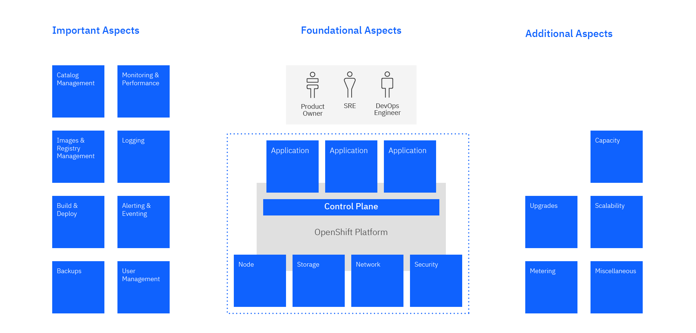
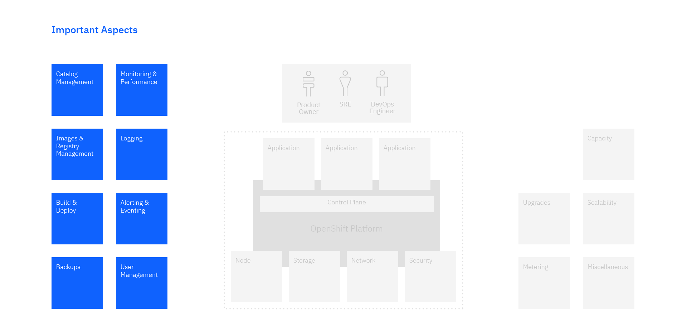
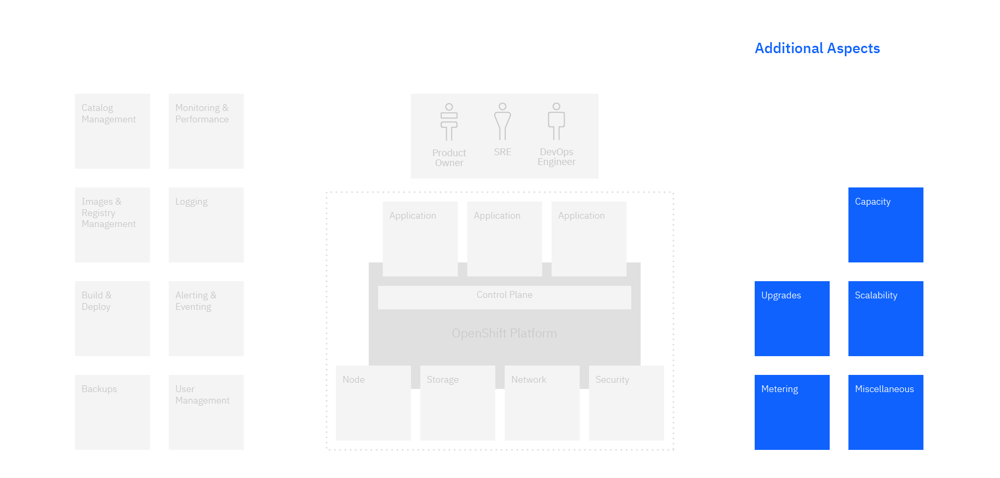

## OpenShift Day-2 Operation Guide
A guide for post deployment operations of Red Hat OpenShift Container Platform

## Introduction

The purpose of this guide is to assist an organization with the operational aspects of Red Hat OpenShift Container Platform on Day-2. The premise of this document is to describe core principles/processes that should be taken on “day 2” where the journey is defined as:

**OpenShift Platform**

* Day-0: Requirements and design of the platform.
* Day-1: Platform installation and initial configuration to a working state.
* Day-2: Platform is installed and ready to begin providing services.
    
    
**OpenShift-based Application**

* Day-0: Requirements and design of the application and potentially changes to the supporting environment.
* Day-1: Deployment and Release of the application, the time where (a new version of) the application is introduced to the production environment. This includes initial configuration of the application itself and of any supporting functionality.
* Day-2: Steady state operations of the application, the time where the application is doing its job for the business.

The definition of Day-1 and Day-2 is not exact. We will find many times, cases where a task can be considered Day-1 or Day-2. We don't want to spend a lot of time arguing whether a task is Day-1 or Day-2. It is more important to identify and describe the tasks that need to be performed. For a given project, feel free to move such tasks to either option, and assign it to the right persona.

The notion of *immutable systems*, DevSecOps and GitOps is not changing the definition of Day-2 tasks. They simply lead to a different approach of *performing* these Day-2 activities. Instead of patching, configuring, tuning a live system, the master source - the configuration repo, the infrastructure as a code repo, the operator code - will be updated and then deployed again.

### Personas

Admittedly there may be different personas responsible at these stages of implementation. For example Platform Day-0 would entail personas such as Architects and SREs. Platform Day-1 would be one of the few stages where typically only the traditional sysadmin or the modern role SRE are involved. Platform Day-2 encapsulates all of the application based stages. However you may see some application design discerned at Platform Day-0. The role involved at Platform Day-2 stage is SREs.   

As each new applications is added to the environment the OpenShift-based applications Day-0 through Day-2 is executed again. The personas involved in Application Day-0 would be Product Owners, DevOpsEngineer, SREs and Architects. Day-1 and Day-2 personas would include DevOps and SREs.

As this document is focused on the Day-2 activities, we will primarily focus on the tasks performed by DevOps Engineers and SREs. See the [Personas](../Personas) topic in this document for more details. 

|               | Application    | Platform       |
| :------------ |:--------------:| :-------------:|
| Day-0         | Architect, Product Owner, DevOpsEngineer, SRE | Architect, SRE            |
| Day-1         | DevOpsEngineer, SRE | SRE            |
| Day-2         | DevOpsEngineer, SRE       | SRE            |

### Reference Architecture
The Garage and Solution Engineering team has developed a Reference Architecture for OpenShift, discussing topics like Network, Storage, and Cluster Nodes. This architecture provides good background and context for the operational aspects of the OpenShift solution:
[OpenShift 4.x Cloud Reference Architecture](https://github.com/ncolon/ocp4-refarch)

The following chart depicts the Day-2 Reference Architecture for OpenShift: in the middle of the charts you see a OpenShift cluster with applications running on top of the standard resources compute, storage, and network. Left and right of the OpenShift cluster, you find the domains of Day-2 activities. On top you see the personas responsible for these activities.

### Bylaws
When describing Day-2 activities for OpenShift, it is relevant to define some *precepts* or *bylaws* that act as guiding principles for the definition and design of these activities:
* Immutable / Disposable Infrastructure 
* Infrastructure as Code
* Automate as much as possible
* Self-Service

We added some design decisions at the end of this documentation.

## OpenShift Day2 Foundational Operational Aspects
In this chapter we describe the foundational operational aspects of a platform and its applications. We start with the personas responsible for Day-1 and Day-2 tasks, and then look into the critical domains of Compute, Storage and Network, as well as Security.

### [Personas](../Personas/)

### [Network](../Network)

### [Node](../Node)

### [Security](../Security)

### [Storage](../Storage)

## OpenShift Day2 Important Operational Aspects
This chapter includes to key operational aspects of a Day-2 operational guide. This includes catalogs, images and registries and in turn builds and deployments. Next we look into observability aspects, for instance monitoring and logging, feeding into event management and alerting. A third dimension are aspects of security, including user and access management as well as the management of credentials. Backups are another aspect covered in this section.

### [Alerting and Event Management](../EventManagement)

### [Backups](../Backups/)

### [Builds and Deployment](../BuildDeploy)

### [Catalog Management](../CatalogManagement)

### [Registry and Image Management](../Registry)

### [Logging](../Logging)

### [Monitoring and Performance Management](../Monitoring)

### [User Management/Authentication/Authorization](../User)

## OpenShift Day2 Additional Operational Aspects
This section contains further operational aspects of a successful operations guide. A key elements is patching and upgrades of the platform and its applications. A second aspects covers some of the non-functional characteristics of the solution, such as scalability and capacity management. Metering is another topic covered in this section.

### [Capacity Management](../Capacity)

### [Metering](../Metering/)

### [Miscellaneous](../Misc)

- [**Support**](../MiscSupport)

- [**Web Console Access**](../MiscWeb)

- [**Pruning**](../MiscPrune)

### [Upgrade](../Upgrade/)

### [Scalability](../Scalability)

## Looking at Day-2 from a Horizontal perspective

In addition to the functional (*vertical*) view shown above, we could also look at Day-2 activities from a horizontal perspective. For instance showing all Day-2 activities for a given application. Another horizontal perspective would be the implementation of the functional capabilities with a common technology such as a Service Mesh.

### [Application Management](../Application)

### [Service Mesh](../ServiceMesh)

## Reference  

### OpenShift Online Document URL
Here is the URL for Red Hat OpenShift official online document  
https://docs.openshift.com/container-platform/4.3/welcome/index.html

### Cluster Ready Checklist
[Cluster Ready Checklist for Kubernetes](https://www.weave.works/blog/production-ready-checklist-kubernetes)
