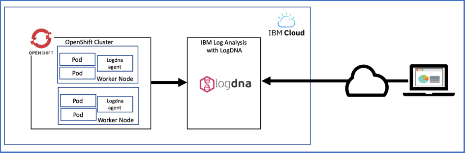
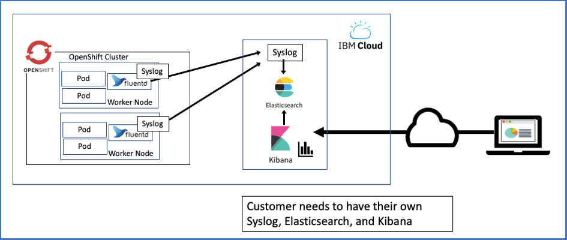
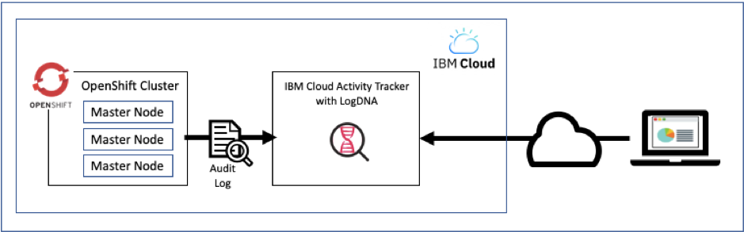
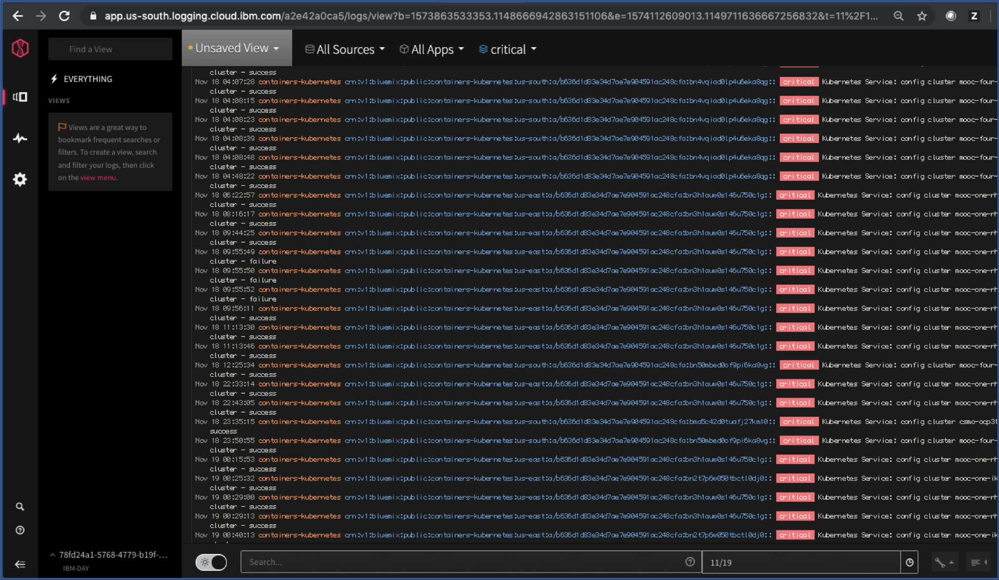

## Logging Solutions on IBM Cloud

The logs such as system log and application log are useful for debugging and monitoring cluster activity. Most of container platform supports a logging solution including OpenShift Container Platform.  

By default, logs are generated and written locally.  Several logging solutions are available to collect, forward, and view the logs in OpenShift on IBM Cloud.  


## Choosing a logging solution
You can choose your logging solution based on which cluster components you need to collect logs for. There are several logs produced in different components in OpenShift as follow:
- Application log
- OpenShift Master log
- OpenShift Worker Nodes/Pods log  

A common implementation is to choose a logging service that you prefer based on its analysis and interface capabilities, such as IBM Log Analysis with LogDNA or Built-in OpenShift Logging functions.  

You can then use IBM Cloud Activity Tracker with LogDNA to audit user activity in the cluster.  We will discuss it in the later section.  


## Application Log
You would generate your applications’ logs for several purposes.  If your applications encounter errors, it would log those errors and those logs may be useful for debugging.  Every application may write logs in different places with different format.  Therefore, you may need to consider how to take care of those logs.  

With OpenShift cluster, you would aggregate your applications logs into a central location since your applications may run on several different pods/nodes.  For example, you would forward your application logs to LogDNA and let LogDNA manage those logs.  


## OpenShift Master log
To collect, forward, and view logs for your cluster's Kubernetes master, you can take a snapshot of the Master logs at any point in time to collect in an IBM Cloud Object Storage bucket. The snapshot includes anything that is sent through the API server, such as pod scheduling, deployments, or RBAC policies.  
https://cloud.ibm.com/docs/containers?topic=containers-health#collect_master  


## OpenShift Worker Nodes/Pods log
There are several ways to check the Worker nodes/pods log.  You can use the CLI to check the logs of an individual OpenShift pod.  You can also use GUI with several different solutions such as OpenShift Web Console, IBM Log Analysis with LogDNA, and external servers with Fluend.  We will take a look at those solutions in the following sections.  


## Using the CLI for OpenShift Pod logs
You can run the command “oc logs *pod_name* ” to see the OpenShift pod logs as below.

```
$ oc logs httpd-1-htzpn
=> sourcing 10-set-mpm.sh ...
=> sourcing 20-copy-config.sh ...
=> sourcing 40-ssl-certs.sh ...
AH00558: httpd: Could not reliably determine the server's fully qualified domain name, using 172.30.48.85. Set the 'ServerName' directive globally to suppress this message
[Sat Oct 12 14:18:15.760713 2019] [ssl:warn] [pid 1] AH01909: 172.30.48.85:8443:0 server certificate does NOT include an ID which matches the server name
[Sat Oct 12 14:18:15.761653 2019] [:notice] [pid 1] ModSecurity for Apache/2.9.3 (http://www.modsecurity.org/) configured.
[Sat Oct 12 14:18:15.761668 2019] [:notice] [pid 1] ModSecurity: APR compiled version="1.4.8"; loaded version="1.4.8"
[Sat Oct 12 14:18:15.761673 2019] [:notice] [pid 1] ModSecurity: PCRE compiled version="8.32 "; loaded version="8.32 2012-11-30"
[Sat Oct 12 14:18:15.761680 2019] [:notice] [pid 1] ModSecurity: LUA compiled version="Lua 5.1"
[Sat Oct 12 14:18:15.761684 2019] [:notice] [pid 1] ModSecurity: YAJL compiled version="2.0.4"
[Sat Oct 12 14:18:15.761688 2019] [:notice] [pid 1] ModSecurity: LIBXML compiled version="2.9.1"
[Sat Oct 12 14:18:15.761693 2019] [:notice] [pid 1] ModSecurity: Status engine is currently disabled, enable it by set SecStatusEngine to On.
AH00558: httpd: Could not reliably determine the server's fully qualified domain name, using 172.30.48.85. Set the 'ServerName' directive globally to suppress this message
[Sat Oct 12 14:18:15.854039 2019] [ssl:warn] [pid 1] AH01909: 172.30.48.85:8443:0 server certificate does NOT include an ID which matches the server name
[Sat Oct 12 14:18:15.854206 2019] [http2:warn] [pid 1] AH10034: The mpm module (prefork.c) is not supported by mod_http2. The mpm determines how things are processed in your server. HTTP/2 has more demands in this regard and the currently selected mpm will just not do. This is an advisory warning. Your server will continue to work, but the HTTP/2 protocol will be inactive.
[Sat Oct 12 14:18:15.854933 2019] [lbmethod_heartbeat:notice] [pid 1] AH02282: No slotmem from mod_heartmonitor
[Sat Oct 12 14:18:15.859059 2019] [mpm_prefork:notice] [pid 1] AH00163: Apache/2.4.34 (Red Hat) OpenSSL/1.0.2k-fips configured -- resuming normal operations
[Sat Oct 12 14:18:15.859089 2019] [core:notice] [pid 1] AH00094: Command line: 'httpd -D FOREGROUND'
[Sat Oct 12 14:18:36.654769 2019] [autoindex:error] [pid 38] [client 172.30.75.75:42370] AH01276: Cannot serve directory /opt/rh/httpd24/root/var/www/html/: No matching DirectoryIndex (index.html) found, and server-generated directory index forbidden by Options directive
172.30.75.75 - - [12/Oct/2019:14:18:36 +0000] "GET / HTTP/1.1" 403 3985 "-" "curl/7.54.0"
$
```

You can use the --follow option with “oc logs” command to monitor the logs for that pod continually.  


## Using OpenShift Web Console for Pod logs on IBM Cloud
OpenShift provides a capability to see Pod’s logs on the Web Console as shown in below.  


You can see the same logs with the oc command as shown in the later section. Using the CLI for OpenShift Pod logs.  


## EFK stack in OpenShift is NOT supported on IBM Cloud
Unlike other environment, the EFK stack such as Elasticsearch, Fluentd, and Kibana as shown in Figure 12 is NOT supported on IBM Cloud because you cannot modify the default configuration of the Red Hat OpenShift on IBM Cloud cluster.  

  

Therefore, the EFK in the OpenShift on IBM Cloud is not an option for the logging solution.  


## Using IBM Log Analysis with LogDNA
You can manage container logs by deploying LogDNA agent to OpenShift cluster. The agent collects logs with the extension .log and extensionless files that are stored in the /var/log directory of pods from all namespaces, including kube-system. The agent then forwards the logs to the IBM Log Analysis with LogDNA service as shown in below.  



The sample output on the LogDNA dashboard is shown in below.  


## Using Fluentd with an external server
To collect, forward, and view logs for a cluster component, you can create a logging configuration by using Fluentd. When you create a logging configuration, the Fluentd cluster component collects logs from the paths for a specified source. Fluentd can then forward these logs to an external server that accepts a syslog protocol as shown in below.

  


## Understanding options for logging on IBM Cloud

To help understand when to use the built-in OpenShift tools or IBM Cloud Log Analysis with LogDNA, you can review the following table.  
Note that this is for OpenShift 3.11 statement. With OpenShift 4.2, this will be updated.

|OpenShift tools:Built-in OpenShift logging tools|IBM Cloud integrations:IBM Log Analysis with LogDNA|
|:---|:---|
|• Built-in view of pod logs in the OpenShift web console.• Built-in pod logs are not configured with persistent storage. You must integrate with a cloud database to back up the logging data and make it highly available and manage the logs yourself.Note: You cannot run the Ansible playbook to deploy the OpenShift Container Platform Elasticsearch, Fluentd, and Kibana (EFK) stack because you cannot modify the default configuration of the Red Hat OpenShift on IBM Cloud cluster.|• Customizable user interface for live streaming of log tailing, real-time troubleshooting, issue alerts, and log archiving.• Aggregated logs across clusters and cloud providers.• Historical access to logs that is based on the plan you choose.• Highly available, scalable, and compliant with industry security standards.• Integrated with IBM Cloud IAM for user access management.• Quick integration with the cluster via a script.• Flexible plans, including a free Lite option.• Log Analysis with DNA can aggregate and manage logs from multiple Kubernetes and OpenShift clusters, several Cloud Databases services, and the Certificate Manager Service.• 3rd party LogDNA agent has to be added to worker nodes to forward logs from pod containers to the IBM Log Analysis with LogDNA service.| 


## Third-party services or configure your own logging
In case you have special requirements for logging, you can set up your own logging solution. Check out third-party logging services such as Splunk that you can add to OpenShift cluster.  
https://cloud.ibm.com/docs/containers?topic=containers-supported_integrations#health_services  


## Solution for Audit Logging
You can also collect Kubernetes API audit logs from OpenShift cluster on IBM Cloud and forward them to IBM Log Analysis with LogDNA. To access OpenShift (Kubernetes) audit logs, you must create an audit webhook in the cluster.  

The Kubernetes audit system in OpenShift cluster consists of an audit webhook, a log collection service and Web Server app, and a logging agent. The webhook collects the Kubernetes API server events from the Master. The log collection service is a Kubernetes ClusterIP service that is created from an image from the public IBM Cloud registry. This service exposes a simple node.js HTTP webserver app that is exposed only on the private network. The webserver app parses the log data from the audit webhook and creates each log as a unique JSON line. Finally, the logging agent forwards the logs from the webserver app to IBM Log Analysis with LogDNA, where you can view the logs.  

https://cloud.ibm.com/docs/containers?topic=containers-health#webhook_logdna



Sample output of audit log events on the Activity Tracker dashboard is shown in below.  



