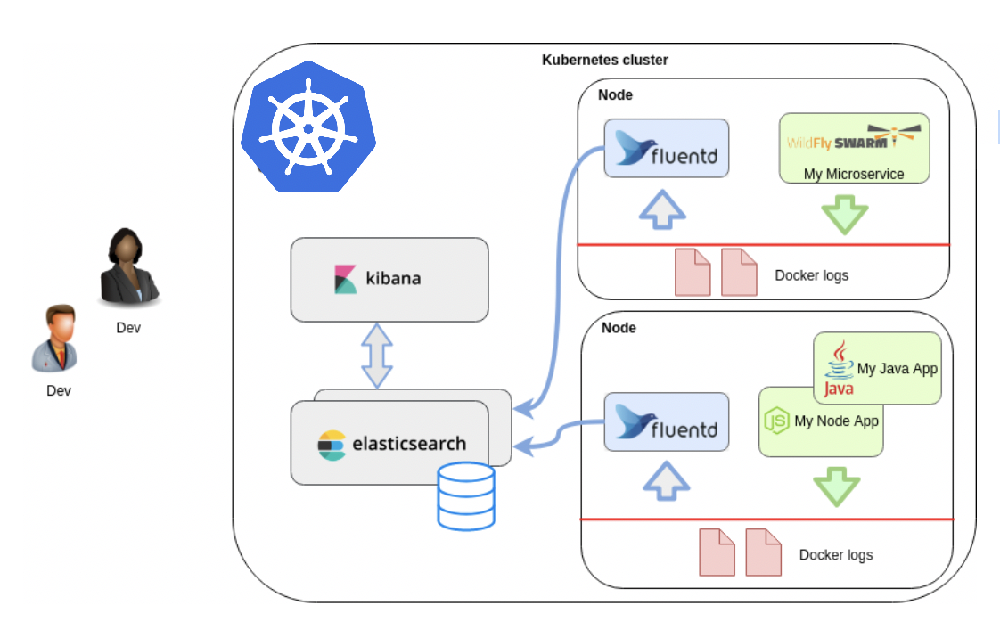

## Logging Overview
The logs such as cluster platform logs and application logs are useful for debugging and and monitoring cluster and applications activity. The easiest and most embraced logging method for kubernetes platform components and containerized applications is to write to the standard output and standard error streams. These logs can be viewed on a Pod level using `oc logs` CLI or via OpenShift web console (Workload -> Pod -> Pod Details -> Logs).

However, the native functionality provided by a container engine or runtime is usually not enough for a complete logging solution. For example, if a container crashes, a pod is evicted, or a node dies, usually you will still want to access your application’s logs. As such, logs should have a separate storage location, and lifecycle that is independent of nodes, pods, or containers. This concept is called cluster-level-logging. Cluster-level logging requires a separate backend to store, analyze, and query logs. OpenShift provides a logging solution based on EFK stack ([Elasticsearch](https://www.elastic.co/products/elasticsearch), [Fluentd](http://www.fluentd.org/architecture) (or Rsyslog), and [Kibana](https://www.elastic.co/guide/en/kibana/current/introduction.html)). The collector, Fluentd, is deployed to each node in the OpenShift Container Platform cluster. It collects all node and container logs and writes them to Elasticsearch (ES). Kibana is the centralized web UI where users and administrators can create rich visualizations and dashboards with the aggregated data.

## Day 1 Platform

Implementation of the Logging solution based on EFK stack provided by OpenShift should be planned during design (Day 0) phase. Ensure that you have the necessary persistent storage for Elasticsearch. Note that each Elasticsearch node requires its own storage volume.

Elasticsearch is a memory-intensive application. Each Elasticsearch node needs 16G of memory for both memory requests and limits with OpenShift 4.3. The initial set of OpenShift Container Platform nodes might not be large enough to support the Elasticsearch cluster. In that case you may need to add additional nodes to the OpenShift Container Platform cluster to run with the recommended or higher memory. Each Elasticsearch node can operate with a lower memory setting though this is not recommended for production deployments.

The OpenShift logging solution based on the EFK stack is deployed separately to OpenShift cluster installation. Follow the instructions specified in OpenShift documentation: https://docs.openshift.com/container-platform/4.3/logging/cluster-logging-deploying.html in order to deploy full logging solution.
Check also the [deployment steps for logging solution for OpenShift on AWS](./EFK_AWS/).

Deployment steps include installation of two Operators: Elasticsearch Operator and Cluster Logging Operator as well as creating of Cluster Logging Custom Resource (CR) to schedule cluster logging pods and other resources necessary to support cluster logging. The Operators are responsible for deploying, upgrading, and maintaining cluster logging. 

**Day 1 Platform tasks for Logging:**
  
  - Size system resources for logging components
  - Deploy Elasticsearch and Cluster Logging Operators   

## Day 2 Platform

The default settings of Cluster Logging CR are tuned for small to medium sized OpenShift Container Platform clusters. If case of increased log traffic, the Cluster Logging CR can be reconfigured using instructions documented [here](https://docs.openshift.com/container-platform/4.3/logging/cluster-logging-deploying-about.html#cluster-logging-deploy-about-config_cluster-logging-deploying-about) and the following chapters of this document.

**Day 2 Platform tasks for Logging:**
  
  - [Assigning the logging resources to specific nodes](#Assigning-the-logging-resources-to-specific-nodes)
  - [Configuring Elasticsearch](#Configuring-Elasticsearch)
  - [Adding additional resources to the Elastic stack](#add-resources-to-elastic)
  - [Configuring Kibana](#Configuring-Kibana)
  - [Configuring Curator](#Configuring-Curator)
  - [Configuring log collector (Fluentd)](#Configuring-log-collector-Fluentd)
  - [Forwarding logs to external logging systems](#Forwarding-logs-to-external-logging-systems)
  - [Monitoring of Elasticsearch](#Monitoring-of-Elasticsearch)
  - [Monitoring of log collector (Fluentd)](#Monitoring-of-log-collector-Fluentd)
  - [Building Kibana visualizations and dashboards](#Building-Kibana-visualizations-and-dashboards)   

## Day 1 Application

Logs provide visibility into the behavior of a running application component and microservice, they are one of the most fundamental tools for debugging and finding issues within your application. If structured correctly, logs can contain a wealth of information about a specific event. Logs can tell us not only when the event took place, but also provide us with details as to the root cause. Therefore, it is important that the log entries are readable to humans and machines. CSMO GSE provides a set of recommendations for a proper logging during application code development ([Build to Manage POV - chapter 4.2 "Logging Format and Catalog](https://www.ibm.com/cloud/architecture/files/service-management-pov-csmo-build-to-manage-v1.1.pdf)).
Make sure that all containerized application components log to STDOUT/STDERR in order to collect these logs automatically by Fluentd. 

**Day 1 Application tasks for logging:**

- Good practices for logging during application code development    

## Day 2 Application

Application logs are collected automatically by the OpenShift EFK stack and stored in the `project.<project_name>.<project_id>.<date>` index. Fluentd enriches application logs with broad set of metadata like container image name, pod name, project/namespace name, application name, worker node hostname etc.

**Multi-tenancy**

The EFK stack is configured out-of-the-box for multi-tenancy and individual users will have access to log entries only from components located in projects they have access. 

**Parsing log messages**

If application generates logs in JSON format and we need to annotate individual fields in the log messages, then we just need to enable `MERGE_JSON_LOG` variable in the Fluentd daemonset as described [here](https://docs.openshift.com/container-platform/4.3/logging/config/cluster-logging-collector.html#cluster-logging-collector-json_cluster-logging-collector).

**Day 2 Application tasks for logging:**

- [Building Kibana visualizations and dashboards](#Building-Kibana-visualizations-and-dashboards)
- [Throttling log collection (per application project)](https://docs.openshift.com/container-platform/4.3/logging/config/cluster-logging-collector.html#cluster-logging-collector-throttling_cluster-logging-collector)

## Mapping to Personas

Persona | task
--- | ---
SRE	| Assigning the logging resources to specific nodes
SRE	| Configuring Elasticsearch
SRE	| Adding additional resources to the Elastic stack
SRE	| Configuring Kibana
SRE	| Configuring Curator
SRE	| Configuring log collector (Fluentd)
SRE	| Forwarding logs to external logging systems
SRE	| Monitoring of Elasticsearch
SRE	| Monitoring of log collector (Fluentd) 
SRE & DevOps Engineer	| Building Kibana visualizations and dashboards
SRE & DevOps Engineer	| Throttling log collection (per application project)   

## Day 2 operations tasks for Logging

## Assigning the logging resources to specific nodes [ SRE ]

You can configure the Cluster Logging Operator to deploy the pods for any or all of the Cluster Logging components, Elasticsearch, Kibana, and Curator to different nodes. Edit the Cluster Logging CR and specify the `nodeSelector` for specific logging solution component in order to schedule it on required worker nodes as described [here](https://docs.openshift.com/container-platform/4.3/logging/cluster-logging-moving-nodes.html).

##  Configuring Elasticsearch [ SRE ]

OpenShift Container Platform uses Elasticsearch to store and organize the log data. You can configure storage for your Elasticsearch cluster and define how shards are replicated across data nodes in the cluster, CPU and memory limits or external access to Elasticsearch.

The following Elasticsearch settings can be configured via `Cluster Logging CR` definition:

- [Define how shards are replicated across data nodes in the cluster](https://docs.openshift.com/container-platform/4.3/logging/config/cluster-logging-elasticsearch.html#cluster-logging-elasticsearch-ha_cluster-logging-elasticsearch)
- [Configure external access to Elasticsearch data](https://docs.openshift.com/container-platform/4.3/logging/config/cluster-logging-elasticsearch.html#cluster-logging-elasticsearch-exposing_cluster-logging-elasticsearch)
- [Configure Elasticsearch CPU and memory limits](https://docs.openshift.com/container-platform/4.3/logging/config/cluster-logging-elasticsearch.html#cluster-logging-elasticsearch-limits_cluster-logging-elasticsearch)
- [Configuring tolerations to control Elasticsearch pod placement](https://docs.openshift.com/container-platform/4.3/logging/config/cluster-logging-tolerations.html#cluster-logging-elasticsearch-tolerations_cluster-logging-tolerations)

## Adding additional resources to the Elastic stack [ SRE ]

If, despite all efforts to manage resources, the Elastic stack requires more [capacity](../Capacity/) then additional Nodes can be added to the cluster for the Elastic stack's use. There are a number of steps needed to make sure that the new Node can be used by the Elasticstack cluster:

- [Configure storage for Elasticsearch cluster](https://docs.openshift.com/container-platform/4.3/logging/config/cluster-logging-elasticsearch.html#cluster-logging-elasticsearch-storage_cluster-logging-elasticsearch)
- [Configuring tolerations to control Elasticsearch pod placement](https://docs.openshift.com/container-platform/4.3/logging/config/cluster-logging-tolerations.html#cluster-logging-elasticsearch-tolerations_cluster-logging-tolerations)
- [Add the relevant `nodeSelector` to the new Node](https://docs.openshift.com/container-platform/4.3/logging/cluster-logging-moving-nodes.html)

##  Configuring Kibana [ SRE ]

OpenShift Container Platform uses Kibana to display the log data collected by Fluentd and indexed by Elasticsearch. You can scale Kibana for redundancy and configure the CPU and memory for Kibana nodes.

The following Kibana settings can be configured via `Cluster Logging CR` definition:

- [Configure Kibana CPU and memory limits](https://docs.openshift.com/container-platform/4.3/logging/config/cluster-logging-kibana.html#cluster-logging-kibana-limits_cluster-logging-kibana)
- [Scaling Kibana for redundancy](https://docs.openshift.com/container-platform/4.3/logging/config/cluster-logging-kibana.html#cluster-logging-kibana-scaling_cluster-logging-kibana)
- [Configuring tollerations to control Kibana pod placement](https://docs.openshift.com/container-platform/4.3/logging/config/cluster-logging-tolerations.html#cluster-logging-kibana-tolerations_cluster-logging-tolerations)

## Configuring Curator [ SRE ]

The Elasticsearch Curator tool performs scheduled maintenance operations on a global and/or on a per-project basis. Curator performs actions (like pruning the old indexes) daily based on its configuration.

The Cluster Logging Operator installs Curator and its configuration. You can configure the Curator cron schedule using the Cluster Logging CR and further configuration options can be found in the Curator ConfigMap, `curator` in the `openshift-logging` project.

The following Curator settings can be configured via `Cluster Logging CR` definition:

- [Configuring the Curator schedule](https://docs.openshift.com/container-platform/4.3/logging/config/cluster-logging-curator.html#cluster-logging-curator-schedule_cluster-logging-curator)
- [Configuring Curator index deletion](https://docs.openshift.com/container-platform/4.3/logging/config/cluster-logging-curator.html#cluster-logging-curator-yaml_cluster-logging-curator)
- [Configuring tollerations to control Curator pod placement](https://docs.openshift.com/container-platform/4.3/logging/config/cluster-logging-tolerations.html#cluster-logging-curator-tolerations_cluster-logging-tolerations)

##  Configuring log collector (Fluentd) [ SRE ]

OpenShift Container Platform uses Fluentd to collect platform and application logs from your cluster which OpenShift Container Platform enriches with Kubernetes Pod and Namespace metadata.

You can configure log rotation, log location, use an external log aggregator, and make other configurations for the log collector.

The following log colector settings can be configured via `Cluster Logging CR` definition:

- [Configure Fluentd CPU and memory limits](https://docs.openshift.com/container-platform/4.3/logging/config/cluster-logging-collector.html#cluster-logging-collector-limits_cluster-logging-collector)
- [Configuring the collected log location](https://docs.openshift.com/container-platform/4.3/logging/config/cluster-logging-collector.html#cluster-logging-collector-log-location_cluster-logging-collector)
- [Throttling log collection](https://docs.openshift.com/container-platform/4.3/logging/config/cluster-logging-collector.html#cluster-logging-collector-throttling_cluster-logging-collector)
- [Configuring log collection JSON parsing](https://docs.openshift.com/container-platform/4.3/logging/config/cluster-logging-collector.html#cluster-logging-collector-json_cluster-logging-collector)
- [Configuring how the log collector normalizes logs](https://docs.openshift.com/container-platform/4.3/logging/config/cluster-logging-collector.html#cluster-logging-collector-undefined_cluster-logging-collector)
- [Configuring the logging collector using environment variables](https://docs.openshift.com/container-platform/4.3/logging/config/cluster-logging-collector.html#cluster-logging-collector-envvar_cluster-logging-collector)
- [Configuring tollerations to control Fluentd pod placement](https://docs.openshift.com/container-platform/4.3/logging/config/cluster-logging-tolerations.html#cluster-logging-collector-tolerations_cluster-logging-tolerations)

## Forwarding logs to external logging systems [ SRE ]
The preferred logging management approach for your organization may be forwarding the logs to an external server with dedicated large capacity of storage. By sending log messages to a remote log server, it will help reduce disk space issues and also meet certain compliance requirements. OpenShift provides two ways to forward logs to external log server.  

### Log Forwarding feature (Tech Preview, OpenShift 4.3 only)

The cluster logging `Log Forwarding` feature enables administrators to configure custom pipelines to send your container and node logs to specific endpoints within or outside of your cluster. You can send logs by type (application logs, OpenShift platform logs or audit logs) to remote destinations not managed by OpenShift Container Platform cluster logging, such as your existing logging service, an external Elasticsearch cluster, external log aggregation solutions, or a Security Information and Event Management (SIEM) system. [How to enable and configure Log Forwarding on OpenShift 4.3](https://docs.openshift.com/container-platform/4.3/logging/config/cluster-logging-log-forwarding.html).

### Sending logs to external devices using Fluentd Forward plug-ins

Another alternative method of forwarding logs to the external logging systems is to use Fluentd `out_forward` plug-in. This way we can configure Fluentd instances to forward logs to the external secured Fluentd instance which can forward logs to any system supported by Fluentd. [How to configure Fluentd out_forward plugin on OpenShift 4.3](https://docs.openshift.com/container-platform/4.3/logging/config/cluster-logging-external.html).

##  Monitoring of Elasticsearch [ SRE ]
Elasticsearch has built-in Prometheus support and can expose Prometheus metrics showing current health and performance. The Cluster Logging Operator automatically configures OpenShift Prometheus to collect Elasticsearch metrics. OpenShift provides also predefined set of alerts for OpenShift Elasticsearch:

**Alert** | **Description** | **Severity**
----- | ----- | -----
ElasticsearchClusterNotHealthy  |  Cluster health status has been RED for at least 2m. Cluster does not accept writes, shards may be missing or master node hasn’t been elected yet.  |  critical
ElasticsearchClusterNotHealthy  |  Cluster health status has been YELLOW for at least 20m. Some shard replicas are not allocated.  |  warning
ElasticsearchBulkRequestsRejectionJumps  |  High Bulk Rejection Ratio at node in cluster. This node may not be keeping up with the indexing speed.  |  warning
ElasticsearchNodeDiskWatermarkReached | Disk Low Watermark Reached at node in cluster. Shards can not be allocated to this node anymore. You should consider adding more disk to the node. | alert
ElasticsearchNodeDiskWatermarkReached | Disk High Watermark Reached at node in cluster. Some shards will be re-allocated to different nodes if possible. Make sure more disk space is added to the node or drop old indices allocated to this node. | high
ElasticsearchJVMHeapUseHigh | JVM Heap usage on the node in cluster is _value_ | alert
AggregatedLoggingSystemCPUHigh | System CPU usage on the node in cluster is _value_ | alert
ElasticsearchProcessCPUHigh | ES process CPU usage on the node in cluster is _value_ | alert

OpenShift Alerting can be further configured to forward events to external Event Managers like CEM or NOI or send as a notification like email or Slack message.  You can find out additional information in [the Event Management section](../EventManagement).  

##  Monitoring of log collector (Fluentd) [ SRE ]
Fluentd has built-in Prometheus support and can expose Prometheus metrics showing current status, health and performance. The Cluster Logging Operator automatically configures OpenShift Prometheus to collect Fluentd metrics. OpenShift provides also predefined set of alerts for OpenShift Fluentd:

**Alert** | **Message** | **Description** | **Severity**
----- | ----- | ----- | -----
FluentdErrorsHigh | In the last minute, _value_ errors reported by fluentd _instance_. | Fluentd is reporting a higher number of issues than the specified number, default 10. | Critical
FluentdNodeDown | Prometheus could not scrape fluentd _instance_ for more than 10m. | Fluentd is reporting that Prometheus could not scrape a specific Fluentd instance. | Critical
FluentdQueueLengthBurst | In the last minute, fluentd _instance_ buffer queue length increased more than 32. Current value is _value_. | Fluentd is reporting that it is overwhelmed. | Warning
FluentdQueueLengthIncreasing | In the last 12h, fluentd _instance_ buffer queue length constantly increased more than 1. Current value is _value_. | Fluentd is reporting queue usage issues. | Critical

OpenShift Alerting can be further configured to forward events to external Event Managers like CEM or NOI or send as a notification like email or Slack message. You can find out additional information in [the Event Management section](../EventManagement).  

## Building Kibana visualizations and dashboards [ SRE & DevOps Engineer ]
Read more about building Kibana visualizations and dashboards in the [Kibana User Guide](https://www.elastic.co/guide/en/kibana/5.6/getting-started.html).

## Implementing Logging Features

##  Kubernetes
Kubernetes does not provide any centralized logging solution. Everything a containerized application writes to stdout and stderr is handled and redirected by a container engine to physical logs located on worker nodes. For example, the Docker container engine redirects those two streams to a logging driver, which is configured in Kubernetes to write to a file in json format. When you run `kubectl logs`, the kubelet on the node handles the request and reads directly from the log file, returning the contents in the response.

##  OpenShift
OpenShift provides EFK stack pre-configured and managed by Cluster Logging Operator described in this document. [Example deployment steps for logging solution for OpenShift on AWS](./EFK_AWS/).

##  IBM Cloud

You can find which solutions are available for logging on IBM Cloud in [here](./LogDNA_IBM/).

##  IBM Cloud Pak for MCM
IBM Cloud Pak for Multicloud Management provides logging solution based on ELK (based on Elasticsearch, Logstash, Kibana and Filebeat). 
Installation of ELK stack is optional and can be [enabled or disabled](https://www.ibm.com/support/knowledgecenter/SSFC4F_1.2.0/install/disable_and_enable_services.html) during MCM Cloud Pak installation.

[Humio](https://www.humio.com/faq) is a new logging solution that is (or will be) included with IBM Cloud Pak for MCM. 
- [Humio and MCM](https://www.humio.com/ibm-humio).
 

## Others
[Grafana Looki](https://grafana.com/oss/loki/) is a horizontally-scalable, highly-available, multi-tenant log aggregation system inspired by Prometheus. It is designed to be very cost effective and easy to operate. It does not index the contents of the logs, but rather a set of labels for each log stream.

