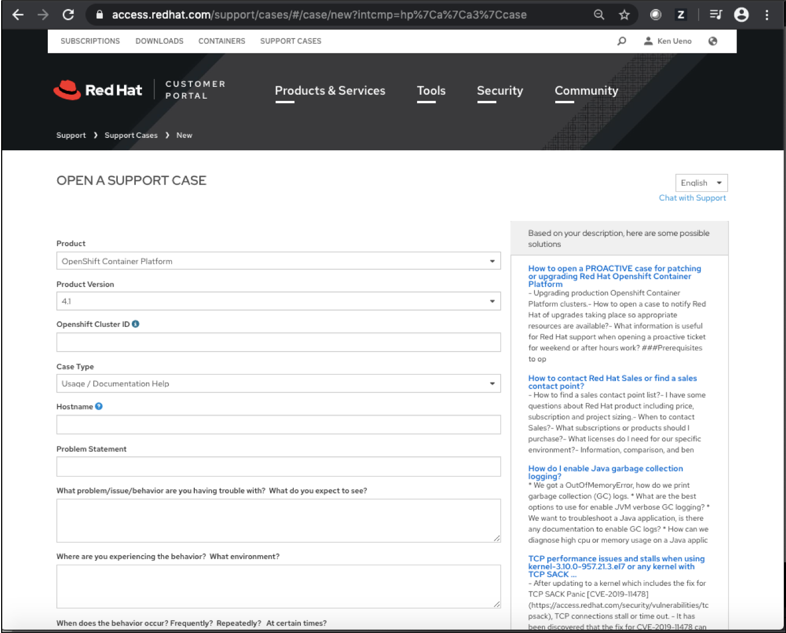

## Support Overview
As a part of Day 2 operations, you may experience issues that require opening a trouble ticket with Red Hat support.  The Red Hat Support Portal is the primary mechanism for opening and managing trouble tickets for the platform.  
* If this is a OpenShift platform provided/managed by a third party, please ensure that you utilize the defined procedures provided to you as they may own/manage issues

In addition, Red Hat support (unless an add-on Entitlement has been purchased), will not accept problems related to Application Development.  However, if the Platform issue is the root cause of the Application Development issue, then it would be supported..
As part of opening the trouble ticket, it is expected and normal that you have the following information ready and available to ensure rapid response.  Detailed instructions on using the Red Hat Support Portal can be found at:
[Red Hat Support Portal](https://access.redhat.com/articles/38363)  


## Mapping to Personas

Persona | task
--- | ---
DevOps Engineer, SRE | Getting support
DevOps Engineer, SRE | Gathering data


## Getting support
In case you need help from Red Hat Support team, through the Customer Portal, you can submit a support case to Red Hat Support.
You access the URL https://access.redhat.com/ and click **Open a Support Case** button.  


Or you access the URL https://access.redhat.com/support/ and click **OPEN NEW CASE** button.  


Then you will get an **OPEN A SUPPORT CASE** page as follow and fill in blanks.  Then, submit it to the support.    

  


## Gathering data about your cluster
When opening and submitting a support case, it is recommended to provide the following information about your cluster to Red Hat Support to aid in troubleshooting:
- Data gathered using the **oc adm must-gather** command
- The unique cluster ID.

[Here](https://github.ibm.com/CASE/OCP-Day2-operations/blob/master/Support/must-gather.txt) is the sample output of the **oc adm must-gather** command.  
Note that the oc adm must-gather command will take a few minutes to complete.    


There are a few ways to get the unique cluster ID.  
You can get it via the **oc get clusterversion** command as follow.
```
$ oc get  clusterversion version -o jsonpath='{.spec.clusterID}{"\n"}'
```
You can also access this information from the console using the (?), help, button, located in the top right corner of the UI, and selecting the **About** option.  
Then, you will get a new window and see the Cluster ID as shown in below.
  


## Impacting to your SLA
When you had an issue with your OpenShift which caused an outage of your service, you opened an issue with Red Hat. If they took 4 hours to get you a solution, you lost 4 hours of uptime.  

To solve the issue quicker, you need to understand how to open a support ticket and how to gather necessary data for problem determination.  We would recommend you to do a rehearsal if possible. 
For example, you would have an experience to open a support ticket to get familiar with the procedure including how to find out the cluster ID as we mentioned before.  

Here is another example. If you kicked off the **oc adm must-gather** command from remote terminal and the network transfer is not high enough, it may take longer than you would expect.  We saw that it took an hour to complete the command. You probably need to try the command to find out how long it will take because it will impact your SLA. You would gather data as quick as possible to send it to the support when you have an outage. Any incidents that cause outages or hits against the agreed upon SLAs should be capture and included within the platform performance measurements / your root cause analysis.  


## Simplifying OpenShift Case Information Gathering Workflow: Must-Gather Operator
While using the **must-gather** command is fairly straightforward, the full end-to-end process to facilitate all of the available tasks can be time consuming. This process involves issuing the command, waiting for the associated tasks to complete, and then upload the resulting information to the Red Hat case management system.  
The must-gather operator streamlines running the must-gather command and uploading the results to the Red Hat case management system. The **must-gather** operator is intended to be used only by the cluster administrator as it requires elevated permissions on the cluster.  

https://blog.openshift.com/simplifying-openshift-case-information-gathering-workflow-must-gather-operator/   


## Implementing Support

In this section, we will put a couple of lines.  Mainly, you will put the link to other page which discussed "how".


## Kubernetes
n/a 


## OpenShift
The information we provide in this page is based on the OpenShift implementation.


## On IBM Cloud
In case you are using OpenShift **Managed** service from your cloud provider such as IBM Cloud and Azure, you would need to understand the support policy with your cloud provider.


## With IBM Cloud Pak for MCM
n/a


## Others
If you have contract from 3rd vender to manage your OpenShift cluster, you need to follow the support policy provided by them. 


## Other consideration
n/a


## Link to the official document
Please read the official document for more information.  

https://docs.openshift.com/container-platform/4.3/support/getting-support.html
https://docs.openshift.com/container-platform/4.3/support/gathering-cluster-data.html  


