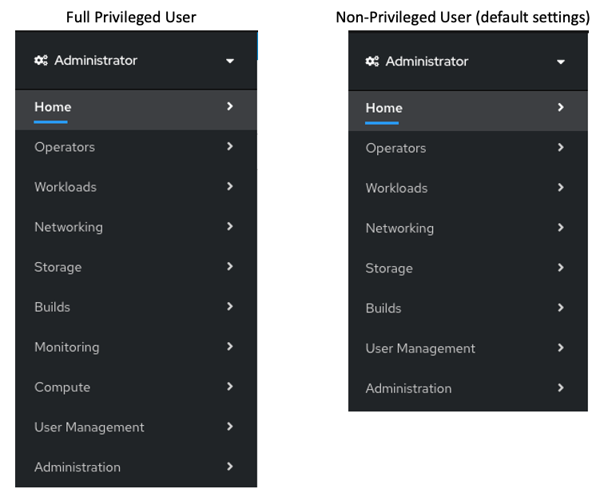
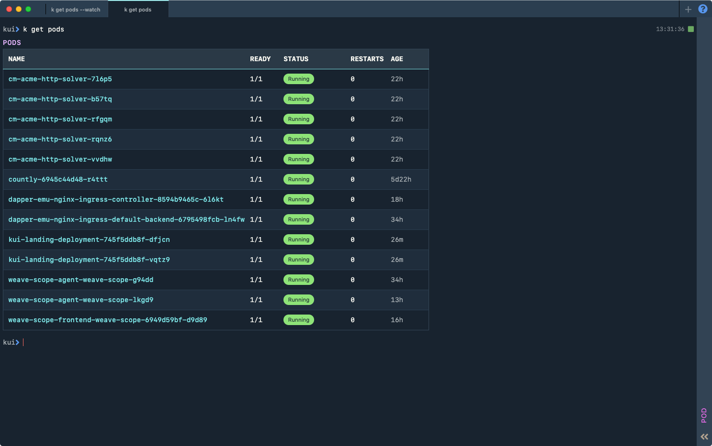

## Web Console Access Overview
The OpenShift Container Platform Web Console is a user interface accessible from a web browser. Developers can use the Web Console to visualize, browse, and manage the contents of projects.  
After your OpenShift installation is completed then you can immediately access the Web Console.  In fact, the OpenShift installation script will display how access the webconsole as part of the installation complete message.  

To see more information please see the [Online documentation of the Web Console](https://docs.openshift.com/container-platform/4.3/web-console/web-console.html)

## Day 1 Platform
As Day 1 tasks (or a preparation of the Day 2 tasks), you need to prepare the certificate for the URL of Web Console. During the installation, the self-singed certificate for the URL of Web Console access will be generated.

## Day 2 Platform
We can modify and customize the OpenShift Web Console.  We can also disable it.
- [Configuring the Web Console](#configuring-the-web-console): You can modify the OpenShift Container Platform Web Console
- [Customizing the Web Console](#Customizing-the-web-console): You can customize the OpenShift Container Platform Web Console
- [Managing Developer access (user permissions)](#Managing-Developer-access): Based on the RBAC rules, you can disable/enable capabilities on the Web Console
- [Disabling the Web Console](#Disabling-the-web-console): You can disable the OpenShift Container Platform Web Console
- [Updating the certificate for the Web Console URL](#Updating-the-cert-for-the-web-console): You can replace the default certificate of the Web Console URL.

## Day 1 Application
N/A 

## Day 2 Application
- [Developer Console](#The-Developer-perspective): The Developer perspective provides workflows specific to developer use cases

## Mapping to Personas

Persona | Day 2 Tasks
--- | ---
SRE | Configuring the Web Console
SRE | Customizing the Web Console
SRE | Updating the certificate for the Web Console URL
SRE | Disabling the Web Console 
DevOps/SRE | The Developer perspective

## Configuring the Web Console 
You can modify the OpenShift Container Platform Web Console to set a logout redirect URL or disable the console by editing the console.config.openshift.io resource.  

https://docs.openshift.com/container-platform/4.3/web_console/configuring-web-console.html  

## Customizing the Web Console 
You can customize the OpenShift Container Platform Web Console including the followings:
- Adding a custom logo and product name
- Creating custom links in the Web Console
- Defining a template for an external log link
- Creating custom notification banners
- Customizing CLI downloads
- Adding YAML examples to Kubernetes resources

It is especially helpful if you need to tailor the Web Console to meet specific corporate or government requirements.

https://docs.openshift.com/container-platform/4.3/web_console/customizing-the-web-console.html  

## The Developer perspective 
The OpenShift Container Platform Web Console provides two perspectives; the Administrator perspective and the Developer perspective. 
The Developer perspective provides workflows specific to developer use cases, such as the ability to:
- Create and deploy applications on OpenShift Container Platform by importing existing codebases, images, and dockerfiles.
- Visually interact with applications, components, and services associated with them within a project and monitor their deployment and build status.
- Group components within an application and connect the components within and across applications.
- Integrate serverless capabilities (Technology Preview).
- Create workspaces to edit your application code using Eclipse Che.

https://docs.openshift.com/container-platform/4.3/web_console/odc-about-developer-perspective.html  

## Managing Developer access (User permissions)
You can manage what capabilities are enabled/disabled on the Web Console for the DevOps engineer based on the RBAC rules.
For example, with the no-privileged user's default settings, there is no "Monitoring" and "Compute" menu in the Administrator view.

You can find the default user permissions in [here](https://github.ibm.com/CASE/OCP-Day2-operations/blob/master/UserManagement/rbac/default_user_permissions.md). 

You can find out the information about the RBAC in [here](../../User/).  

## Updating the certificate for the Web Console URL
When you build an OpenShift 4 cluster, a self-signed certificate is applied to HTTPS endpoints such as the Web Console and API server by default.  
Therefore, a certificate verification error occurs when accessing with a browser or the oc command, and it is necessary to perform an operation of "permit access to potentially insecure endpoints", so in operations such as a production environment, it is not a good idea to keep using as it is.   
In other words, you would replace it with a formal certificate if necessary.  
In addition to the certificate corresponding to the API server (api. <OpenShift 4 cluster domain>), the certificate requires a wildcard certificate (* .apps. <OpenShift 4 cluster domain>) corresponding to Router.  
Replacing a certificate is a very simple task. You will login to the cluster as a user with the cluster-admin role and applying the prepared formal certificate with the oc command.  

See the OpenShift official document for detailed instructions.  
https://docs.openshift.com/container-platform/4.3/networking/ingress-operator.html#nw-ingress-setting-a-custom-default-certificate_configuring-ingress

## Disabling the Web Console 
If you have any reason that you are not allow to use the Web Console of your OpenShift cluster, you can disable the OpenShift Container Platform Web Console by editing the console.operator.openshift.io resource.

https://docs.openshift.com/container-platform/4.3/web_console/disabling-web-console.html  

## Implementing Web Console
Since Web Console in OpenShift is the feature comes with OpenShift.  Which means that the information we mentioned above are for OpenShift only.

## Kubernetes
Kubernetes provides the Web Console but it is not included in OpenShift.  In other words, OpenShift Web Console contains most of features which Kubernetes Web Console provides and therefore we don't need to use Kubernetes Web Console feature to manage OpenShift.  

https://kubernetes.io/docs/tasks/access-application-cluster/web-ui-dashboard/  

## OpenShift
Information described in the previous sections are applicable only for OpenShift.

## On IBM Cloud
OpenShift **managed service** which is provided by **IBM Cloud** provides its unique dashboard as well as OpenShift Web Console which we described in this document above.

## With IBM Cloud Pak for MCM
N/A

## Others

**KUI**
KUI does not come with OpenShift.  KUI is an open source kubernetes application.  KUI is a Visual Web Terminal that allows you to interact with multiple command line tools in order to minimize context switching and get more done in a single place.

The following is a sample of running a kubectl get pods.  It displays the output in a nice graphical format, and it provides context senstive next action.

If you click on the name of the pods then it will display the output of the kubectl desc podsname.

More information about KUI can be found in the [KUI webpage](https://kui.tools/)

## Other consideration

n/a
