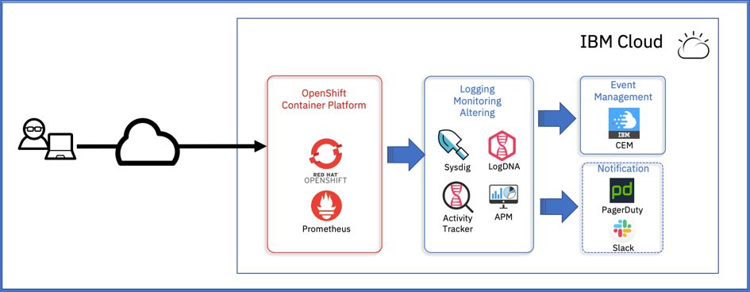
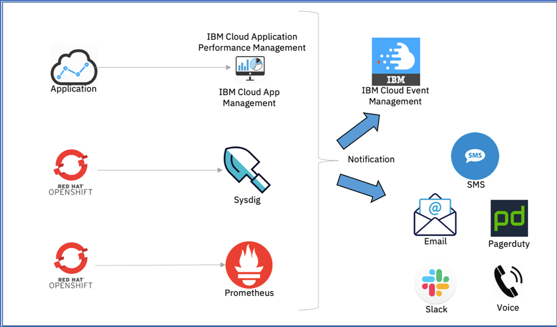
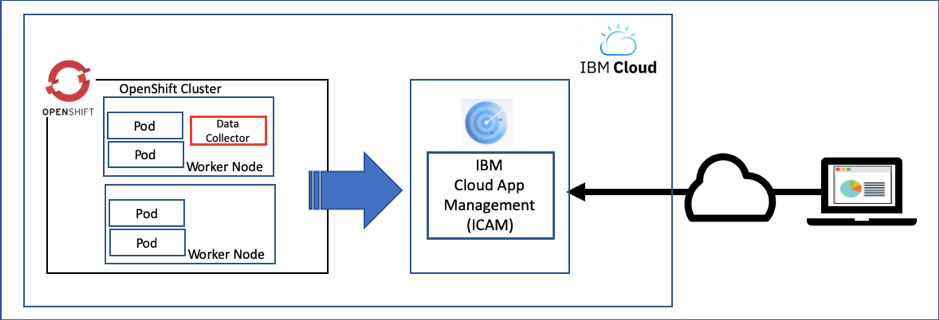
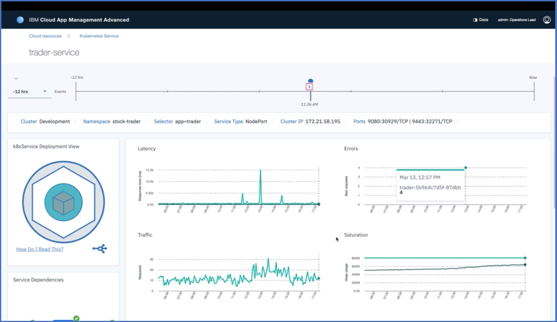
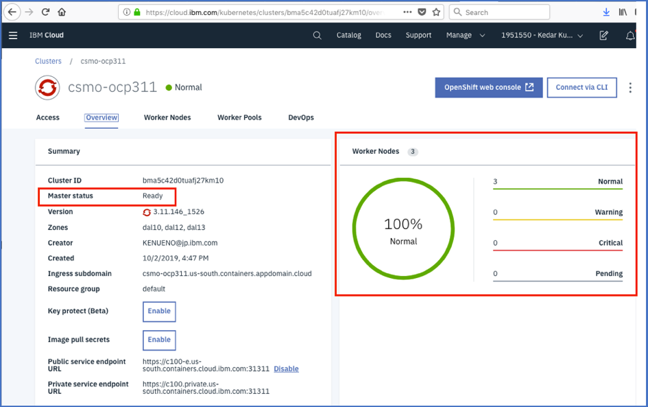
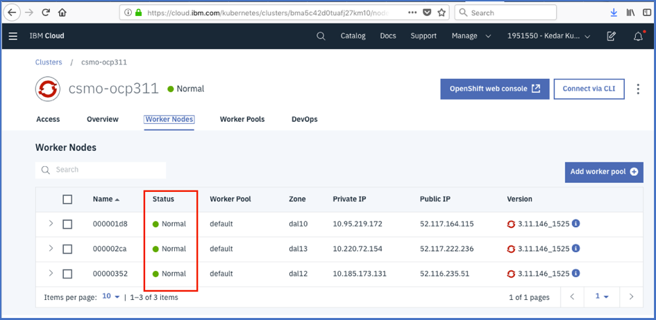
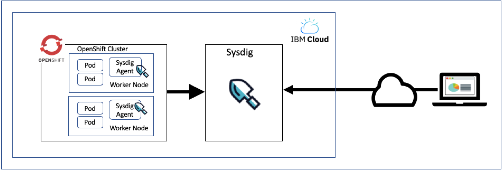
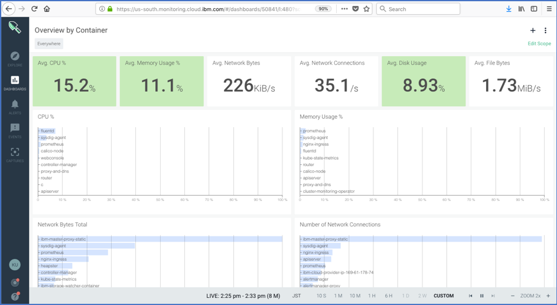
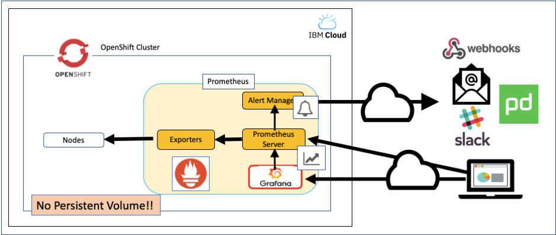
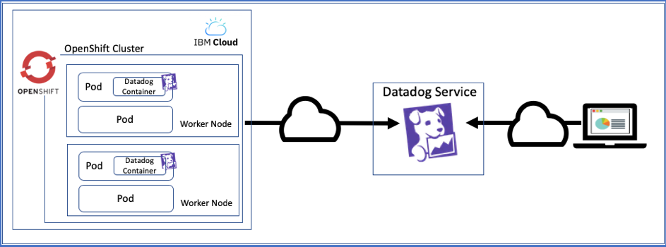

## Monitoring Solutions on IBM Cloud

Red Hat OpenShift Container Platform has been one of popular platforms for the Cloud computing environment and it will take an important role in IBM Cloud strategy.  

There are several infrastructures which OpenShift supports such as AWS, Azure, VMware, and Bare Metal servers. 

At 1st of August in 2019, Red Hat OpenShift on IBM Cloud was first generally available with OpenShift version 3.11 as well.  
We have a series of technical documents which talk about the Day2 operation solution for OpenShift.  

This document is a part of the series of those documents.  In this document, we will discuss the overview of observability solutions for the OpenShift such as monitoring, logging, and event management.  Especially, we focus on the solution on IBM Cloud in this document.  We will provide deeper discussions of those solutions in another document.  

There ware separate pages which cover the observability solutions on other Cloud providers such as AWS as well as on-premise environment such as on VMware.

## Overview of the Observability Solutions on IBM Cloud

The overview of the observability solutions for OpenShift on IBM Cloud is shown in below.  

On IBM Cloud, there are many services available to manage OpenShift such as IBM Cloud Monitoring with Sysdig for Monitoring, IBM Log Analysis with LogDNA for Logging, IBM Cloud Activity Tracker with LogDNA for Auditing, and so on.  

## Monitoring Solutions

Metrics would be useful to monitor OpenShift cluster. You can use OpenShift features and/or the services on IBM Cloud to monitor the health of the cluster. There are a few solutions available to monitor OpenShift on IBM Cloud.  

## Choosing a monitoring solution

There are many metrics you can gather in OpenShift.  The following table shows a list of tools which gather metrics with OpenShift on IBM Cloud.  

|Metrics|Tools|
|:---|:---|
|Application Metrics|Prometheus|
||IBM Cloud Application Performance Management|
||Node Exporter with Prometheus/Grafana dashboard|
|System Metrics:  Worker Nodes Metrics|Heapster (kubectl top command)|
||IBM Cloud Console|
||IBM Monitoring with Sysdig dashboard|
||cAdvisor (Kubelet)|
|System Metrics:  Pods/Containers Metrics|kube-state-metrics with Prometheus/Grafana dashboard|
||Heapster (kubectl top command)|
||IBM Cloud Console|
||IBM Monitoring with Sysdig dashboard|

For the application metrics, we will talk about the IBM Cloud Availability Monitoring and Prometheus in the following sections.  

For the system metrics, we will talk about Grafana dashboard, IBM Cloud Console, and IBM Monitoring with Sysdig dashboard in the following sections.  

With those monitoring solutions, you would use other tools such as IBM Cloud Event Management, PagerDuty, Slack, Email, and so on to generate/receive alerts and events as shown in below.  

As mentioned in the table above, there are three tools we would introduce for applications monitoring.  With any tools, you might want to report several metrics such as “number of requests received”, “number of successfully processed requests”, and “number of failed requests”.  You would find out what metrics you need for your application and if you can gather those metrics with the tools we will explain.  

## Monitor Applications by Prometheus

You can also monitor your applications by Prometheus.  The OpenShift on IBM Cloud includes the built-in Prometheus which can be used for the platform monitoring but for the application monitoring.  Therefore, you need to install your own Prometheus to gather metric for your application.  

## Monitor Applications by IBM Cloud Availability Monitoring

By using IBM Cloud Availability Monitoring, you can monitor the responsiveness and throughput of your Cloud Foundry applications which are running on IBM Cloud.  You can also proactively detect, isolate, and diagnose performance issues of your Cloud Foundry applications before they impact users of your Cloud Foundry applications.  The IBM Cloud Availability Monitoring dashboard displays availability and response time information for monitored URLs of your Cloud Foundry applications.
What does this mean is that the IBM Cloud Availability Monitoring service does NOT support your applications running on the OpenShift on IBM Cloud unfortunately.  

## Monitoring Applications by IBM Cloud Application Performance Monitoring

IBM Cloud Application Performance Monitoring is an solution to monitor application performance. IBM provides it as a SaaS offering running on IBM Cloud.  With this offering, you can monitor your OpenShift resources at OS level.  At the current version, it doesn't provide you at the container nor application level performance metric unfortunately. 

  

## Monitor Applications by IBM Cloud App Management

IBM provides another solution for your application management.  You can build an IBM Cloud App Management as your application performance solution on your IBM Cloud account.  As of writing, IBM does not provide SaaS offering with IBM Cloud App Management yet.  

With IBM Cloud App Management Advanced, you can manage your microservice-based applications such as Nodes and Liberty applications running on your OpenShift cluster on IBM Cloud as shown in below.  

## Monitor OpenShift Master on IBM Cloud

OpenShift Master is monitored by IBM. IBM Cloud automatically scans the Master for vulnerabilities that are found in Kubernetes. If vulnerabilities are found, IBM Cloud automatically applies fixes and resolves vulnerabilities on behalf of the user to ensure Master protection.  

## Monitor OpenShift Worker Nodes

On the Kubernetes Cluster dashboard on IBM Cloud Console, you can see the health of your Worker Nodes and status of Master as shown in below.  

You can also see each Worker nodes’ status on the Worker Nodes tab as shown in below.  

To monitor detailed metric for Worker Nodes, IBM Monitoring with Sysdig is your 1st choice of the solutions on IBM Cloud. The 2nd choice would be the built-in Prometheus in OpenShift.  

## Using IBM Cloud Monitoring with Sysdig

You can gain operational visibility into the performance and health of the OpenShift by deploying Sysdig agent to OpenShift Worker Nodes to forward metrics to IBM Cloud Monitoring with Sysdig as shown in below.  

For your reference, the following figure shows a sample data on the Sysdig Dashboard on IBM Cloud with the OpenShift cluster.  
  

## Using Built-in Prometheus

You can configure other tools for more monitoring capabilities, such as Prometheus. Prometheus is an open source monitoring, logging, and alerting tool that was designed for Kubernetes. The tool retrieves detailed information about the cluster, worker nodes, and deployment health based on the Kubernetes logging information as shown in below.  

  

As an example, the following screenshot shows the Grafana dashboard comes with the built-in monitoring solution in OpenShift on IBM Cloud.  

  

## Understanding options for monitoring on IBM Cloud

To help understand when to use the IBM Cloud Monitoring with Sysdig or the built-in OpenShift monitoring tools, you can review the following table.  

|OpenShift tools:Built-in OpenShift monitoring tools|IBM Cloud integrations:IBM Monitoring with Sysdig|
|:---|:---|
|
• OpenShift built-in monitoring pre-configured and self-updating monitoring stack for cluster components.

• Based on Prometheus open source project and ecosystem.

•Includes a set of Grafana dashboards.

• Built-in Prometheus and Grafana deployments in openshift-monitoring project for cluster metrics.

• At-a-glance, real-time view of how your pods consume cluster resources that can be accessed from the OpenShift Cluster Console.

• Monitoring is on a per-cluster basis. It provides monitoring for single cluster.

• The openshift-monitoring project stack is set up in a single zone only.

• No persistent storage is available to back up or view metric history.

• Includes a set of alerts to notify the cluster administrator about problems.
|•
Includes advanced monitoring and troubleshooting capabilities such as customizable user interface (custom dashboards) for a unified look at your cluster metrics, container security, resource usage, alerts, and custom events.

• Provides operational visibility to the performance and health of cluster components, applications, and services for multiple clusters.

• Aggregated metrics and container monitoring across clusters and cloud providers for consistent operations enablement.

• Historical access to metrics that is based on the timeline and plan, and ability to capture and download trace files.

• Highly available, scalable, and compliant with industry security standards.

• 3rd party Sysdig service agent has to be added to worker nodes to forward metrics to IBM® Cloud Monitoring with Sysdig service.

• Integrated with IBM Cloud IAM for user access management.

• Quick integration with the cluster via a script.

• Free trial to try out the capabilities.

|  

## Third-party services or configure your own logging

In case you have special requirements for monitoring, you can set up your own monitoring solution. Check out third-party monitoring services such as Datadog that you can add to OpenShift cluster.  

https://cloud.ibm.com/docs/containers?topic=containers-supported_integrations#health_services  

As an example of those monitoring services, the following figure shows an overview of monitoring service with Datadog for OpenShift on IBM Cloud.

