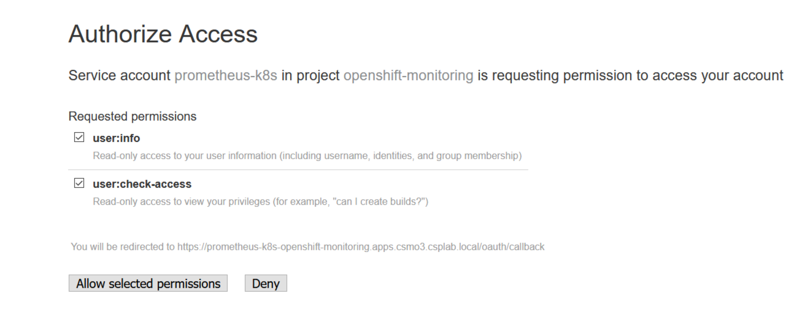

## Monitoring Overview
The approach an organization takes to Monitoring and Alerting on events of importance is one of the most important considerations for an enterprise. It is often overlooked by organizations and at times haphazardly implemented at the last minute. In many cases it does not provide the proper coverage of an application and its components.

Out of the box, the Red Hat OpenShift Container Platform provides the ability to monitor the OpenShift platform. As described below and at the links included herein, this capability should be leveraged and integrated with your enterprise event management and application performance management.

This section is based on OpenShift version 4.3. Please be sure to check the Red Hat documentation for the installed version at your location.

Please read the [Red Hat documentation](https://docs.openshift.com/container-platform/4.3/monitoring/cluster-monitoring/about-cluster-monitoring.html) for more information and guidance.

The goal of any monitoring endeavor is to provide observability of the platform and applications so that one can "ask" questions to spot anomalies and un-cover the cause of an unplanned issue as quickly as possible.

## Day 1 Platform
There are a couple of tasks for Day 1 Infrastructure as follows.  

- Installation of the Monitoring Stack is default

  Implementation of the OpenShift Infrastructure Monitoring Stack is completed during OpenShift installation. Should there be a need for additional infrastructure related monitoring. Whether it be a third party solution from IBM or others, these tools should be planned and allocated for during this phase.
The monitoring stack imposes additional resource requirements. Consult the computing resources recommendations in [Scaling the Cluster Monitoring Operator](https://docs.openshift.com/container-platform/4.3/scalability_and_performance/scaling-cluster-monitoring-operator.html) and verify that you have sufficient resources.  

- Perform Customization of Monitoring Stack

  Note that customization of the default OpenShift Infrastructure Monitoring Stack is limited. Supported customizations include adding persistent storage to monitoring components, routing notification of the defined monitoring alerts and so on. Adding new alerts or changing the predefined dashboards is not supported (as of OpenShift 4.3).
  Any configuration that is not explicitly documented [here](https://docs.openshift.com/container-platform/4.3/monitoring/cluster-monitoring/configuring-the-monitoring-stack.html) is not supported.

- [Configure Alert Manager to forward to the correct Destination](#alerting)

## Day 2 Platform

### Verify Platform Monitoring
Now that the Platform is up and running the Out of the box monitoring should be verified as operational
- [Viewing performance data in the login dashboard](#OpenShift-Dashboard)
- [Viewing Prometheus metrics](#Using-Prometheus)
- [Confirm the default Grafana dashboards are available](#Using-Grafana)
- [Verify actionable alerts are flowing to the correct destination](#alerting)     

## Day 1 Application

Though tightly coupled Application and Infrastructure monitoring are quite different. Each application presents its own characteristics which we need to monitor. For example with a Java app we may want to keep an eye on heap utilization and an app that is streaming video we may need to focus more on disk performance. The unique attributes and limits of the application should be identified in the development phase along with their affect on the infrastructure.

The cluster monitoring stack in version 4.3 includes a **Tech Preview** for monitoring your own service. Important agreement and support information [here](https://docs.openshift.com/container-platform/4.3/monitoring/monitoring-your-own-services.html).

**[Quote from Red Hat Online document](https://docs.openshift.com/container-platform/4.3/monitoring/monitoring-your-own-services.html)**
>Red Hat does not recommend using them in production. These features provide early access to upcoming product features, enabling customers to test functionality and provide feedback during the development process.

At this time in order to reduce risk for critical applications,  we recommend installing service/application monitoring outside of this monitoring stack.  

Keep in mind, the Platform is monitored quite nicely out of the box. There are numerous solutions available for Application Performance Management. Such as:
- [IBM Cloud App Management](https://www.ibm.com/support/knowledgecenter/SS8G7U_18.2.0/com.ibm.app.mgmt.doc/welcome.htm)
- [Sysdig](https://sysdig.com/)
- [Prometheus](https://prometheus.io/)
- [New Relic](https://newrelic.com/)
- and others

All deployed applications also require the business appropriate level of run time monitoring.
Key Considerations:
- Leverage Shift left testing of the application to understand the performance characteristics  
- Monitor the type of Run time (Java, Nodejs, Go. etc)
         - Logging
         - Tracing
         - Metrics: [Golden Signals](https://landing.google.com/sre/sre-book/chapters/monitoring-distributed-systems/), [RED](https://grafana.com/blog/2018/08/02/the-red-method-how-to-instrument-your-services/) or [USE](http://www.brendangregg.com/usemethod.html) Methods are recommended

- Determine depth of Monitoring based on business criticality - Beyond Metrics, Logs and Traces, Do we require Blackbox, API Health Checks, User Experience Monitoring
- Assess application performance for production readiness
- Define saturation monitors - This is not always the easiest metric to figure out. For JVMs, Heap size, and garbage collection, for a streaming application, disk I/O are metrics for saturation
- Identify run book requirements - Items such as application restart, routine maintenance garbage candidates for the runbook

Prometheus provides exporters for the most popular run times. When implemented these exporters can monitor the most popular run times [here](https://prometheus.io/docs/instrumenting/exporters/). Exporters are also available for Blackbox testing and SNMP Monitoring. Black-box testing is a method of application testing/monitoring external to the applications (URL loads, pings metrics)

You can find out an example of application monitoring with customer installed Prometheus  [here](https://github.ibm.com/CASE/openshift-custom-app-monitoring/blob/master/README.md).

 We also recommend using Build to Manage practices when building your applications please see the [Points of View](https://www.ibm.com/cloud/architecture/files/service-management-pov-csmo-build-to-manage-v1.1.pdf).  

## Day 2 Application

The APM solution of your choice should be deployed and/or the application should be instrumented to emit metrics and data  

- Verify application metrics visible in the Application Monitoring solution
- Verify initial alerts based on known application characteristics should be deployed
- Take the time to ensure application performs as expected
- Ensure depth of monitoring meets business application criticality Blackbox tests such as URLs loads or "pings", API Health Checks and Synthetic transactions should be deployed   

## Mapping to Personas

| Persona | task |
| --- | --- |
| SRE | Viewing performance data in the login dashboard |
| SRE | Viewing Prometheus metrics |
| SRE | Rendering data with the default Grafana dashboards |
| SRE | Ensure Alert  Manager is forwarding to the desired destination |
| SRE, DevOps Engineer | Verify actionable alerts are flowing |
| SRE, DevOps Engineer | Verify the application metrics visible in the Application Monitoring solution |
| SRE, DevOps Engineer | Implement alerts based on known application characteristics from testing |
| SRE, DevOps Engineer | Ensure application performs as expected |
| SRE, DevOps Engineer | Ensure monitoring depth meets business needs |

## Monitoring Day 2 Tasks

## Viewing performance data in the login dashboard: [SRE]
Once deployed, the OpenShift Web Console displays a high level view of the current performance on the main OpenShift Dashboard. KPIs such as a Cluster Health Indicator, Capacity Utilization and availability across the cluster. High level cluster information,  alerts and top Pods, are displayed as well. This is a view only interface, meaning there are no integrations or extensions available.

### Cluster Level Monitoring
When OpenShift is deployed, the Open Source monitoring and alerting tools, [**Prometheus**](https://prometheus.io/) the Prometheus [**Alert Manager**](https://prometheus.io/docs/alerting/overview/), and visualization software [**Grafana**](https://grafana.com/), are installed.

Combined this software is referred to as the Monitoring Stack in the Open Shift documentation. This Stack provides immediate monitoring and visualization of the OpenShift deployment infrastructure components. Several Grafana Dashboards are supplied which provide various views of the time-series data collected by Prometheus. The Dashboard shown below leverages the [USE Method](http://www.brendangregg.com/usemethod.html) (Utilization, Saturation and Errors) for visualization of overall cluster performance:

  

Some of the other dashboards included are:
- etcd - Metrics and etcd related performance.
- Kubernetes Compute resources for Namespace Pods, Namespace Workloads and other Compute Related Dashboards
- Use Method by Node
- Prometheus Metrics

***NOTE:*** When accessing Prometheus, Grafana or the Alertmanager for the first time you may need to enter your user:password again and allow the respective tool access to your account:

### Viewing Prometheus metrics: [SRE]
OpenShift provides a Prometheus (like) UI for viewing and generating queries against the collected data. The UI is available under the Monitoring tab by selecting metrics:

The UI allows you to:
- Generate, run and save queries
- Run a test query, great for a quick test that the Prometheus deployment is working.
- Launch the Prometheus Metrics UI

In addition to the components of the stack itself, the monitoring stack provide coverage for:

- CoreDNS
- Elasticsearch (if Logging is installed)
- Etcd
- Fluentd (if Logging is installed)
- HAProxy
- Image Registry
- Kubelets
- Kubernetes Api Server
- Kubernetes Controller Manager
- Kubernetes Scheduler
- Metering (if Metering is installed)
- OpenShift Api Server
- OpenShift Controller Manager
- Operator Lifecycle Manager (OLM)
- Telemeter client

Please see [Examining Cluster Metrics](https://docs.openshift.com/container-platform/4.3/monitoring/cluster-monitoring/examining-cluster-metrics.html) for more information on using this interface.

## Rendering data with the default Grafana dashboards: [SRE]
Verify Built-in Grafana Dashboards are properly working by selecting dashboards under the monitoring tab in the OpenShift Dashboard hamburger menu.
Open one of the available dashboards and observe the performance of the OpenShift installation.  In this example we launched the etcd dashboard.

The OpenShift Grafana deployed with the Monitoring Stack does not allow for customizations. Should you desire to build your own dashboards (using this Prometheus data source) or need to import some of the [Open Shift Dashboards from the Grafana website](https://grafana.com/grafana/dashboards?search=OpenShift), please see [Red Hat Blog: Custom Grafana dashboards for Red Hat OpenShift Container Platform 4](https://www.redhat.com/en/blog/custom-grafana-dashboards-red-hat-openshift-container-platform-4).

## Alerting: [SRE]
Included with the Monitoring Stack are ~120 predefined alerts. The Alert Manager is available by selecting Alerts under the monitoring tab in the web console.

We recommend integrating the Alert Manager and any other Monitoring tools you use with your organizations event management solution. Please see [Event management](../EventManagement) for
- more information on using the Alert Manager UI
- pre-defined alerts
- notification setup
- alert silencing and management

Also the Red Hat Documentation for managing [cluster alerts](https://docs.openshift.com/container-platform/4.3/monitoring/cluster_monitoring/managing-cluster-alerts.html).

For more information please refer to the [Alerting](../EventManagement) chapter of this repository.  

## Implementing the Monitoring Stack

## Kubernetes
Kubernetes itself does not include a monitoring solution. Kubernetes does emit a sufficient set of metrics which are available to the out-of-the-box Monitoring Stack or a variety of solutions from IBM and third parties.  

## OpenShift
The included monitoring stack in OpenShift is installed by default. The operations with OpenShift monitoring stack we described in this document come with OpenShift.

## OpenShift managed service on IBM Cloud  
You can find what solutions are available for monitoring and alerting on IBM Cloud in [here](ibmcloud).  

## With IBM Cloud Pak for MCM
IBM CloudPak for Multi Cloud Manager provides the ability to manage multiple cloud environments from a single point. Items such as Cluster configuration, Application Manager, Certificate management and Governance are available.

MCM also includes IBM Cloud App Management, IBM Cloud Event Management and IBM Cloud Automation) for monitoring, alerting and managing your cluster infrastructure and applications across multiple clouds. Please note: the Multi Cloud Manager tool itself has been recently Open Sourced.

More information on this Cloud Pak is [here](https://www.ibm.com/support/knowledgecenter/SSFC4F_1.2.0/kc_welcome_cloud_pak.html).

## Others Considerations

### Remote Health Monitoring [SRE]
OpenShift has a built in health monitoring system which reports data to Red Hat. This facility uses two integrated components: Telemetry and Insights Operator.
Red Hat has chosen a select set of anonymized metric data about the health, usage, and size of your clusters and reports it to Red Hat. For more information please see this [link](https://docs.openshift.com/container-platform/4.3/support/remote_health_monitoring/about-remote-health-monitoring.html).

### Available Operators [SRE & Developer]
Please see this [link](https://docs.openshift.com/container-platform/4.3/operators/olm-what-operators-are.html) for information about the Open Shift Operators.

OpenShift provides Operators for integration with third party products such as New Relic, Sysdig, and Prometheus.

### Scalable and HA Solution for Prometheus [SRE]
Should you have the need for a solution to Federate multiple clouds and scalable and HA solution using Prometheus, [**Thanos**](https://blog.openshift.com/federated-prometheus-with-thanos-receive/) may be an solution for you.
