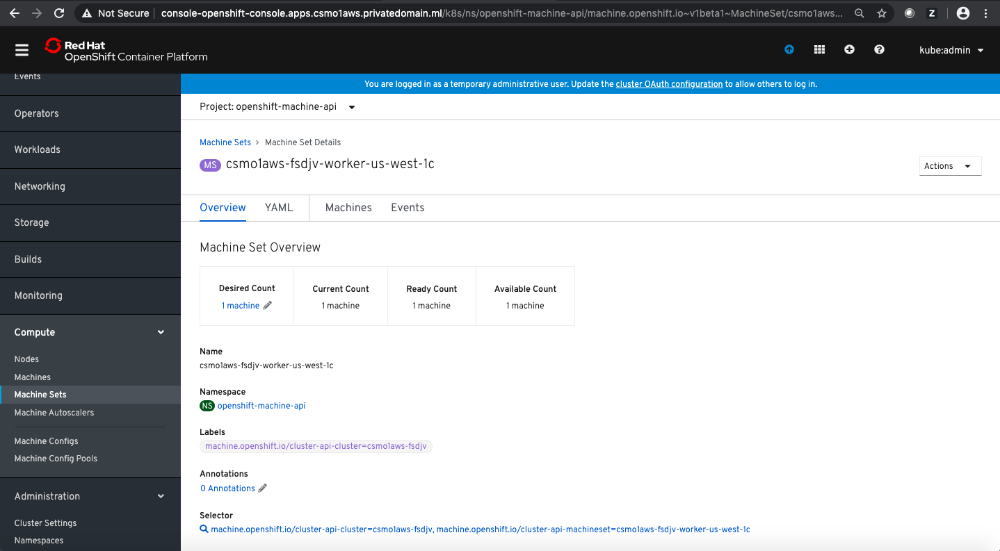

## Scalability Overview

One of the major advantages of a cloud platform such as Open Shift Container Platform is the capability to scale up resources to deal with additional load and to scale down to conserve resources when there is less load.
In this document we will detail some of the tasks relevant to scalability in OpenShift.

In practice, make sure to test the scalability capabilities of your infrastructure and ensure that your procedures are suitable. For example, attempt to roll out additional nodes gradually and don't burst out with hundreds of new nodes simultaneously. This will needlessly strain the provisioning capabilties of your infrastructure and you may hit rate-limits set by your cloud provider.

Additionally, take into account the actual availability zones your clusters require - don't perform all your scaling in one physical location.

In this document, we will focus on the Master Nodes scalability and Worker Nodes scalability.  

Note that there are two basic patterns to deploy OpenShift infrastructure:  
- User Provisioned Infrastructure (UPI) is when the resources are provisioned externally and OpenShift uses them.
- Installer Provisioned Infrastructure (IPI) is when the OpenShift installer programmatically creates the resources. 
The choice between UPI and IPI is done as part of the overall OpenShift architecture during Day 0 planning.


## Day 1 Platform

Care must be taken during the initial design and deployment of the OpenShift cluster to allow the cluster to expand. For example, set the cluster classless inter-domain routing (CIDR) to be large enough to accept the number of nodes you expect to grow into.

**Day 1 Operations tasks for Scalability:**
  
  - [Set the cluster network CIDR](#set-the-cluster-network-cidr)
  - [Set the pod capacity of Nodes](#set-the-pod-capacity-of-nodes)


## Day 2 Platform

During regular Day 2 operations the cluster may scale up, based on [Capacity](../Capacity) requirements.

- [Add Worker Nodes](#add-worker-nodes)
- [Add Worker Nodes Manually](#add-worker-nodes-manually)
- [Add Master Nodes](#add-master-nodes)


## Day 1 Application
For the purposes of this section, scaling the application is considered to be part of application management and deployment and is not covered here, but in [Build & Deploy](../BuildDeploy).


## Day 2 Application
For the purposes of this section, scaling the application is considered to be part of application management and deployment and is not covered here, but in [Build & Deploy](../BuildDeploy).


## Mapping to Personas

Persona | Task
--- | ---
SRE | Set the cluster network CIDR
SRE | Set the pod capacity of Nodes
SRE | Add Worker Nodes 
SRE | Add Worker Nodes Manually
SRE | Add Master Nodes


<a name="set-the-cluster-network-cidr"></a>

## Set the cluster network CIDR
The [CIDR](https://en.wikipedia.org/wiki/Classless_Inter-Domain_Routing) setting defines the maximum size of the overall OpenShift network.

> The default clusterNetwork cidr 10.128.0.0/14 cannot be used if the cluster size is more than 500 nodes. It must be set to 10.128.0.0/12 or 10.128.0.0/10 to get to larger node counts beyond 500 nodes.

More information can be found in the [OpenShift 4.3 documentation](https://docs.openshift.com/container-platform/4.3/scalability_and_performance/recommended-install-practices.html).


<a name="set-the-pod-capacity-of-nodes"></a>

## Set the pod capacity of Nodes

> The OpenShift Container Platform node configuration file contains important options. For example, two parameters control the maximum number of pods that can be scheduled to a node: podsPerCore and maxPods.

In Kubernetes, a pod that is holding a single container actually uses two containers. The second container is used to set up networking prior to the actual container starting. Therefore, a system running 10 pods will actually have 20 containers running.

`maxPods` sets the number of pods the node can run to a fixed value, regardless of the properties of the node.

`podsPerCore` sets the number of pods the node can run based on the number of processor cores on the node.

Setting podsPerCore to 0 disables this limit. The default is 0. podsPerCore cannot exceed maxPods.

When both options are in use, the lower of the two values limits the number of pods on a node. 

More information about configuring these settings can be found in the [OpenShift 4.3 documentation](https://docs.openshift.com/container-platform/4.3/scalability_and_performance/recommended-host-practices.html#recommended-node-host-practices_).


<a name="add-worker-nodes"></a>

## Add Worker Nodes
To manage high volume workload with your applications, the OpenShift can be scaled by adding more worker nodes manually or by the AutoScaler.  There are two ways to add worker nodes; 1). adding worker nodes manually or 2). adding worker node by AutoScaler. We will talk about those ways. You also would like to understand that there will be different ways to add worker node manually. It depends on how you create you cluster environment. We will discuss several cases such as a). Cluster in IPI (AWS, Azure, GCP), b). Cluster in UPI (VMware and Bere Metal), and c). Cluster in IBM Cloud.  


<a name="add-worker-nodes-manually"></a>

### Add Worker Nodes manually  
We will start discussing how to add worker nodes manually.  As mentioned, the steps will be different depends on the cluster environment.  We will cover 3 scenarios such as AWS for IPI, VMware for UPI, and IBM Cloud.  


### Add Worker Nodes in IPI (AWS, Azure)
To add worker nodes in IPI, you would need to know about the resources **Machine** and **MachineSet**. It is based on the Kubernets Cluster API.  You can find the information about the Cluster API in the following URL.

Kubernetes Cluster API:  
https://github.com/kubernetes-sigs/cluster-api   


### The Machine resource
The Machine is the resource which describes the status of nodes.
When you deploy your cluster in IPI, the Installer automatically creates the Machine resource for the Master and Worker nodes.

Run the `oc get machines` command to obtain the Machine resource information. You need to be a user which has cluster admin permission.
 
```
$ oc get machines -n openshift-machine-api
NAME                                     STATE     TYPE        REGION      ZONE         AGE
csmo1aws-fsdjv-master-0                  running   m4.xlarge   us-west-1   us-west-1b   43h
csmo1aws-fsdjv-master-1                  running   m4.xlarge   us-west-1   us-west-1c   43h
csmo1aws-fsdjv-master-2                  running   m4.xlarge   us-west-1   us-west-1b   43h
csmo1aws-fsdjv-worker-us-west-1b-mkdqf   running   m4.large    us-west-1   us-west-1b   43h
csmo1aws-fsdjv-worker-us-west-1b-p24nk   running   m4.large    us-west-1   us-west-1b   43h
csmo1aws-fsdjv-worker-us-west-1c-pm2bj   running   m4.large    us-west-1   us-west-1c   43h
$ 
```

The Machine is defined as the resource in the Machine API project called **openshift-machine-api**.
As you see in the command output above, the Machines are created per nodes (both Master and Worker).

There are a several options to display the output of **oc get machines** command. 

```
$ oc get machines -n openshift-machine-api -o jsonpath='{range .items[*]}{"\n"}{.metadata.name}{"\t"}{.spec.providerSpec.value.instanceType}{end}{"\n"}'

csmo1aws-fsdjv-master-0	m4.xlarge
csmo1aws-fsdjv-master-1	m4.xlarge
csmo1aws-fsdjv-master-2	m4.xlarge
csmo1aws-fsdjv-worker-us-west-1b-mkdqf	m4.large
csmo1aws-fsdjv-worker-us-west-1b-p24nk	m4.large
csmo1aws-fsdjv-worker-us-west-1c-pm2bj	m4.large
$ 
```
For your reference, further examples are available [here](./scalability_command_examples.md#oc-get-machines).

You can specify **-o yaml** option with the oc get machine command, you can find the meta date such as Machine name and Label as well as the spec information.

```
$ oc get machine/<machine_name> -n openshift-machine-api -o yaml
```


### The Machine Set resource
The MachineSet is the resource which makes a group of the Machine resource in the **openshift-machine-api** project. The MachineSet is also created by the Installer automatically.
The cluster administrator can add or remove the Machine by increasing or decresing the number of replicas of the MachineSet.
You can find out the Machine Set information by issuing the oc get machineset command as follow.

```
$ oc get machinesets -n openshift-machine-api
NAME                               DESIRED   CURRENT   READY   AVAILABLE   AGE
csmo1aws-fsdjv-worker-us-west-1b   2         2         2       2           2d12h
csmo1aws-fsdjv-worker-us-west-1c   1         1         1       1           2d12h
$
```

You can also get the MachineSet information as the YAML format with the **-o yaml** option for the oc get machineset command.
```
$ oc get machineset/<machineset_name> -n openshift-machine-api -o yaml
```

You can get detailed information of the machinesets by executing **oc describe machinesets** command. You can find some examples of the use of [oc commands](./scalability_command_examples.md#oc-describe-machine).


The MachineSet for the Machine of Worker nodes is created automatically in the **Availability Zone** which you specify during the cluster installation.

You can find out on which Availability Zone is used if you see the **providerSpec**.  You may need to add the new MachineSet if a new Region or new Availability Zone is added in your Cloud provider.  


### Adding / Removing Machine

To add the Machine to a specific Availability Zone, you can run the **oc scale** command.  It will increase the number of replica of MachineSet. The following is an example to add two worker nodes.

```
$ oc scale machineset csmo1aws-fsdjv-worker-us-west-1c --replicas=2 -n openshift-machine-api
machineset.machine.openshift.io/csmo1aws-fsdjv-worker-us-west-1c scaled
$
```

By the command above, the number of replica of the MachineSet will become 2.  The worker nodes and Machine in the availability zone in the MachineSet will be 2 as well.

If you removed applications/services or decrease workload for some reason, you may want to reduce number of worker nodes.  If that's the case, then you can run oc scale command and specify appropriate number of replicas as follow. 

```
$ oc scale machineset csmo1aws-fsdjv-worker-us-west-1b --replicas=1 -n openshift-machine-api
machineset.machine.openshift.io/csmo1aws-fsdjv-worker-us-west-1b scaled
$
```

In this case, the number of replica will be 1.

After you execute the command, you can verify the result with the commands such as **oc get machines** and/or **oc get nodes**.  

In our example above, the number of workers on us-west-1b zone is 1 and the number of workers on us-west-1c zone is 2.

```
$ oc get machines -n openshift-machine-api
NAME                                     STATE     TYPE        REGION      ZONE         AGE
csmo1aws-fsdjv-master-0                  running   m4.xlarge   us-west-1   us-west-1b   2d13h
csmo1aws-fsdjv-master-1                  running   m4.xlarge   us-west-1   us-west-1c   2d13h
csmo1aws-fsdjv-master-2                  running   m4.xlarge   us-west-1   us-west-1b   2d13h
csmo1aws-fsdjv-worker-us-west-1b-gx8d2   running   m4.xlarge   us-west-1   us-west-1b   4m33s
csmo1aws-fsdjv-worker-us-west-1c-5sr2w   running   m4.xlarge   us-west-1   us-west-1c   17m
csmo1aws-fsdjv-worker-us-west-1c-x8gxr   running   m4.xlarge   us-west-1   us-west-1c   6m38s
$
```

```
$ oc get nodes
NAME                                         STATUS   ROLES    AGE     VERSION
ip-10-0-129-227.us-west-1.compute.internal   Ready    master   2d13h   v1.14.6+cebabbf4a
ip-10-0-136-11.us-west-1.compute.internal    Ready    worker   57s     v1.14.6+cebabbf4a
ip-10-0-139-19.us-west-1.compute.internal    Ready    master   2d13h   v1.14.6+cebabbf4a
ip-10-0-146-131.us-west-1.compute.internal   Ready    worker   3m8s    v1.14.6+cebabbf4a
ip-10-0-146-194.us-west-1.compute.internal   Ready    worker   13m     v1.14.6+cebabbf4a
ip-10-0-151-108.us-west-1.compute.internal   Ready    master   2d13h   v1.14.6+cebabbf4a
$ 
```  


### Adding / Removing worker nodes via Web Console
You can also add/remove worker nodes via Web Console.
1. Login with the cluster admin permission
2. Go to Compute --> Machine Sets


3. Select MachineSet on the list and click it
4. Click on X machine under the **Desired Count** on the **Overview** tab in the **Machine Set Details** page


5. On the Edit Count window, type the replica number which you want to have and click on Save button

In our example, we updated the replica number from 1 to 2 for the csmo1aws-fsdjv-worker-us-west-1c Machine Set.

6. Once it's done, then the worker nodes will be added/removed.  
   
   As you see above, the Desired Count becomes 2 in our case.  
   You can also find out that there is a new node created in the us-west-1c zone.
      


## Add Worker Nodes in UPI (VMware, Bare Metal)
The worker nodes can be added using the same steps as the control plane nodes. 

Create a new VM with the RHCOS installer as normal, using the **worker.ign** file generated during the original install. During the machine's start up, it will sync with the existing OpenShift cluster's **Machine Config Operator** to be admitted into the cluster.

Note: it may be required to manually approve the node's CSR (Certificate Signing Request) as described in the installation documentation of vSphere or Baremetal.   


## Add Worker Nodes in IBM Cloud (a.k.a. ROKS)
With IBM Cloud, adding worker nodes in the OpenShift cluster will be done by IBM Cloud Console or by using the IBM Cloud CLI with commands such as 
  `ibmcloud ks worker-pool resize --cluster <cluster_name_or_ID> --worker-pool <pool_name>  --size-per-zone <number_of_workers_per_zone>`
More information can be found in the [ROKS documentation](https://cloud.ibm.com/docs/containers?topic=containers-add_workers).


## Add Worker Nodes by AutoScaler  
In the previous section, we discussed how to add worker nodes manually.  In this section, we will show you how to add worker nodes by the AutoScaler. With the Auto Scaling capability in OpenShift, the worker nodes will be added / removed automatically based on the application deployment status. You need to understand two more resources such as **ClusterAutoscaler** and **MachineAutoscaler** in addition to Machine and MachineSet resources. 


### Create ClusterAutoscaler
The ClusterAutoscaler is a resource for automatically adjusting the size of OpenShift cluster. In the ClusterAutoscaler resource, it describes the maximum number of nodes, the possibility of scaling down, and the minimum and maximum values of CPU, memory, and GPU that can be used by the cluster. When it does the auto scaling (scale up), the upper limit defined by the ClusterAutoscaler will not be exceeded. Note that the ClusterAutoscaler is set for the OpenShift cluster wide, so that only one ClusterAutoscaler can be created per cluster. It is not tied to a specific project. The ClusterAutoscaler is managed by the Operator.  

The following example creates a YAML file that describes a resource named "ca-sample" and creates a ClusterAutoscaler resource with the oc create command. In this sample resource, the upper limit of the total number of nodes in the cluster is 10 and auto scale down is enabled.

```
$ cat << EOF  > cluster-autoscaler-sample.yaml
apiVersion: "autoscaling.openshift.io/v1"
kind: "ClusterAutoscaler"
metadata:
  name: "ca-sample"          ## Name of the ClusterAutoscaler resource
spec:  
  resourceLimits:    
    maxNodesTotal: 10        ## Max number of nodes in the cluser  
  scaleDown:    
    enabled: true            ## Enable Scale Down
EOF

$ oc create -f cluster-autoscaler-sample.yaml
```   


### Create MachineAutoscaler
The MachineAutoscaler is a resource for automatically adjusting the number of Machines in the MachineSet. The number of Machines is adjusted so as not to exceed the upper limit defined by the ClusterAutoscaler. The MachineAutoscaler is required to determine which MachineSet the ClusterAutoscaler will adjust the number of replicas for.  

The following example creates a MachineAutoscaler resource named ma-sample01. The number of replicas is automatically adjusted within the range of 1 to 5 for the specified MachineSet. The MachineAutoscaler is created in the openshift-machine-api project as well as the Machine and the MachineSet. You can check the created the ClusterAutoscaler and the MachineAutoscaler information with the oc get command.

```
$ cat << EOF  > machine-autoscaler-sample01.yaml
apiVersion: "autoscaling.openshift.io/v1beta1"
kind: "MachineAutoscaler"
metadata:
  name: "ma-sample01"
  namespace: "openshift-machine-api"
spec:
  minReplicas: 1                       ## Min replica number of MachineSet
  maxReplicas: 5                       ## Max replica number of MachineSet
  scaleTargetRef:    
    apiVersion: machine.openshift.io/v1beta1
    kind: MachineSet
    name: <clusterID>-ap-northeast-1a   ## Specify an existing MachineSet name
EOF
$ oc create -f machine-autoscaler-sample01.yaml
```  

Note that the AutoScale function by ClusterAutoscaler will not work unless the following two conditions are met.
- MachineAutoscaler is set for all MachineSets
- The number of replicas of all MachineSets is set to 1 or more and one or more Machines are operating.  


Check to see if it works. Create a job like the following, and start a large number of containers at once that only execute the sleep command.

```
$ cat << EOF  > job-work-queue-sample.yaml
apiVersion: batch/v1
kind: Jobmetadata:
  generateName: work-queue-  
  namespace: autoscale-demo01
spec:  
  template:    
    spec:      
      containers:      
      - name: work        
        image: busybox        
        command: ["sleep",  "300"]        
        resources:          
          requests:            
            memory: 500Mi            
            cpu: 500m        
        restartPolicy: Never  
  completions: 20  
  parallelism: 20
EOF

$ oc new-project autoscale-demo01; oc project autoscale-demo01
$ oc create -f job-work-queue-sample.yaml
```

Assuming that your OpenShift cluster has the default configuration. With the above example, the resource is not enough to deploy pods at once.  Therefore, after a while, the worker node will be added automatically.  The pod status will be changed from **Pending** to **Running**.  Then the pod which was on hold will be deployed.
You can run **oc get nodes** command and/or oc get pods command to see those behavior.  You can also verify that the worker node will be delete automatically if you delete a newly created pod by issuing **oc delete project** which will also delete the project.

Note that there are a few cases which the ClusterAutoscaler doesn't remove worker nodes.  For example, if the pod is using the local storage on the worker node, the worker node won't be removed by the ClusterAutoscaler.  Another example is that the pod which won't be move to other worker node due to the cluster resource shortage, then the worker will not be removed by the ClusterAutoscaler.  


<a name="add-master-nodes"></a>

## Add Master Nodes
There should be at least 3 Master nodes deployed with OpenShift 4.x.  If you wish to add new masters due to load (on etcd, for example) then the procedure for adding a new master is the same as adding a regular worker node, except that the node must have the label `machineconfiguration.openshift.io/role: infra` instead of `worker`.


