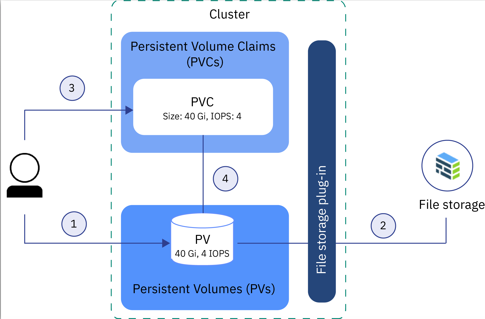
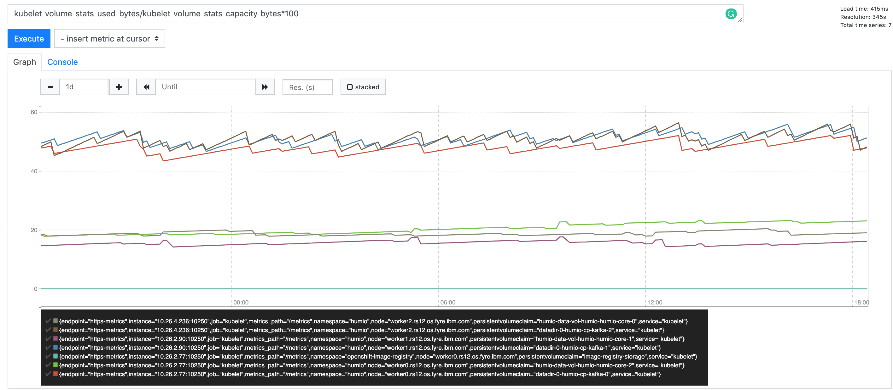
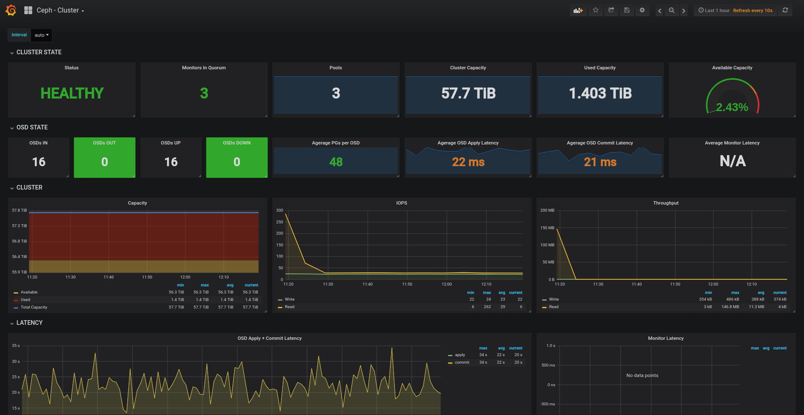

## Storage Overview

OpenShift Container Platform uses the kubernetes Persistent Volume (PV) framework that abstracts details of how storage is provided from how it is consumed. This is mainly done by two kubernetes API resources: PersistentVolumes and PersistentVolume Claims. 

Persistent Volumes (PV) are storage units that have been provisioned by an administrator or dynamically provisioned using Storage Classes. They are independent of any single pod, breaking them free from the ephemeral life cycle of pods. At its core, a volume is just a directory, possibly with some data in it, which is accessible to the containers in a pod. How that directory comes to be, the medium that backs it, and the contents of it are determined by the particular volume type used.

Persistent Volume Claims (PVC), on the other hand, are requests for the storage, i.e. PVs. Developers can use Persistent Volume Claims (PVCs) to request PV resources without having specific knowledge of the underlying storage infrastructure.

There are two ways of dealing with kubernetes storage: static or dynamic which is more commonly used.

With static provisioning, administrators provision PVs that they think pods might require before the actual requests are made, and these PVs are manually bound to specific pods with explicit PVCs.

Dynamic provisioning is done with Storage Classes. Cluster administrators do not need to manually create the PVs beforehand. They instead create multiple profiles of storage, just like templates. When a developer makes a PVC, depending on the requirements of the request, one of these storage classes is used at the time of the request in order to dynamically provision the PV.

The interaction between PVs and PVCs have the following lifecycle:

- [Provision storage](https://docs.openshift.com/container-platform/4.3/storage/understanding-persistent-storage.html#provisioning_understanding-persistent-storage)
- [Bind claims](https://docs.openshift.com/container-platform/4.3/storage/understanding-persistent-storage.html#binding_understanding-persistent-storage)
- [Use Pods and claimed PVs](https://docs.openshift.com/container-platform/4.3/storage/understanding-persistent-storage.html#using-pods_understanding-persistent-storage)
- [Storage Object in Use Protection](https://docs.openshift.com/container-platform/4.3/storage/understanding-persistent-storage.html#pvcprotection_understanding-persistent-storage)
- [Release volumes](https://docs.openshift.com/container-platform/4.3/storage/understanding-persistent-storage.html#releasing_understanding-persistent-storage)
- [Reclaim volumes](https://docs.openshift.com/container-platform/4.3/storage/understanding-persistent-storage.html#reclaiming_understanding-persistent-storage)

OpenShift Container Platform 4.3 supports the following PersistentVolume plug-ins:
- AWS Elastic Block Store (EBS)
- Azure Disk
- Azure File
- Cinder
- Fibre Channel
- GCE Persistent Disk
- HostPath
- iSCSI
- Local volume
- NFS
- Red Hat OpenShift Container Storage
- VMware vSphere 


## Day 1 Platform

The Storage type used within OpenShift cluster is determined by the place where you decided to deploy your cluster (on-prem or cloud provider like IBM Cloud, AWS, Google Cloud, Azure) and by specific requirements of the workloads running on the cluster(s) like speed/iops or type like block, file or object storage. RedHat OpenShift 4.3 supports several [types](https://docs.openshift.com/container-platform/4.3/storage/understanding-persistent-storage.html#types-of-persistent-volumes_understanding-persistent-storage) of storage and some of them are backed up by networked storage system such as EBS, NFS or Ceph and other are locally attached storage like Local Volume or HostPath.
The storage type used by the cluster and initial definition of storage classes should be part of the design and implementation phases (Day 0 and Day 1).

**Day 1 Platform tasks for Storage:**
- Determine the initial storage requirements
- Define the initial set of StorageClass resources  


## Day 2 Platform

The following Day 2 Operations tasks for OpenShift platform are related to storage:

- [Adding a new StorageClass](#Adding-a-new-StorageClass)
- [Changing a default StorageClass](#Changing-a-default-StorageClass)
- [Provisioning Persistent Volumes](#Provisioning-Persistent-Volumes)
  - [Static Provisioning](#Static-Provisioning)
  - [Dynamic Provisioning](#Dynamic-Provisioning)
- [Storage Monitoring](#Storage-Monitoring)
- [Expanding persistent volumes](https://docs.openshift.com/container-platform/4.3/storage/expanding-persistent-volumes.html)
- [Persistent Volume backup](#Persistent-Volume-backup)


## Day 1 Application

Without storing data in a persistent volume, the file system of a container is ephemeral. When a container restarts, the file system is reset to whatever the file system state is in the container’s image and files not stored in a persistent volume don’t survive the restart.

Enterprise application workloads frequently need a sustainable and supportable way to store data and objects in flight or as output from your applications, while taking advantage of the portability, scalability, and recoverability of containers. Instead of fighting the natural tendency of containers to be stateless and lightweight, the pattern looks to augment Kubernetes to facilitate the behaviors we want.

There are many types of storage depending on application requirements: 
- Block storage: (ex. Elastic Block Store (EBS))
- File storage: (ex. Elastic File System (EFS))
- Object storage:  (ex. Simple Storage Service (S3))

Each of these offerings has individual performance characteristics, pros, and cons. You must align your application and workload with the proper type of storage for its needs. As part of the Day 0 and Day 1 you should also estimate the initial storage space needed for application workload.

**Day 1 Application tasks for Storage:**
- Estimate the initial storage space needed for application workload
- Determine the storage type requirements for applications  


## Day 2 Application

The following Day 2 Operations tasks for OpenShift applications are related to storage:

- [Setting storage quota per project](#Setting-storage-quota-per-project--SRE-DevOps)
- [Expanding Persistent Volumes](https://docs.openshift.com/container-platform/4.3/storage/expanding-persistent-volumes.html)
- [Application Storage Monitoring](#Application-storage-monitoring--SRE-DevOps)

## Mapping to Personas

Persona | task
--- | ---
SRE, Storage Administrator | Adding a new StorageClass
SRE, Storage Administrator | Changing a default StorageClass
SRE, Storage Administrator | Static Provisioning
SRE, Storage Administrator | Backing up Persistent Volumes
SRE, Storage Administrator | Expanding Persistent Volumes
SRE, Storage Administrator | Setting storage quota per project
SRE, Storage Administrator | Storage Monitoring
SRE, DevOps Engineer | Application Storage Monitoring
DevOps Engineer | Dynamic Provisioning   


## Day 2 Operations Tasks for Storage

<a name="Adding-a-new-StorageClass"></a>

## Adding a new StorageClass: [ SRE ]

The `StorageClass` resource object describes and classifies storage that can be requested, as well as provides a means for passing parameters for dynamically provisioned storage on demand.  StorageClass objects can also serve as a management mechanism for controlling different levels of storage and access to the storage. SREs or Storage Administrators (storage-admin) define and create the StorageClass objects that users can request without needing any intimate knowledge about the underlying storage volume sources.
StorageClass objects are a globally scoped object and must be created by `cluster-admin` or `storage-admin` users.
[OpenShift 4.3 documentation specifies how to define StorageClass objects for various types of supported storage](https://docs.openshift.com/container-platform/4.3/storage/dynamic-provisioning.html#defining-storage-classes_dynamic-provisioning).  


<a name="Changing-a-default-StorageClass"></a>

## Changing a default StorageClass: [ SRE ]
The default StorageClass is used to dynamically provision storage for PersistentVolumeClaims that do not require any specific storage class. A new StorageClass can be marked as a new default by adding the following annotation:
```
oc patch storageclass <your-class-name> -p '{"metadata": {"annotations":{"storageclass.kubernetes.io/is-default-class":"true"}}}'
```

## Provisioning Persistent Volumes
There are two ways PVs may be provisioned: statically or dynamically.

<a name="Static-Provisioning"></a>

### Static Provisioning: [ SRE ]
A cluster administrator creates a number of PVs. They carry the details of the real storage, which is available for use by cluster users. They exist in the Kubernetes API and are available for consumption.
Static provisioning is a feature that is native to Kubernetes and that allows cluster administrators to make existing storage devices available to a cluster. As a cluster administrator, you must know the details of the storage device, its supported configurations, and mount options.

To make existing storage available to a cluster user, you must manually create the storage device, a PV, and a PVC.

The following image shows how to statically provision file storage in a cluster. This sample flow works similar with other storage types, such as block storage.



1. The cluster admin gathers all the details about the existing storage device and creates a persistent volume (PV) in the cluster.
2. Based on the storage details in the PV, the storage plug-in connects the PV with the storage device.
3. The cluster admin or a developer creates a PVC. Because the PV and the storage device already exist, no storage class is specified in the PVC.
4. After the PVC is created, the storage plug-in tries to match the PVC to an existing PV. When PVC and PV match, the status of the PVC and the PV changes to `Bound`. You can now use the PVC to mount persistent storage to your app. When you delete the PVC, the PV and the physical storage instance are not removed. You must remove the PVC, PV, and the physical storage instance separately.

The process described above can be automated and partially managed by the OpenShift Operators. For example provisioning of `Local Volume` storage is managed by the `Local Storage Operator`. The Local Storage Operator automatically creates Persistent Volumes on local disk devices attached to Nodes and StorageClass that can be used during definition of Persistent Volume Claims. When PVs are ready, the SRE or DevOps Engineer can statically create a PVC using StorageClass for Local Volume Storage. [More details about Local Volume storage with practical examples](./Local/).  


<a name="Dynamic-Provisioning"></a>

### Dynamic Provisioning: [ DevOps Engineer ]
Dynamic volume provisioning allows storage volumes to be created on-demand. The dynamic provisioning feature eliminates the need for cluster administrators to pre-provision storage. Instead, it automatically provisions storage when it is requested by OpenShift cluster users like developers. The implementation of dynamic volume provisioning is based on the API object `StorageClass`. [To enable dynamic provisioning, a cluster administrator needs to pre-create one or more StorageClass objects for users](#Adding-a-new-StorageClass). 
Cluster Admins, SREs or users request dynamically provisioned storage by including a storage class in their `PersistentVolumeClaim`. Dynamic provisioning can be enabled on a cluster such that all claims are dynamically provisioned if no storage class is specified. A cluster administrator can enable this behavior by [marking one StorageClass object as default](#Changing-a-default-StorageClass).  


<a name="Storage-Monitoring"></a>

## Storage Monitoring: [ SRE ]
 
Information about current PVC utilization is provided by both `kubelet` and `kube_state_metrics` in the form of Prometheus metrics. 
SREs should monitor the following metrics related to PVC utilization and PV status.

Resource | Metrics
--- | ---
PVC | kubelet_volume_stats_available_bytes
PVC | kubelet_volume_stats_capacity_bytes
PVC | kubelet_volume_stats_used_bytes
PVC | kubelet_volume_stats_inodes_used
PVC | kubelet_volume_stats_inodes_free
PVC | kubelet_volume_stats_inodes
PV  | kube_persistentvolume_status_phase


The following PromQL query calculates the percentage utilization of PVCs:

```
kubelet_volume_stats_used_bytes/kubelet_volume_stats_capacity_bytes*100
```

Here is a sample screen shot of the Prometheus console with results of the query listed above.



Alerts related to storage, predefined in OpenShift:

|Alert | Rule |
|---|---|
| KubePersistentVolumeErrors | `kube_persistentvolume_status_phase{job="kube-state-metrics",namespace=~"(openshift-.*\|kube-.*\|default\|logging)",phase=~"Failed\|Pending"} > 0` |
| KubePersistentVolumeFullInFourDays | `(kubelet_volume_stats_available_bytes{job="kubelet",namespace=~"(openshift-.*\|kube-.*\|default\|logging)"} / kubelet_volume_stats_capacity_bytes{job="kubelet",namespace=~"(openshift-.*\|kube-.*\|default\|logging)"}) < 0.15 and predict_linear(kubelet_volume_stats_available_bytes{job="kubelet",namespace=~"(openshift-.*\|kube-.*\|default\|logging)"}[6h], 4 * 24 * 3600) < 0` |
| KubePersistentVolumeUsageCritical | `kubelet_volume_stats_available_bytes{job="kubelet",namespace=~"(openshift-.*\|kube-.*\|default\|logging)"} / kubelet_volume_stats_capacity_bytes{job="kubelet",namespace=~"(openshift-.*\|kube-.*\|default\|logging)"} < 0.03` |

Particular storage solutions also may provide additional monitoring metrics and dashboards. More information about [Rook Ceph monitoring](https://github.com/rook/rook/blob/master/Documentation/ceph-monitoring.md). Example Rook Ceph Cluster Grafana dashboard is shown below.  

    


<a name="Persistent-Volume-backup"></a>

## Persistent Volume backup [ SRE ]

OpenShift does not provide a Persistent Volume backup tooling. One of the backup options is to use third party tools [Velero](https://velero.io) or [Stash](https://stash.run/).   
Another option may be building a custom solution like in the following example: [How to backup, clone and migrate Persistent Volume Claims on OpenShift](https://blog.openshift.com/how-to-backup-clone-and-migrate-persistent-volume-claims-on-openshift/).

<a name="Setting-storage-quota-per-project--SRE-DevOps"></a>

## Setting storage quota per project [ SRE, DevOps Engineer ]

A resource quota, defined by a ResourceQuota object, provides constraints that limit aggregate resource consumption per project. It can limit the quantity of objects that can be created in a project by type, as well as the total amount of compute resources and storage that may be consumed by resources in that project.

Example storage quota for a given project:
```yaml
apiVersion: v1
kind: ResourceQuota
metadata:
  name: storage-consumption
spec:
  hard:
    persistentvolumeclaims: "10" 
    requests.storage: "50Gi" 
    gold.storageclass.storage.k8s.io/requests.storage: "10Gi" 
    silver.storageclass.storage.k8s.io/requests.storage: "20Gi" 
    silver.storageclass.storage.k8s.io/persistentvolumeclaims: "5" 
```
After a resource quota for a project is first created, the project restricts the ability to create any new resources that may violate a quota constraint until it has calculated updated usage statistics.
[More information about OpenShift project quotas](https://docs.openshift.com/container-platform/4.3/applications/quotas/quotas-setting-per-project.html).

<a name="Application-storage-monitoring--SRE-DevOps"></a>

## Application storage monitoring [ SRE, DevOps Engineer]
The storage space for specific projects and applications is assigned via specific `PersistentVolumeClaims` and can be monitored using OpenShift platform metrics described in [Storage Monitoring](#Storage-Monitoring). Mentioned metrics like `kubelet_volume_stats_used_bytes` can be filtered/aggregated by namespace name or PVC name. For example the following query returns total PVC storage usage in GB for all `humio-data.*` PVCs in the project `humio`:
```
sum(kubelet_volume_stats_used_bytes{namespace="humio", persistentvolumeclaim=~"humio-data.*"}/1024/1024/1024)
```

## Storage configuration examples

- [IBM Cloud](ibmcloud)
- [Local Volumes](./Local/)
- [Ceph Block Storage via Container Storage Interface](ceph-csi)
- [VMware vSphere](vmware)
- [OpenShift Container Storage](openshift-container-storage)
