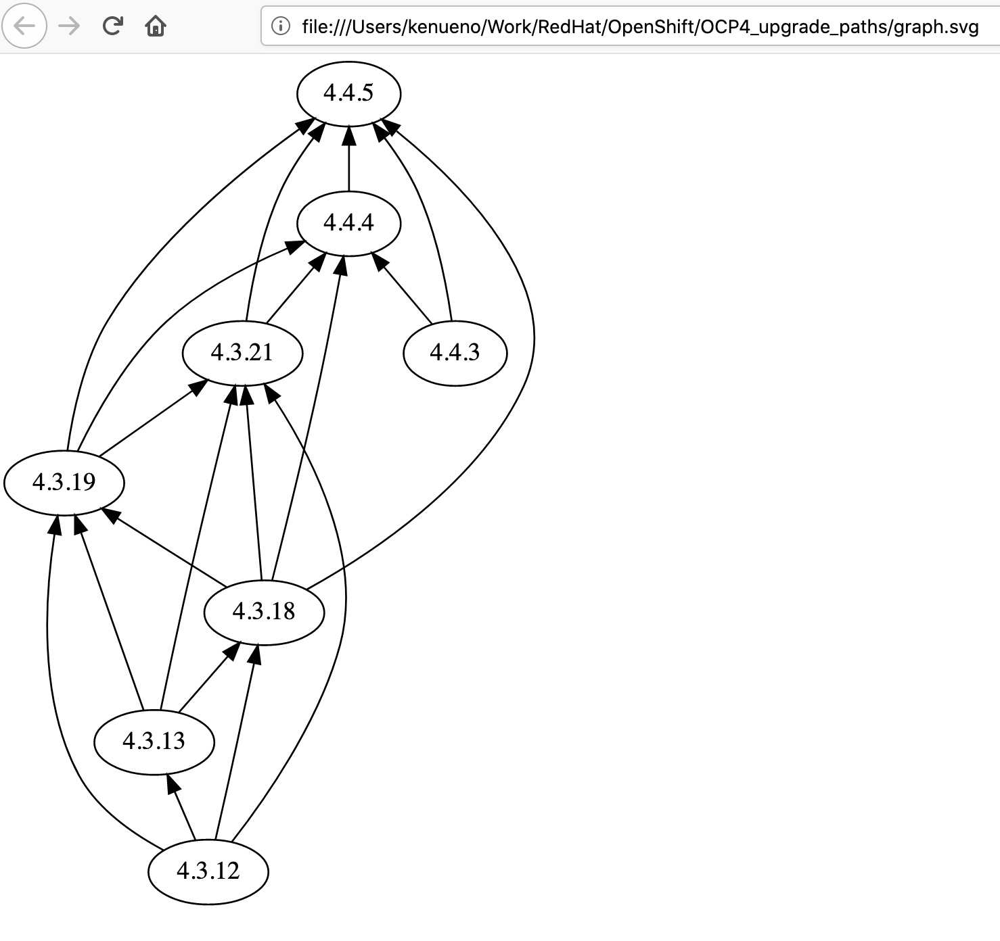

## OpenShift Container Platform (OCP) 4 upgrade paths

In Red Hat Knowledgebase, there is an article which talk about the OCP upgrade paths.  
[OpenShift Container Platform (OCP) 4 upgrade paths: 4583231](https://access.redhat.com/solutions/4583231)

>Issue:  
>What are the upgrade paths in OpenShift 4?  
>How to upgrade to the next minor version of OpenShift 4?

In this document, we will demonstrate how you can find out the upgrade paths based on the knowledgebase information.

## Preparation

Before we dive into deeper, we will talk about preparation you need to do.  
To follow the instructions in the knowledgebase, there are several tools we need to install on our environment.  
For this demonstration, we use macOS Catalina 10.15.4 on our laptop.  
Here are the commands we needed to install on our macOS.

- jq
- dot
- graph.sh

We also needed to install `brew` command to install `jq` and `dot` commands

Here is the commands we executed to install `brew` command.

```
/bin/bash -c "$(curl -fsSL https://raw.githubusercontent.com/Homebrew/install/master/install.sh)"
```

Once we successfully installed the brew command (a.k.a. Homebrew), then we installed the `jq` command.

```
brew install jq
```

Then, we installed `dot` command.  Note that the graphviz includes the `dot` command.

```
brew install graphviz
```

One more thing we needed to installed is that the `graph.sh`.

>First, download the available graph.sh file: <https://github.com/openshift/cincinnati/blob/master/hack/graph.sh>

Now, we got everything we need to follow the instructions in the knowledgebase.

## Listing the available upgrade paths

In the knowledgebase, there are two ways to find out the upgrade paths introduced.  

## Listing upgrade paths with a text

The upgrade path from a current version to the next available version can be found by using curl command.

We will export the CURRENT_VERSION and CHANNEL_NAME variables before we execute the curl command as follow.

```
kenueno@kenuenoMacBook-Pro OCP4_upgrade_paths % export CURRENT_VERSION=4.3.12
kenueno@kenuenoMacBook-Pro OCP4_upgrade_paths % export CHANNEL_NAME=stable-4.4
```

I the above example, we specified "4.3.12" as our current OCP cluster version.  
Then, we specified "stable-4.4" channel for the target version.  

Now, we are ready to run the curl command as follow.  

```
kenueno@kenuenoMacBook-Pro OCP4_upgrade_paths % curl -sH 'Accept:application/json' "https://api.openshift.com/api/upgrades_info/v1/graph?channel=${CHANNEL_NAME}" | jq -r --arg CURRENT_VERSION "${CURRENT_VERSION}" '. as $graph | $graph.nodes | map(.version=='\"$CURRENT_VERSION\"') | index(true) as $orig | $graph.edges | map(select(.[0] == $orig)[1]) | map($graph.nodes[.].version) | sort_by(.)'
[
  "4.3.13",
  "4.3.18",
  "4.3.19",
  "4.3.21"
]
kenueno@kenuenoMacBook-Pro OCP4_upgrade_paths %
```

In our case, the upgrade paths from "4.3.12" to "4.4" are "4.3.13", "4.3.18", "4.3.19" and "4.3.21" as shown above.

Note that we used the `jq` command since it can easily extract values from JSON, aggregate them, and display them after formatting.  

## Listing upgrade paths with a dot graph

There is a way to show the upgrade paths with a `dot` grap.  
A `dot` graph can be generated which may make it easier to understand the available upgrade paths.  

We also use the curl command and it will pipe the output to the `graph.sh` script, then pipe to the `dot` command to generate a graph as follow.

```
kenueno@kenuenoMacBook-Pro OCP4_upgrade_paths % curl -sH 'Accept:application/json' 'https://api.openshift.com/api/upgrades_info/v1/graph?channel=fast-4.4&arch=amd64' | ./graph.sh | dot -Tsvg > graph.svg
kenueno@kenuenoMacBook-Pro OCP4_upgrade_paths % 
```

Once the commands generated the graph, in our example above, it is called **graph.svg**, we can take a look at the graph via a Web browser such as Safari, Chrome and Firefox as follow.  

 

The above output is for the stable-4.4 channel as of 2020-05-27.  
Note that this output will most likely change at later dates, and is shown for demonstration purposes only.