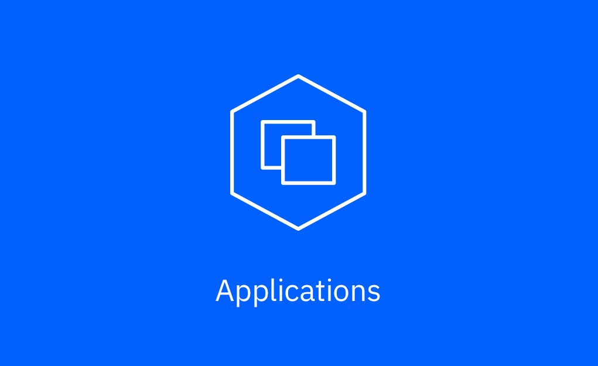
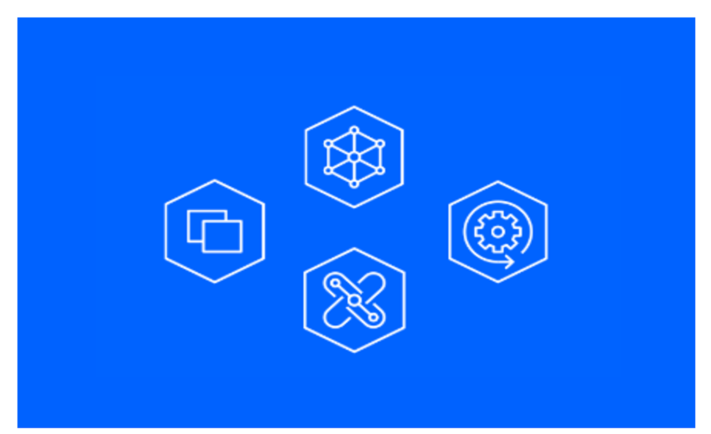

import HomepageTemplate from 'gatsby-theme-carbon/src/templates/Homepage';

export default HomepageTemplate;

## Click to your IBM Cloud Pak

<Row>

<Column colLg={4} colMd={4} noGutterMdLeft>
<ArticleCard
    color="dark"
    title="Cloud Pak for Applications"
    href="/apps/cp4a_overview/"
    >

</ArticleCard>
</Column>

<Column colLg={4} colMd={4} noGutterMdLeft>
<ArticleCard
    color="dark"
    title="Cloud Pak for Automation"
    href="/automation/introduction/"
    >

</ArticleCard>

</Column>

<Column colLg={4} colMd={4} noGutterMdLeft>
<ArticleCard
    color="dark"
    title="Cloud Pak for Integration"
    href="/integration/introduction/"
    >

</ArticleCard>
</Column>
</Row>

<Row>

<Column colLg={4} colMd={4} noGutterMdLeft>
<ArticleCard
    color="dark"
    title="Cloud Pak for Multicloud Management"
    href="/mcm/cp4mcm_introduction/"
    >

</ArticleCard>

</Column>

<Column colLg={4} colMd={4} noGutterMdLeft>
<ArticleCard
    color="dark"
    title="Cloud Pak for Security"
    href="/security/introduction/"
    >

</ArticleCard>

</Column>

<Column colLg={4} colMd={4} noGutterMdLeft>
<ArticleCard
    color="dark"
    title="Multiple Cloud Pak Implementation"
    href="/multipak/multipak_overview/"
    >

</ArticleCard>

</Column>

</Row>

<Row>

<Column colLg={4} colMd={4} noGutterMdLeft>
<ArticleCard
    color="dark"
    title="OpenShift Platform"
    href="/ocp/introduction/"
    >

</ArticleCard>
</Column>
</Row>
