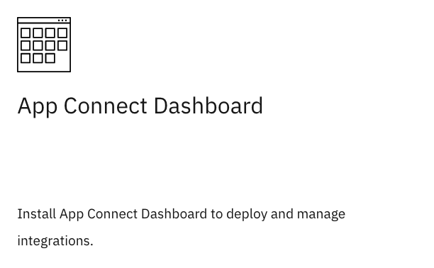
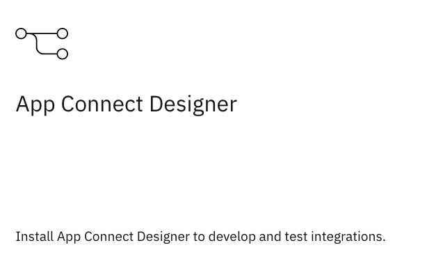

<InlineNotification>

Version 2020.2 is out for Cloud Pak for Ingegration.  This version is the first to feature Operators and has significant changes to the deployment and operations.  Please refer to the [Knowledge Center](https://www.ibm.com/support/knowledgecenter/en/SSGT7J_20.2/overview.html) while we update this playbook.  Thanks!

</InlineNotification>

<AnchorLinks>
  <AnchorLink>Overview</AnchorLink>
  <AnchorLink>The Platform Navigator</AnchorLink>
  <AnchorLink>Deploy the App Connect Dashboard</AnchorLink>
  <AnchorLink>Deploy the App Connect Designer</AnchorLink>
  <AnchorLink>Using App Connect Designer</AnchorLink>
  <AnchorLink>Deploying Flows via the Dashboard</AnchorLink>
</AnchorLinks>

## Overview

Once you have the Cloud Pak for Integration, you will have many capabilities that are available for deployment.  To experience these capabilities, the Cloud Pak provides the Platform Navigator user interface.  This interface isn't likely to be used by a developer to deploy new workload, but it can be helpful for you as a new user to become familiar with some of the provided capabilities within the Cloud Pak or to socialize these capabilities within your teams.  The Platform Navigator also has convenient interfaces to inspect your deployed integration instances.

<InlineNotification>

**Integration Developers:** Use this asset with an associated how-to for deploying [App Connect Enterprise using OpenShift Pipelines Tekton](https://github.com/ibm-cloud-architecture/gse-devops/tree/master/cloudpak-for-integration-tekton-pipelines).  To convert on all of the benefits provided by Kubernetes and OpenShift, it is important to employ sound DevOps techniques and tooling that may start with a solid CI-CD toolchain implementation.  Please try this very useful asset that was created by our Garage team and feel free to leave feedback.

</InlineNotification>

## The Platform Navigator

If you are looking to deploy your first App Connect instance, it is assumed that you have already installed the Cloud Pak for Integration.  If you have not, you may wish to start with the [Overview](../cp4i-introduction) and [Requirements](../cp4i-requirements-2020.1.x) before proceeding to the [Installation](cp4i-install).  Once you have completed the installation come back to deploy your first App Connect instances.

If you have not yet accessed the Platform Navigator for the Cloud Pak for Integration you may need to first find the URL.  This is **not** the same as the Cloud Pak Common Services dashboard URL given to you at the end of the Cloud Pak installation process.  If you (or your administrator) just installed the Cloud Pak you can easily find the URL by looking up the **Route**.  You will need to first authenticate to the OpenShift cluster from your `oc` command line or or by using the OpenShift Container Platform User Interface.

From OCP you can run the following command:

```
oc get routes -n integration
```

<InlineNotification>

**New to OpenShift Command Line?** The `oc` CLI code and installation instructions can be accessed [here from RedHat OpenShift](https://docs.openshift.com/container-platform/4.3/cli_reference/openshift_cli/getting-started-cli.html)

</InlineNotification>

This will list the `ibm-icp4i-prod` route used to provide access into the platform's UI for the Cloud Pak.  Paste the HOST/PORT value into your browser.

Alternatively, from the OCP UI, navigate to **Networking -> Routes** and change to the **integration** project to find this route or URL.


You can authenticate to the UI using the `admin` credential you configured during install, or more preferably using an alternate User ID that you or your cluster administrator have configured.

You can either tour the product from the **Welcome** screen or **Skip** to the normal experience.  This steps outlined below start from the screen displaying **"Lets get you going!"**.


## Deploy the App Connect Dashboard

To aid in the deployment of your first flow, start by creating an instance of the App Connect Dashboard.  If this step has already been performed, proceed to the next section.

From the Platform Navigator chose the tile for **creating an instance of App Connect**.  


Continue by selecting the tile for **App Connect Dashboard**.  



The Dashboard is a tool that you can use to deploy services while you familiarize yourself with the App Connect and the Cloud Pak and prior to setting up your CI toolchain.  You may also use this for an easy way to socialize some of the capabilities with your teammates.

After selecting the above action you are presented with a screen that makes some statements about the project space you wish to deploy into, security context constraints, image pull secret and persistent volume storage requirements.

If you are relatively new to OpenShift, it is important to understand that when you deploy something to run within your cluster, it is run within a given namespace / project.  This project space must have some prerequisites met to be able to run your application.  Users / service accounts must exist with the correct permission to perform certain actions.  This example assumes you are using the `ace` project namespace that was created as part of the Cloud Pak installation.  This namespace already has some default security settings configured.


<InlineNotification>

**Note:**  If you are using your own project you will need to assign an appropriate security context constraint (SCC) to the service accounts that exist within that project.  The SCC creates a set of rules that defines the activities that can be performed by the service accounts and workload within the project's namespace.  It defines which activities can be performed and under which level of authority (plus much more).  IBM has provided a specific SCC policy for running the App Connect workload named  `ibm-anyuid-scc`.  To apply this to another namespace / project, see this section from the [Knowledge Center](https://www.ibm.com/support/knowledgecenter/en/SSGT7J_20.1/install/install_ace.html).  For more on Security Context Constraints see [this blog](https://github.com/jabbott7335/security-context).

</InlineNotification>

Your project's namespace must also have access to pull the required container images from a suitable image repository.  If your cluster has access to the IBM Entitled Registry, and you wish to deploy the Dashboard using the online image follow the **Online** instructions.  To pull the images from your private registry follow **Private**.

<Tabs>
<Tab label="Online">

Log in to [MyIBM Container Software Library](https://myibm.ibm.com/products-services/containerlibrary) with the IBM ID and password that are associated with the entitled software.  In the Entitlement Keys section, copy the entitlement key.

Create the secret for your project (in this case `ace`) pulling images with the following command:

```
oc project ace
create secret docker-registry ibm-entitlement-key --docker-username=cp --docker-password=<entitlement-key-goes-here> --docker-server=cp.icr.io
```

When deploying the Dashboard component, you will provide the name of this secret(ibm-entitlement-key) as the imagePullSecret.

</Tab>
<Tab label="Private">

The Cloud Pak for integration has configured the `ace` project namespace to have service accounts that already have your local registry imagePullSecret.  You can look up the name of that value for the deployer service account by running the following command:

```
oc get secret -n ace
```

The name of the secret you will need for the imagePullSecret field is deployer-dockercfg-XXXXX.  Save the name of this imagePullSecret for later use.

If you are using another namespace that you have created.  Use the following command syntax to add your secret key that authenticates you to your registry using the following command syntax:

```
create secret docker-registry your-secret-name --docker-username=your-docker-user --docker-password=your-entitlement-key --docker-server=your-registry-url
```

</Tab>
</Tabs>

Next, create the Helm TLS secret that will be used to deploy into your project namespace.  This requires a few steps:

- Log into your Cloud Pak common services API using the cloudctl CLI [found here](https://www.ibm.com/support/knowledgecenter/SSGT7J_20.1/cloudctl/3.2.3/install_cli.html?view=kc).  The URL was given at the end of install otherwise can be found in the same manner we discovered the route above to the Cloud Pak for Integration Platform Navigator.  `oc get routes | grep management-ingress`
- Choose the correct project / namespace that you wish to deploy into (or run `oc project ace` assuming the `ace` project)
- Create the secret by running the following (again assuming you are using the `ace` namespace):

```
kubectl create secret generic ibm-ace-dashboard-icp4i-prod-helm-certs --from-file=cert.pem=$HOME/.helm/cert.pem --from-file=ca.pem=$HOME/.helm/ca.pem --from-file=key.pem=$HOME/.helm/key.pem --namespace=ace
```

<InlineNotification>

**Note:** For additional help on creating the Helm TLS secret see the [Knowledge Center](https://www.ibm.com/support/knowledgecenter/en/SSGT7J_20.1/install/install_ace.html).  A few different techniques are shown.  If you are unsure of your work compare to a similar secret that was created under the integration namespace during the deployment of the Cloud Pak.

</InlineNotification>

Since this application requires a persistent volume for storing state, the final piece of information you will need prior to deploying the service is the name of the storage class associated with your file storage provider with READ-WRITE-MANY access.  When you or your cluster administrator installed the Cloud Pak you would have also used a similar storage provider except it was likely for block storage.  You can find a list of storage classes already configured within cluster:

```
oc get sc
```

If there isn't one available work with the cluster administrator to configure an applicable **file** storage provider that allows for **RWX** access.  Alternatively you can preconfigure a Persistent Volume Claim manually prior to deploying the Dashboard.  

<InlineNotification>

**Best-Practice:** When making storage decisions for your workload consider the access modes, speed and resilience.  Resilience considerations include the time your cluster administrator requires to properly maintain the solution.  As a best-practice, use storage providers maintained by your public cloud if possible.  If you are using an on-premise solution, consider using OpenShift Container Storage (although you may be required to purchase additional subscription).

</InlineNotification>

Once these prerequisite steps have been completed continue to the chart **configuration** by choosing **next**.

Use the following set of parameters to provide a basic deployment of the feature:

- Provide a name for the Helm release such as:  `my-ace-dashboard`
- The target namespace (recommend to use the prepared `ace` namespace while learning the product):  `ace`
- Target cluster: `local-cluster`
- Provide the Helm TLS secret name you created earlier:  `ibm-ace-dashboard-icp4i-prod-helm-certs`
- Accept the license agreement

Open the **All parameters** section and scroll to the **Docker image information**

- Verify the image-registry / image settings.  This will show you which registry the image is being pulled from and the specific name and version of the image.  The registry used will relate to the method you chose above when setting / locating your imagePullSecret.
- Enter the value for your the name of your imagePullSecret (this example is for online see above for private ie. `deployer-dockercfg-XXXXX`):  `ibm-entitlement-key`

Scroll down to find the section for **Persistent storage configuration**

- Only provide the PersistentVolumeClaim name if you are not using dynamic provisioning (it is suggested to use dynamic provisioning / storage class for new users especially)
- Under Persistent storage class provide your class representing file storage for READ-WRITE-MANY access (this example is for RedHat OpenShift Kubernetes Service on IBM Cloud):  `ibmc-file-gold`

After selecting **Install** you can find the Helm chart components being deployed by visiting your OCP Administrator interface.  You can also log into the Cloud Pak User Interface provided by Common Services.  From within that UI use the hamburger menu in the upper left view **Helm Releases**.  


This option allows you to view and perform actions against your Helm releases.

When it completes you will be able to access the **App Connect Dashboard** from the Platform Navigator under the **View instances** tab.

## Deploy the App Connect Designer

With the App Connect Dashboard deployed you know have the capability to run integration flows in the form BARs on App Connect server instances within your cluster.  Agile integration developers will typically download and use the Eclipse based [IBM App Connect Enterprise Toolkit](https://developer.ibm.com/integration/docs/app-connect-enterprise/get-started/).  Conversely, a low-code alternative for demonstrating product features is the App Connect Designer.  This interface provides a very easy way to create and export basic flows that run in App Connect instances.  

From the Cloud Pak for Integration Platform Navigator choose the tile for **creating an instance of App Connect**.  Continue by selecting the tile for **App Connect Designer**. 



After selecting the above action you are presented with a screen that provides prerequisite information about the project space you wish to deploy into, security context constraints, image pull secret and persistent volume storage requirements.

In in the previous deployment section for the App Connect Dashboard, you already applied the security context constraint and added the imagePullSecret to the target project / namespace (it is assumed you are using the same namespace).  Remember the imagePullSecret used depends on the type of installation you wish to perform, meaning is the image in a local registry (private) or being pulled from the IBM Entitled Registry (online).  See the corresponding tab to review how you configured this in the previous section.

<Tabs>
<Tab label="Online">

Log in to [MyIBM Container Software Library](https://myibm.ibm.com/products-services/containerlibrary) with the IBM ID and password that are associated with the entitled software.  In the Entitlement Keys section, copy the entitlement key.

Create the secret for your project (in this case `ace`) pulling images with the following command:

```
oc project ace
create secret docker-registry ibm-entitlement-key --docker-username=cp --docker-password=<entitlement-key-goes-here> --docker-server=cp.icr.io
```

When deploying the component, you will provide the name of this secret (ibm-entitlement-key) as the imagePullSecret.

</Tab>
<Tab label="Private">

The Cloud Pak for integration has configured the `ace` project namespace to have service accounts that already have you local registry imagePullSecret.  You can look up the name of that value for the deployer service account by running the following command:

```
oc get secret -n ace
```

The name of the secret you will need for the imagePullSecret field is deployer-dockercfg-XXXXX.  Save the name of this imagePullSecret for later use.

If you are using another namespace that you have created.  Use the following command syntax to add your secret key that authenticates you to your registry using the following command syntax:

```
create secret docker-registry your-secret-name --docker-username=your-docker-user --docker-password=your-entitlement-key --docker-server=your-registry-url
```

</Tab>
</Tabs>

The App Connect Designer requires a persistent volume for storing state.  Prior to deploying the service find the name of a storage class associated with a suitable **block** storage provider with READ-WRITE-ONE access.  When you or your cluster administrator installed the Cloud Pak you would have likely used this storage class.  You can find a list of storage classes already configured within cluster:

```
oc get sc
```

If there isn't one available work with the cluster administrator to configure an applicable **block** storage provider that allows for **RWO** access.  Alternatively, you can preconfigure a Persistent Volume Claim manually prior to deploying the Dashboard.  

<InlineNotification>

**Note:** This version of the Designer allows you to connect to both local and IBM Cloud versions of App Connect.  If you plan on taking advantage of an IBM Cloud instance it should already be deployed.  See the [Knowledge Center](https://www.ibm.com/support/knowledgecenter/en/SSGT7J_20.1/install/install_ace_designer.html) if you would like to perform this configuration.  Once deployed you will need to redeploy another instance if you want to change the behavior.

</InlineNotification>

Once these steps have been completed continue to the chart **configuration** by choosing **next**.

Use the following set of parameters to provide a basic deployment of the feature:

- Provide a name for the Helm release such as:  `my-ace-designer`
- The target namespace (recommend to use the prepared `ace` namespace):  `ace`
- Target cluster: `local-cluster`
- Accept the license agreement

Open the **All parameters** section and scroll to the **Docker image information**

- Verify the image-registry/image settings.  This will show you which registry the image is being pulled from and the specific name and version of the image.  The registry used will relate to the method you chose above when setting/finding your imagePullSecret.
- Enter the value for your the name of your imagePullSecret (this example is for online see above for private ie. `deployer-dockercfg-XXXXX`):  `ibm-entitlement-key`
- Repeat the above step for the **Values for the server container** section to specify where the ACE Server and related images are to be pulled from and the imagePullSecret

Scroll down to find the section for **Persistent storage configuration**

- Under Persistent storage class provide the storage class representing bock storage for READ-WRITE-ONE access (this example is for RedHat OpenShift Kubernetes Service on IBM Cloud):  `ibmc-block-gold`

After selecting **Install** you can find the Helm chart components being deployed by visiting your OCP Administrator interface.  You can also log into the Cloud Pak UI provided by Common Services and from the hamburger menu in the upper left view **Helm Releases**. 

When the Helm release deployment completes you will be able to access the **App Connect Designer** from the Cloud Pak for Integration Platform Navigator under the **View instances** tab.

## Using App Connect Designer

Your next step is to begin using the App Connect Designer.  The [Knowledge Center](https://www.ibm.com/support/knowledgecenter/SSTTDS_11.0.0/com.ibm.ace.icp.doc/certc_creatingapiflows.htm) for the Designer shows you how to create, export, import and deploy flows.

## Deploying Flows via the Dashboard 

Once you have an API flow that you created in the App Connect Designer or [IBM App Connect Enterprise Toolkit](https://developer.ibm.com/integration/docs/app-connect-enterprise/get-started/), you are able to create a BAR file that can be run using the App Connect Server.  The [Knowledge Center](https://www.ibm.com/support/knowledgecenter/SSTTDS_11.0.0/com.ibm.ace.icp.doc/run-designerflow-in-acesoftware/creatingiserver4baricp4i.html) shows you how to easily run BARs from the App Connect Dashboard.  As mentioned above, to learn a best-practice for deploying APIs via OpenShift Pipelines, see this [GitHub repository](https://github.com/ibm-cloud-architecture/gse-devops/tree/master/cloudpak-for-integration-tekton-pipelines).