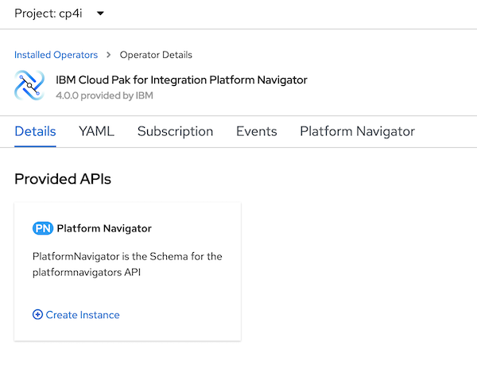
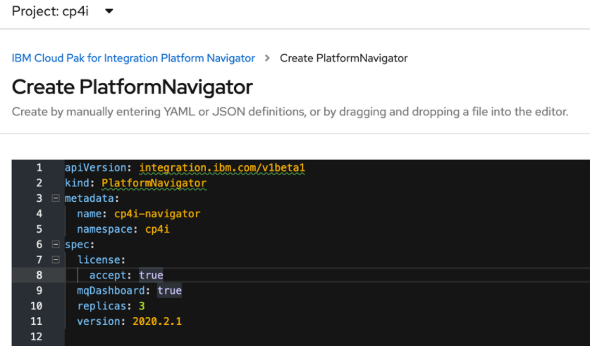
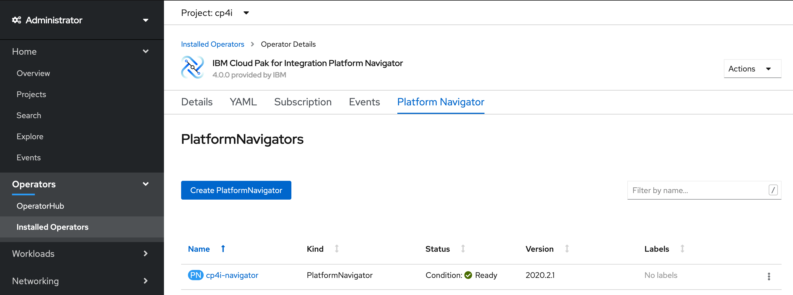
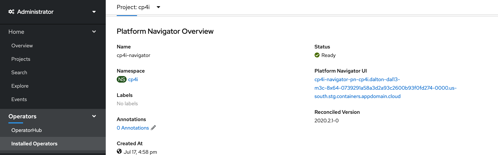
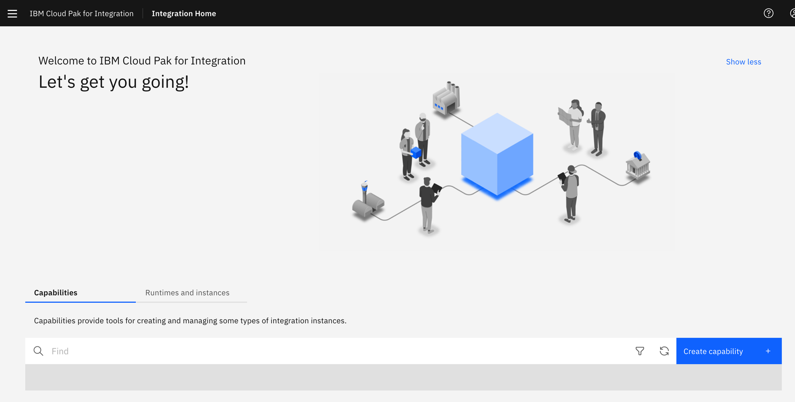

<InlineNotification>

Cloud Pak for Integration v2020.2.1 is the first to feature Operators and this comes with significant changes to the user experience.  As always, refer to the [Knowledge Center](https://www.ibm.com/support/knowledgecenter/en/SSGT7J_20.2/overview.html) for updated installation procedures.  This document features a very basic installation of the Platform Navigator.  We will be adding additional components in the coming days.

</InlineNotification>

<PageDescription>

Installation of the Cloud Pak for Integration 2020.2 currently requires OpenShift Cloud Platform (OCP) 4.4.  Using the top level Operator for Cloud Pak for Integration to deploy all of the other operators a fix delivered as part of OCP 4.4.11.  Prior to this version you must deploy the operators for Event Streams and API Connect prior to the top level operator.  It is recommended that you use a version of OCP 4.4.11 or higher.

</PageDescription>

<AnchorLinks>
  <AnchorLink>Configuring Your Installation</AnchorLink>
  <AnchorLink>Offline-Air-Gap Installation</AnchorLink>
  <AnchorLink>Online Installation</AnchorLink>
  <AnchorLink>Uninstall</AnchorLink>
</AnchorLinks>

## Prerequisites

This document does not describe how to install or configure the underlying OpenShift Cloud Platform (OCP). Prior to 
installing ensure you have a working OCP cluster with the necessary capacity available.

- Check the [Requirements](cp4i-requirements) section to ensure proper cluster sizing
- To perform Offline or Air-Gap installation, at this time please see [mirroring operators to a restricted environment in the Knowledge Center](https://www.ibm.com/support/knowledgecenter/en/SSGT7J_20.2/install/mirroring_operators.html).  This is an advanced technique to attempt at this time.
- For **online installs** make sure you have an entitlement key from [MyIBM Container Software Library](https://myibm.ibm.com/products-services/containerlibrary) to access the IBM Entitled Docker Registry
- For convenience, install the [OpenShift Container Platform CLI](https://docs.openshift.com/container-platform/4.3/cli_reference/openshift_cli/getting-started-cli.html) on your laptop or another jump server that has access to your OpenShift cluster.

## Configuring Your Installation

The installation of the Cloud Pak for Integration v2020.2 has changed considerably.  The installation and management of Cloud Pak workload now utilizes operators.  Essentially, operators contain both a customer resource definition (CRD) and a controller.  These help deploy and manage the operations of your Cloud Pak workload.  Deploying an operator is not the same as deploying the capability or workload itself.  It however enables the deployment of the capability it represents.  Operators can (and often will) require / include the deployment of other operators.  It is recommended that you learn all about operators since they will become central to most of what you do within OpenShift for the foreseeable future.  Please see [this page](https://docs.openshift.com/container-platform/4.4/operators/olm-what-operators-are.html) to learn more.

The general steps for installation are as follows:

- Add operator catalog sources (for Cloud Paks and Common Services)
- Subscribe to (Install) operators
- Configure and deploy IBM Common Services
- Configure and deploy IBM Cloud Pak for Integration capabilities

Even though deploying Cloud Pak for Integration capabilities also deploys the required IBM Common Services, if you wish to control certain aspects of the Common Services layer you can deploy them prior to installing Cloud Pak capabilities.  In fact, it is a best-practice to perform this deployment independently.

<InlineNotification>

Currently, there is a install glitch between OpenShift 4.4.8-4.4.12 that tends to deploy a beta version of Common Services.  This is avoided by deploying Common Service prior to deploying Cloud Pak capabilities.  

</InlineNotification>

As a Cluster-Admin log into the OpenShift Administrative UI and navigate to the OperatorHub.  In the upper right of the UI, use the `+` sign to add the catalog sources.

Paste the following YAML to add the catalog for **IBM Common Services** and select `create`:

```yaml
apiVersion: operators.coreos.com/v1alpha1
kind: CatalogSource
metadata:
  name: opencloud-operators
  namespace: openshift-marketplace
spec:
  displayName: IBMCS Operators
  publisher: IBM
  sourceType: grpc
  image: docker.io/ibmcom/ibm-common-service-catalog:latest
  updateStrategy:
    registryPoll:
      interval: 45m
```

Next add another catalog source that will allow you to load operators for the Cloud Paks:

```yaml
apiVersion: operators.coreos.com/v1alpha1
kind: CatalogSource
metadata:
  name: ibm-operator-catalog
  namespace: openshift-marketplace
spec:
  displayName: ibm-operator-catalog 
  publisher: IBM Content
  sourceType: grpc
  image: docker.io/ibmcom/ibm-operator-catalog
  updateStrategy:
    registryPoll:
      interval: 45m
```

<InlineNotification>

**What just happened?**  You just got two new pods in the **openshift-marketplace** project.  Do an `oc get po -n openshift-marketplace` to see them.  These will manage your new catalogs.  Searching the catalog will let you find Cloud Pak operators, as well as, the operators for the Common Services.

</InlineNotification>

## Offline-Air-Gap Installation

To perform Offline or Air-Gap installation, at this time please see [mirroring operators to a restricted environment in the Knowledge Center](https://www.ibm.com/support/knowledgecenter/en/SSGT7J_20.2/install/mirroring_operators.html).  This is an advanced technique to attempt at this time.

## Online Installation

To begin deploying the Cloud Pak for Integration using the operator based installation, you first add the operator to your cluster and then create instances from the operator for the capabilities they represent.  Configuration of the instances is managed by the operators and you will make these choices during instance creation.  A typical first step would be to deploy the top level Cloud Pak for Integration operator, only use this method of subscription if you are using OCP 4.4.11 or newer.

<InlineNotification>

For your convenience the Cloud Pak for Integration will automatically deploy the required IBM Common Services components as you deploy the Cloud Pak capabilities.  It is our belief that for some instances you will want to be able to deploy these with explicit settings / services.  Thus, this guide will walk you through first configuring the Common Services and second, the Platform Navigator as your first Cloud Pak capability.

</InlineNotification>

Begin by [deploying IBM Common Service by following these steps](https://cloudpak8s.io/common_services/cs_install/) and then return here to continue deploying the Cloud Pak for Integration.

### Adding the Platform Navigator

**1.** From the OCP Administrative UI as the Cluster Admin, return to the OperatorHub and filter on Nav to find and select the IBM Cloud Pak for Integration Platform Navigator tile.  

<InlineNotification>

If you are using OCP 4.4.11 or newer you can subscribe to the top level operator for IBM Cloud Pak for Integration, to subscribe to all Integration Pak capabilities in one step.

</InlineNotification>

The operators will provide information around configuration and use.  Choose **Install** to configure and deploy the operator to your cluster.

**2.** The **Create Operator Subscription** dialog allows you to configure several behaviors of the operator.

The **Installation Mode** scopes the operator either to a specific or all namespaces within the cluster.  If you scope the operator to a specific namespace, you will only be able to deploy instances of the included capabilities to that namespace.  If chose to make the operator available to **All namespaces on the cluster**, you will be able to deploy its capabilities in any properly prepared project / namespace.

<InlineNotification>

Operators scoped to all-namespaces are automatically deployed into a special namespace called `openshift-operators`.  The operator then appears when you are displaying under any of the projects within the cluster.

</InlineNotification>

**Update Channel** allows you to set the target for version management.  The channel sets the desired version of release.

**Approval Strategy** either gives permission for updates to proceed without approval or to require your approval prior to proceeding.  Choosing manual will prompt the cluster administrator for permission to proceed to new versions.

In our case we will accept all of the defaults and **Subscribe** to the operator.  In a few moments this operator will appear under the **Installed Operators** for all projects.

**3.** Prepare a project `cp4i` to deploy the Platform Navigator into.

- Create a project `oc new-project cp4i`
- Log in to [MyIBM Container Software Library](https://myibm.ibm.com/products-services/containerlibrary) with the IBM ID and password that are associated with the entitled software.  In the Entitlement Keys section, copy the entitlement key. This key will be used in future steps.
- Create the secret in the new project to hold the entitlement key

```
oc create secret docker-registry ibm-entitlement-key --docker-username=cp --docker-password=**your-entitlement-key-goes-here** --docker-server=cp.icr.io --namespace=cp4i
```

**4.** Navigate to the **OCP Administrative UI - Installed Operators** from within your prepared project `cp4i` open the **IBM Cloud Pak for Integration Platform Navigator** operator.  From the **Details** tab choose **Create Instance**



The **Create PlatformNavigator** YAML allows for configuration of the instance.  The only required change is to `accept` the license agreement by changing `false` to `true`.  (Other changes can be made here such as namespace or the name of the deployment)



Chose **Create**.  The Platform Navigator is deployed to your `cp4i` project.  If you didn't pre-deploy the IBM Common Services, the Platform Navigator operator would have done this deployment using defaults for you.  In fact, it will check for all the required services and add any that may have been omitted and deploy them.  The deployment may take a few minutes as the images that are required must be downloaded from the public registry.



**5.** Once deployed you can find the URL for your Platform Navigator from within the **Installed Operators** interface.  Navigate to the **Platform Navigator** tab within the Platform Navigator Operator and open the deployed instance and find the link under **Platform Navigator UI**.



You can log into the Cloud Pak UI using the `admin` secret that was created by that operator.  Find the secret by running:

```
oc get secrets -n ibm-common-services platform-auth-idp-credentials -ojsonpath='{.data.admin_password}' | base64 --decode && echo "" 
```

The familiar Platform Navigator allows you to view your running instances of capabilities, runtimes and instances.  You can use the new operators (and of course your CI-CD pipelines) for instance deployment.  



Check back soon form additional capability deployment.

## Uninstall

Uninstalling the Cloud Pak for Integration can be accomplished by following these steps in order:
- Uninstall any deployed instances of each capability with the Cloud Pak.  This task can be performed using the interface available within each of the operators
- Verify / Remove any orphaned persistent storage volume claims
- If desired, unsubscribe / uninstall the operators begining at the top level and working down
- To uninstall the Common Services, follow the instructions for **Uninstalling all services** [here](https://www.ibm.com/support/knowledgecenter/SSHKN6/installer/3.x.x/uninstallation.html) and then run `bash <(curl -s https://raw.githubusercontent.com/IBM/ibm-common-service-operator/master/common/scripts/force-uninstall.sh)`
