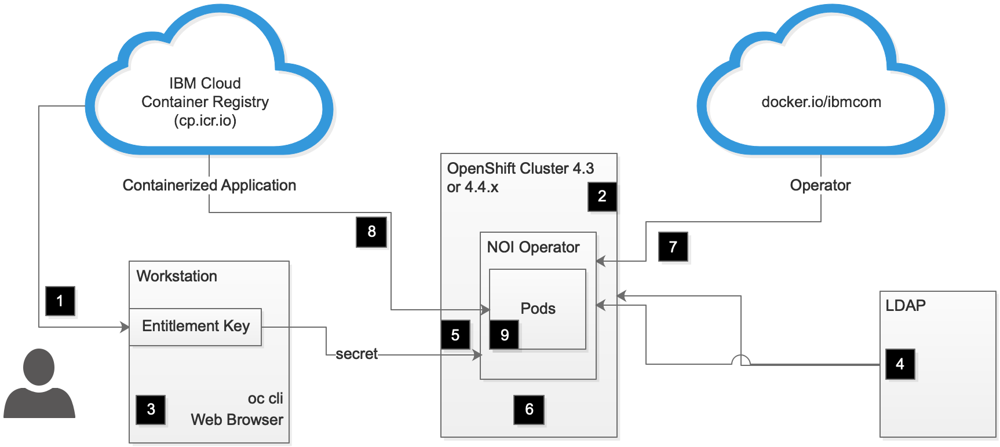
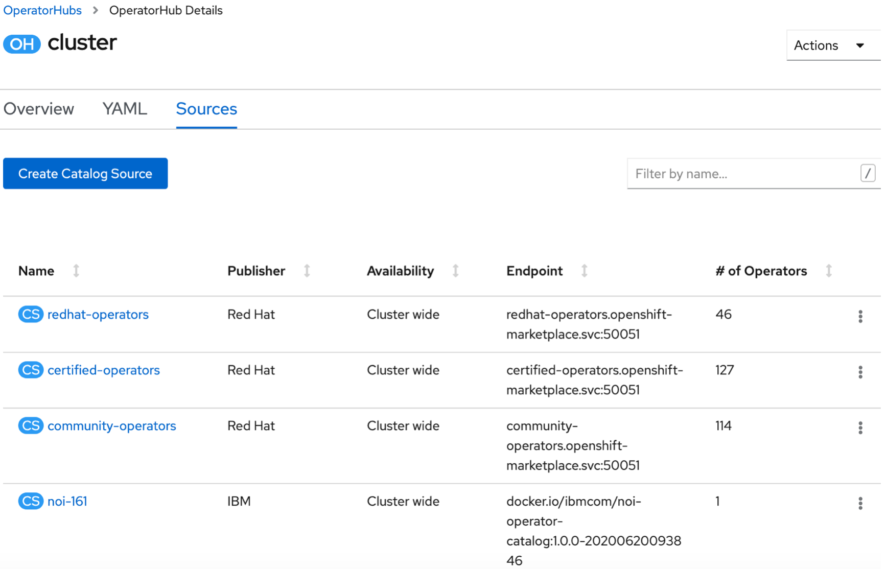
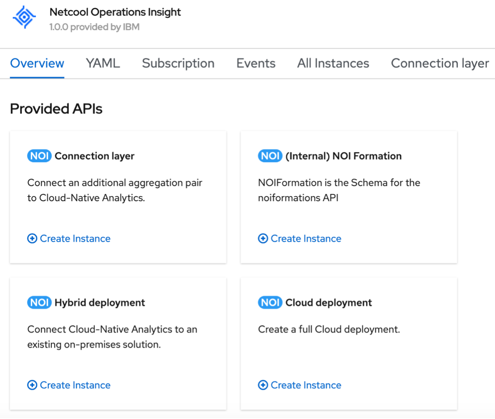

## **Solution Overview**

Netcool Ops Manager (NOM) is an optional component of Cloud Pak for Multicloud 
Management. Netcool Ops Manager consists of multiple parts. The components are:
- IBM Netcool Operations Insight (NOI)
- IBM Agile Service Manager (ASM)
- IBM Cloud Event Management (CEM)
- IBM Predictive Insights (PI)

The components can be installed on Prem, on the cloud, or in a 
hybrid installation.  This playbook is 
written for the Cloud Pak for Multicloud Management (MCM), 
so the focus is on installing Netcool Ops Manager on 
OpenShift Container Platform (OCP), which can run on Prem or in the cloud. 

The targetted audience for this section of the playbook is technical 
sales or technical services engineers who need a unified guide to install 
Netcool Ops Manager.

The current version 1.6.1 of NOI changes the installation method to use the `Operator.`  It no longer requires the IBM Common Platform (ICP) Common Service.  NOI 1.6.0.3 uses ICP.  Because of this, you can not perform an upgrade from 1.6.0.3 to 1.6.1.

## Previous Version

The previous version installation instruction is desribed in 
[The installation instruction for NOI 1.6.0.3 including ASM 1.1.7](/mcm/cp4mcm_netcool_ops_manager/noi_1603) section.

## The Operator Lifecycle Management

The NOI 1.6.1 can be installed online by using the Operator Lifecycle Management(OLM) or offline by downloading the container software first and then pushing it to the OpenShift Cluster.  The latter method is typically referred to as the CLI (Command Line Interface) method, as you need to use the CLI to perform the installation.

## Installation Steps.

The following are the steps to install NOI 1.6.1:




1. [Obtain your ICR entitlement key](#nom-icr)
1. [Prepare the Openshift cluster](#nom-ocp)
1. [Prepare the installation workstation](#nom-bastion)
1. [Prepare the LDAP server](#nom-ldap)
1. [Create the Openshift resources](#nom-rss)
1. [Create the application secret](#nom-pwd)
1. [Install the Operator](#nom-op)
1. [Create the NOI Instance](#nom-ins)
1. [Post installation steps](#nom-post)

Each step is detailed as follows:


<a name="nom-icr"></a>

## Obtain your ICR entitlement key

When installing through the Operator Lifecycle Management, the container will be downloaded directly from the `cp.icr.io` (IBM Cloud Container Registry).   You first need to get your entitlement key from the IBM Cloud Container Registry. Once you got your entitlement key, you can create a Kubernetes secret.  You specify the secret name in the Operator.  This step is described later.

For IBM Staff, please go to `My IBM Entitlement` site to get your internal entitlement key.

<a name="nom-ocp"></a>

## Preparing the Openshift cluster

The [Official documentation](https://www.ibm.com/support/knowledgecenter/SSTPTP_1.6.1/com.ibm.netcool_ops.doc/soc/integration/concept/deploying_on_rhocp.html) of NOI 1.6.1 mentioned that NOI 1.6.1 is supported to run on:
- OpenShift Container Platform version 4.3
- OpenShift Container Platform version 4.4.3 

A later version of 4.4.x seems to work; in fact, Specifying Custom Resource using a form is only supported on 4.4.6 or newer.

If you install on OCP 4.3 or 4.4.5 (or earlier), you need to specify `the Custom Resource (CR)` using the YAML.  On OCP 4.4.6 or above, you have the option to specify the CR using a form.  In this playbook, we will describe the custom resource using YAML.

### Sizing
The online documentation (links provided below)
provides sizing guidelines.  Separate sizing 
guidelines are available depending on whether you are installing for a 
__trial__ (PoC) or 
for a __production__ environment.

#### CPU and Memory
Recommended minimal worker nodes sizing:

Description | Quantity
--- | ---
Number of worker nodes | 5
Number of vCPUs per worker node | 16 
Minimum memory per worker node | 32 GB

Information on sizing can be found at the following sites:
[Sizing Guidelines](https://www.ibm.com/support/knowledgecenter/SSTPTP_1.6.1/com.ibm.netcool_ops.doc/soc/integration/reference/soc_sizing_full.html)

#### Storage Capacity

If you are installing into OCP, then **Rook/Ceph** or 
**Openshift Container Storage (OCS)**, with **RADOS Block Device (RBD)** storage class, is the default supported OCP Storage solution.  We recommend Rook/Ceph 
as the dynamic storage solution for Netcool Ops Manager.

**Image Registry Storage**: As you are preparing the OCP cluster, If you are going to install through CLI, please allow at least 150GB of image-registry storage for the Netcool Ops Manager. This capacity is in addition to your image-registry requirements for your other OCP's purpose. 

**Persistent Volume Claim**: If you are deploying the Openshift Container Storage (OCS), then OCS 
creates a default 2 TB Rook/Ceph/RDB block storage.  For an initial production installation of Netcool Ops Manager, you need about 800 GB of storage (PVC) space and image-registry storage.  Please take note of the storage class name. You need this later during the installation.

If you need help with installing your OCP environment, please see this 
playbook's section on [installing OpenShift](../../ocp/introduction/).

If other team members configured your OCP cluster, then please ensure that they provide you with an account with a cluster administrator role.


<a name="nom-bastion"></a>

## Preparing the installation workstation

You will need to use your local workstation web browser to access the OCP Web Interface, install the Operator, and create the NOI Custom Resource.

You will also need the OCP client to help you with the installation.

### Getting the oc and kubectl command lines
You download oc and kubectl from your OCP cluster. The kubectl executable is 
a symbolic link of the oc executable.  The following 
[documentation from Red Hat](https://docs.openshift.com/container-platform/4.3/cli_reference/openshift_cli/getting-started-cli.html) 
describes the steps to get started with the `oc` and `kubectl` command line 
interface.

<a name="nom-ldap"></a>

## Preparing the LDAP server
You need to provide details of your LDAP server for the following components:
- OCP Cluster
- IBM Common Platform (ICP) Console of IBM Common Services.
- NOI Proxy configuration.

Setting up your LDAP server is a common requirement across all  Cloud Paks, 
so it is not detailed here.  

During the installation, you will need to specify the following information, so 
get the information before you start the helm chart configuration:

- Your Base Distinguished name.
- Your LDAP URL.
- Your LDAP Bind User Name and Password.
- The filter to get the user information (User Filter and User ID map).
- The filter to get the group information (Group Filter and Group ID map).
- The filter to map a user to a group (Group member ID map).

One of the pods deployed by the NOI Helm Chart is an OpenLDAP pod. You can choose to set up the OpenLDAP as a standalone repository or as a proxy to an external LDAP server.  If you choose to use the OpenLDAP pod as a proxy, then Netcool Ops Manager expects the external LDAP server to support the hierarchical LDAP structure.  In particular, the NOI LDAP configuration wants to use ou (Organizational Unit).  
More information on the NOI Proxy LDAP requirement can be found in the 
[IBM Knowledge Center](https://www.ibm.com/support/knowledgecenter/SSTPTP_1.6.0/com.ibm.netcool_ops.doc/soc/admin/reference/managing_users_using_an_external_ldap_server.html).

<InlineNotification>

Note that since RHEL 7.4, the RHEL repository no longer distributes the OpenLDAP server.  The default LDAP server for RHEL 7.5 onwards is the IPA (Identity, Policy, Audit) server. The 
IPA server only supports a flat LDIF structure. It does not support `ou`, so you can not use the IPA server as the external LDAP server for NOI.  This information can be found in the 
[Red Hat Solutions](https://access.redhat.com/solutions/4172491) documentation.


</InlineNotification>

### User in LDAP.

If you are using an external LDAP server, then create the following user in the external LDAP:
- __smadmin__ - The administrative user for the dashboard.
- __impactadmin__ - The administrative user for Netcool/Impact.
- __icpadmin__ - The default ICP admin user
- __icpuser__ - The default ICP standard user


<a name="nom-rss"></a>

## Create the Openshift resources

You need to create the following Openshift resource for the Operator.
- namespace
- Custom Resource name
- Service Account Registry Secret.
- Service Account

### namespace
Create the namespace for the NOI installation.
If you decide your namespace to be `noi161ns` then perform the following:

```
oc new-project noi161ns
```

### Custom Resource name

All your pods will be prefixed with your custom resource name, so choose something short.  For example, `noicr`.

### Service Account Registry Secret.

You create a secret containing your entitlement key described earlier.  

```
oc create secret docker-registry noi-registry-secret --docker-server=cp.icr.io --docker-username=cp --docker-password="your entitlement key from the first step above"
```

You specify the `noi-registry-secret` into the service account (next step) and into a custom resource (later).


### Service Account

It is recommended to use the suggested `noi-service-account`, perform the following:

```
oc create serviceaccount noi-service-account -n noi161ns
oc adm policy add-scc-to-user privileged system:serviceaccount:noi161ns:noi-service-account
oc patch serviceaccount default -p '{"imagePullSecrets": [{"name": "noi-registry-secret"}]}'
```

<a name="nom-pwd"></a>

## Create the application secret

If you are using the internal OpenLDAP, then this step is optional.  If you do not specify the secret, then the password will be created for you.  You can get the password post-install from the Kubernetes secret.

If you are going to use the external LDAP, then you need to specify the password for:
- LDAP user
- smadmin
- impactadmin
- icpadmin

The password should match each user's password in the external LDAP.

If you want to use a friendly password, you can either create the secret before installing or change the password after the installation.

The details of specifying the password through Kubernetes secret are described in the [Configuring Authentication](https://www.ibm.com/support/knowledgecenter/SSTPTP_1.6.1/com.ibm.netcool_ops.doc/soc/integration/task/int-creating_passwords_and_secrets-rhocp.html) section of the online document.

For your convenience, the following list the command to specify the password `Netcool2020` to everything, including the internal LDAP pod.  Note there is an additional line for impact as the secret name should be `custom-resource-impact-secret` rather than the documented `custom-resource-impactadmin-secret`.  Copy and paste this snippet and change the _password_, _custom resource name_, and _namespace_ to your preferred value.

```
oc create secret generic noicr-icpadmin-secret --from-literal=ICP_ADMIN_PASSWORD=Netcool2020 --namespace noi161ns
oc create secret generic noicr-impactadmin-secret --from-literal=IMPACT_ADMIN_PASSWORD=Netcool2020 --namespace noi161ns
oc create secret generic noicr-ldap-secret --from-literal=LDAP_BIND_PASSWORD=Netcool2020 --namespace noi161ns
oc create secret generic noicr-omni-secret --from-literal=OMNIBUS_ROOT_PASSWORD=Netcool2020 --namespace noi161ns
oc create secret generic noicr-was-secret --from-literal=WAS_PASSWORD=Netcool2020 --namespace noi161ns
oc create secret generic noicr-couchdb-secret --from-literal=password=Netcool2020 --from-literal=secret=couchdb --from-literal=username=root --namespace noi161ns
oc create secret generic noicr-systemauth-secret --from-literal=password=Netcool2020 --from-literal=username=system --namespace noi161ns
oc create secret generic noicr-ibm-hdm-common-ui-session-secret --from-literal=session=Netcool2020 --namespace noi161ns
oc create secret generic noicr-cassandra-auth-secret --from-literal=username=hdm --from-literal=password=Netcool2020 --namespace noi161ns
oc create secret generic noicr-ibm-redis-authsecret --from-literal=username=redis --from-literal=password=Netcool2020 --namespace noi161ns
oc create secret generic noicr-kafka-admin-secret --from-literal=username=kafka --from-literal=password=Netcool2020 --namespace noi161ns
oc create secret generic noicr-kafka-client-secret --from-literal=username=admin --from-literal=password=Netcool2020 --namespace noi161ns
oc create secret generic noicr-impact-secret --from-literal=IMPACT_ADMIN_PASSWORD=Netcool2020 --namespace noi161ns
```

<a name="nom-op"></a>

## Install the Operator

- Using a browser login to the OCP Web Interface as a user with a cluster-admin role. 
- choose the following menu / sub-menu:
`Administration > Cluster Settings > Global Configurations > OperatorHub > Sources`.
- Click `Create Catalog Source`.  
- Specify the image URL as `docker.io/ibmcom/noi-operator-catalog:1.0.0-20200620093846`.  Specify other details to your preference.
- Click `Create`
- After a few minutes in the `Sources` tab, you should see that the _# of Operators_ should turn to 1, as per the diagram below




- Go to the Main Menu, and select `Operators > OperatorHub`.
- In the search text box, enter Netcool, and the NOI Operator should be listed, click on it and select `Install.`
- Select the namespace that you have created earlier, do **not** specify the Approval Strategy > Manual, and select `Install.`
- From the main menu, select `Operators > Installed Operators`, wait until the status says `Succeeded`.
- You can use your workstation, perform an `oc login`, ensure that you are in the correct namespace perform the `oc project noi161ns` otherwise, do the `oc get pods` and you should see the noi-operator pods is running.

<a name="nom-ins"></a>

## Create the NOI instances.

- Continue from the `Operators > Installed Operators` select the `Netcool Operations Insight` Operator.  You should see the following screen:



- Select the `Create Instances` under the Cloud Deployment.
- You will be presented with a YAML editor. An example of the YAML file is provided, in the example, the following are the options that had been selected:
    - Custom Resource name: `noicr`
    - Namespace: `noi161ns`
    - antiAffinity: true
    - clusterDomain: `apps.yourdomain.com`
    - deploymenttype: `trial` (Enter `production` for production use)
    - entitlementSecret: `noi-registry-secret`
    - for internal LDAP, do not change any of the LDAP entry.
    - storageClass: `rook-ceph-block`  (the name of your ceph storage class) There are multiple locations where the storage class information is required; in the example, all pods are assigned the same storage class.
    - Enable ASM
    - Enable a selection of ASM Observer: Kubernetes, Docker, REST, File, vCentre.
    - Disable the Topology netDisco and appDisco 
    
Note that at any time after the installation, you can change most of the configuration by editing the custom resource `noicr`.    
    
The following is the example YAML specification:  

```
# Please edit the object below. Lines beginning with a '#' will be ignored,
# and an empty file will abort the edit. If an error occurs while saving, this file will be
# reopened with the relevant failures.
#
apiVersion: noi.ibm.com/v1beta1
kind: NOI
metadata:
  creationTimestamp: "2020-07-18T20:25:52Z"
  generation: 2
  name: noicr
  namespace: noi161ns
  resourceVersion: "53759204"
  selfLink: /apis/noi.ibm.com/v1beta1/namespaces/noi161ns/nois/noicr
  uid: 05b565fd-e774-4895-8239-c1702db8fdbe
spec:
  advanced:
    antiAffinity: true
    imagePullPolicy: IfNotPresent
    imagePullRepository: cp.icr.io/cp/noi
  clusterDomain: apps.youdomain.com
  deploymentType: trial
  entitlementSecret: noi-registry-secret
  ldap:
    baseDN: dc=mycluster,dc=icp
    bindDN: cn=admin,dc=mycluster,dc=icp
    mode: standalone
    port: "389"
    sslPort: "636"
    storageClass: rook-ceph-block
    storageSize: 1Gi
    suffix: dc=mycluster,dc=icp
    url: ldap://localhost:389
  license:
    accept: true
  persistence:
    enabled: true
    storageClassCassandraBackup: rook-ceph-block
    storageClassCassandraData: rook-ceph-block
    storageClassCouchdb: rook-ceph-block
    storageClassDB2: rook-ceph-block
    storageClassElastic: rook-ceph-block
    storageClassImpactGUI: rook-ceph-block
    storageClassImpactServer: rook-ceph-block
    storageClassKafka: rook-ceph-block
    storageClassNCOBackup: rook-ceph-block
    storageClassNCOPrimary: rook-ceph-block
    storageClassZookeeper: rook-ceph-block
    storageSizeCassandraBackup: 50Gi
    storageSizeCassandraData: 50Gi
    storageSizeCouchdb: 5Gi
    storageSizeDB2: 5Gi
    storageSizeElastic: 75Gi
    storageSizeImpactGUI: 5Gi
    storageSizeImpactServer: 5Gi
    storageSizeKafka: 50Gi
    storageSizeNCOBackup: 5Gi
    storageSizeNCOPrimary: 5Gi
    storageSizeZookeeper: 5Gi
  topology:
    appDisco:
      certSecret: ""
      dbsecret: ""
      dburl: ""
      dsDefaultExistingClaim: ""
      dsStorageClass: rook-ceph-block
      dsStorageSize: 5Gi
      enabled: false
      pssExistingClaim: ""
      pssStorageClass: rook-ceph-block
      pssStorageSize: 5Gi
      secure: false
      sssStorageClass: rook-ceph-block
      sssStorageSize: 5Gi
    enabled: true
    netDisco: false
    observers:
      alm: false
      appdynamics: false
      aws: false
      azure: false
      bigfixinventory: false
      cienablueplanet: false
      ciscoaci: false
      contrail: false
      dns: false
      docker: true
      dynatrace: false
      file: true
      googlecloud: false
      ibmcloud: false
      itnm: false
      jenkins: false
      junipercso: false
      kubernetes: true
      newrelic: false
      openstack: false
      rancher: false
      rest: true
      servicenow: false
      taddm: false
      vmvcenter: true
      vmwarensx: false
      zabbix: false
    storageClassCassandraBackupTopology: rook-ceph-block
    storageClassCassandraDataTopology: rook-ceph-block
    storageClassElasticTopology: rook-ceph-block
    storageClassFileObserver: rook-ceph-block
    storageSizeCassandraBackupTopology: 50Gi
    storageSizeCassandraDataTopology: 50Gi
    storageSizeElasticTopology: 75Gi
    storageSizeFileObserver: 5Gi
  version: 1.6.1
```

Once you are ready to initialize, select the **Create** button.

The Operator starts by running the pod `noicr-verifysecrets-*`  you can check using the `oc get pods` commands.  If the `verifysecrets` do not complete, then you have some authorization configuration errors, otherwise, the Operator starts deploying the pods in stages.

If everything is running successfully you should be able to see the list of pods similar to the following:

```
[jwahidin@workstation noi-operator-1.0.0]$ oc get pods
NAME                                                              READY   STATUS      RESTARTS   AGE
asm-operator-86d7867886-jtqrf                                     1/1     Running     0          37h
cem-operator-bc5bb4ff9-6jhcv                                      1/1     Running     0          37h
noi-operator-6d5786bcf4-55xw2                                     1/1     Running     0          38h
noicr-alert-action-service-alertactionservice-b988bcb76-mwb66     1/1     Running     0          37h
noicr-alert-trigger-service-alerttriggerservice-68c9f56d-5jv8k    1/1     Running     0          37h
noicr-cassandra-0                                                 1/1     Running     0          38h
noicr-common-dash-auth-im-repo-dashauth-5785bff598-p2kl7          1/1     Running     0          37h
noicr-couchdb-0                                                   1/1     Running     0          38h
noicr-db2ese-0                                                    2/2     Running     0          38h
noicr-ea-noi-layer-eanoiactionservice-55cbcf84dd-fptss            1/1     Running     0          37h
noicr-ea-noi-layer-eanoigateway-57986b54b8-9tjxn                  1/1     Running     0          37h
noicr-ea-noi-layer-easetupomnibus-h5xch                           0/2     Completed   0          38h
noicr-elasticsearch-0                                             1/1     Running     0          38h
noicr-grafana-6cb8c5ff6c-4g477                                    1/1     Running     0          37h
noicr-ibm-cem-akora-app-cem-78dd8895dd-69mgx                      1/1     Running     0          37h
noicr-ibm-cem-brokers-846456587c-x98db                            1/1     Running     0          37h
noicr-ibm-cem-cem-users-6fd585c65b-z8vfd                          1/1     Running     0          37h
noicr-ibm-cem-channelservices-6857fc4bc4-xtjsn                    1/1     Running     0          37h
noicr-ibm-cem-event-analytics-ui-fd5b9f67c-ktms9                  1/1     Running     0          37h
noicr-ibm-cem-eventpreprocessor-75bdffd8cf-kdjvc                  1/1     Running     0          37h
noicr-ibm-cem-incidentprocessor-6c687548fd-lqfrh                  1/1     Running     1          37h
noicr-ibm-cem-integration-controller-b8c6d9d54-55h9z              1/1     Running     0          37h
noicr-ibm-cem-normalizer-6b6cb779c6-kbdnl                         1/1     Running     0          37h
noicr-ibm-cem-notificationprocessor-764c68d99d-qcn2r              1/1     Running     0          37h
noicr-ibm-cem-rba-as-86f446f5cd-ldcpk                             1/1     Running     0          37h
noicr-ibm-cem-rba-rbs-6759b5d7cf-569ck                            1/1     Running     0          37h
noicr-ibm-cem-scheduling-ui-867579b575-lvppj                      1/1     Running     1          37h
noicr-ibm-ea-asm-mime-eaasmmime-5cb5f6d7d7-g6c89                  1/1     Running     1          37h
noicr-ibm-ea-asm-normalizer-normalizerstreams-678d7fb4cc-mcbsp    1/1     Running     0          37h
noicr-ibm-ea-mime-classification-eaasmmimecls-8687645759-h6s4v    1/1     Running     0          37h
noicr-ibm-ea-ui-api-graphql-8657c6dc6d-cmc8q                      1/1     Running     0          37h
noicr-ibm-hdm-analytics-dev-archivingservice-567b749b6b-tbvxz     1/1     Running     0          37h
noicr-ibm-hdm-analytics-dev-collater-aggregationservice-58dtx46   1/1     Running     0          37h
noicr-ibm-hdm-analytics-dev-dedup-aggregationservice-69b76qcr9b   1/1     Running     0          37h
noicr-ibm-hdm-analytics-dev-eventsqueryservice-79df4f6f67-n8zxp   1/1     Running     0          37h
noicr-ibm-hdm-analytics-dev-inferenceservice-84bbcccd8-bb6s7      1/1     Running     0          37h
noicr-ibm-hdm-analytics-dev-ingestionservice-794b854dc-lrnbb      1/1     Running     0          37h
noicr-ibm-hdm-analytics-dev-normalizer-aggregationservice-wrlhz   1/1     Running     1          37h
noicr-ibm-hdm-analytics-dev-policyregistryservice-664c694cdp6p4   1/1     Running     0          37h
noicr-ibm-hdm-analytics-dev-servicemonitorservice-7d7679f899x4r   1/1     Running     0          37h
noicr-ibm-hdm-analytics-dev-setup-6f8gc                           0/2     Completed   0          37h
noicr-ibm-hdm-analytics-dev-trainer-c9f868b7b-n9776               1/1     Running     0          37h
noicr-ibm-hdm-common-ui-uiserver-5588cbf6cc-sfvgk                 1/1     Running     0          37h
noicr-ibm-noi-alert-details-service-64bf9f7-rbgwf                 1/1     Running     0          37h
noicr-ibm-noi-alert-details-setup-znrrl                           0/1     Completed   0          37h
noicr-ibm-redis-server-0                                          2/2     Running     0          38h
noicr-ibm-redis-server-1                                          2/2     Running     0          37h
noicr-ibm-redis-server-2                                          2/2     Running     0          37h
noicr-impactgui-0                                                 2/2     Running     0          38h
noicr-kafka-0                                                     2/2     Running     0          38h
noicr-kafka-1                                                     2/2     Running     0          38h
noicr-kafka-2                                                     2/2     Running     0          38h
noicr-logstash-587495ddf5-8ntpw                                   1/1     Running     0          37h
noicr-nciserver-0                                                 2/2     Running     0          5h54m
noicr-ncobackup-0                                                 2/2     Running     1          38h
noicr-ncodatalayer-agg-ir-75c9749469-9jcrv                        1/1     Running     0          37h
noicr-ncodatalayer-agg-irf-7b7b8bfb89-tqpcx                       1/1     Running     0          37h
noicr-ncodatalayer-agg-setup-sj6bx                                0/1     Completed   0          37h
noicr-ncodatalayer-agg-std-7b5cf79884-99cbg                       1/1     Running     1          37h
noicr-ncodatalayer-agg-std-7b5cf79884-bdd56                       1/1     Running     0          37h
noicr-ncoprimary-0                                                1/1     Running     2          38h
noicr-openldap-0                                                  1/1     Running     0          38h
noicr-proxy-5d9f77b864-dzns9                                      1/1     Running     0          37h
noicr-register-cnea-mgmt-artifact-1595241600-8bpn2                0/1     Completed   0          11m
noicr-register-cnea-mgmt-artifact-1595241900-tr49h                0/1     Completed   0          6m32s
noicr-register-cnea-mgmt-artifact-1595242200-8vct9                0/1     Completed   0          90s
noicr-spark-master-655cf4666d-79shf                               1/1     Running     0          37h
noicr-spark-slave-5f85db758d-tnscr                                1/1     Running     0          37h
noicr-spark-slave-5f85db758d-wzt4t                                1/1     Running     0          37h
noicr-topology-docker-observer-77bc9699d7-ptngj                   1/1     Running     0          37h
noicr-topology-elasticsearch-0                                    1/1     Running     0          37h
noicr-topology-kubernetes-observer-5fdcd8b8d-b69lm                1/1     Running     0          37h
noicr-topology-layout-648f8d6d7d-nz68k                            1/1     Running     0          37h
noicr-topology-merge-f5f69c4bc-r8sgf                              1/1     Running     0          37h
noicr-topology-noi-gateway-6c655fff94-gx7tc                       1/1     Running     3          37h
noicr-topology-noi-probe-578b797567-rhvsl                         1/1     Running     2        37h
noicr-topology-observer-service-84c8bbd9d6-vlknz                  1/1     Running     0          37h
noicr-topology-rest-observer-5667f7b85c-8hwxz                     1/1     Running     0          37h
noicr-topology-search-79875cb5bb-v2br8                            1/1     Running     0          23h
noicr-topology-secret-manager-7bj4q                               0/3     Completed   2          37h
noicr-topology-status-6b677bf47f-68wg2                            1/1     Running     0          37h
noicr-topology-system-health-cronjob-1595241600-n6nfq             0/1     Completed   0          11m
noicr-topology-system-health-cronjob-1595241900-x88qp             0/1     Completed   0          6m31s
noicr-topology-system-health-cronjob-1595242200-z72l5             0/1     Completed   0          90s
noicr-topology-topology-696d996d9c-lhhn7                          1/1     Running     0          37h
noicr-topology-ui-api-cf6644744-785qp                             1/1     Running     0          23h
noicr-topology-vmvcenter-observer-db47dbf77-v2tjc                 1/1     Running     0          37h
noicr-verifysecrets-9fnsc                                         0/1     Completed   0          38h
noicr-webgui-0                                                    2/2     Running     0          38h
noicr-zookeeper-0                                                 1/1     Running     0          38h
```


<a name="nom-post"></a>

## Post-installation steps


If you check on the status of the noicr (custom resource), you can see the next steps that you can perform.  It is listed here for convenience.

```
status:
  message: >-
    This deployment of Netcool Operation Insight is now complete. You can now

    access to the following services:

    Identify the public IP of the cluster:
      export NODE_IP=<Public IP of the ICp cluster>

    WebGUI:
      Update your hosts file( On the machine you are running your Browser) or your DNS settings with this mapping
      $NODE_IP netcool.noicr.apps.yourdomain.com

      firefox https://netcool.noicr.apps.yourdomain.com:443/ibm/console

      Default credentials are: icpadmin/password you can get from the secret noicr-icpadmin-secret using the following
      kubectl get secret noicr-icpadmin-secret -o json -n noi161ns| grep ICP_ADMIN_PASSWORD  | cut -d : -f2 | cut -d '"' -f2 | base64 -d;echo

    WAS Console:
      Update your hosts file( On the machine you are running your Browser) or your DNS settings with this mapping
      $NODE_IP was.noicr.apps.yourdomain.com

      firefox https://was.noicr.apps.yourdomain.com:443/ibm/console

      Default credentials are: smadmin/password you can get from the secret noicr-was-secret using the following
      kubectl get secret noicr-was-secret -o json -n noi161ns| grep WAS_PASSWORD | cut -d : -f2 | cut -d '"' -f2 | base64 -d;echo

    Impact GUI:
      Update your hosts file( On the machine you are running your Browser) or your DNS settings with this mapping
      $NODE_IP impact.noicr.apps.yourdomain.com

      firefox https://impact.noicr.apps.yourdomain.com:443/ibm/console

      Credentials are: impactadmin/password you can get from the secret noicr-impact-secret using the following
      kubectl get secret noicr-impact-secret -o json -n noi161ns| grep IMPACT_ADMIN_PASSWORD | cut -d : -f2 | cut -d '"' -f2 | base64 -d;echo

    Impact Servers:
      Update your hosts file( On the machine you are running your Browser) or your DNS settings with this mapping
      $NODE_IP nci-0.noicr.apps.yourdomain.com

      firefox https://nci-0.noicr.apps.yourdomain.com:443/nameserver/services

      Default credentials are: impactadmin//password you can get from the secret noicr-impact-secret using the following
      kubectl get secret noicr-impact-secret -o json -n noi161ns| grep IMPACT_ADMIN_PASSWORD | cut -d : -f2 | cut -d '"' -f2 | base64 -d;echo

    AIOPS:
      Update your hosts file( On the machine you are running your Browser) or your DNS settings with this mapping
      $NODE_IP netcool.noicr.apps.yourdomain.com

      firefox https://netcool.noicr.apps.yourdomain.com:443/
    Default credentials are: icpadmin/password you can get from the secret
    noicr-icpadmin-secret using the following
      kubectl get secret noicr-icpadmin-secret -o json -n noi161ns| grep ICP_ADMIN_PASSWORD  | cut -d : -f2 | cut -d '"' -f2 | base64 -d;echo

    Sample Data:
      To create a job that installs and trains the analytics system with sample data, run the following commands:

      kubectl run ingesnoi3 -i --restart=Never --env=LICENSE=accept  --namespace noi161ns\
            --env=CONTAINER_IMAGE=cp.icr.io/cp/noi/ea-events-tooling:4.0.11-20200616105630BST \
            --overrides='{ "apiVersion": "v1", "spec": { "imagePullSecrets": [{"name": "noi-registry-secret"}] } }' \
            --image=cp.icr.io/cp/noi/ea-events-tooling:4.0.11-20200616105630BST \
            loadSampleData.sh -- -r noicr  -t cfd95b7e-3bc7-4006-a4a8-a73a79c71255 \
            -a noi-service-account   -s noi-registry-secret  \
            -j > loadSampleData.yaml

      kubectl create -f loadSampleData.yaml -n noi161ns

      If the default service account does not have access to the image repository, uncomment the image pull secrets
      section in the loadSampleData.yaml file and set noi-registry-secret  as the imagePullSecrets.name
      value before running the kubectl create command.

      To see how the sample events have been grouped, connect your browser to WebGUI, choose 'Event Viewer' from
      the 'Incidents' menu, and change the view from 'Default' to 'Example_IBM_CloudAnalytics'.
```


### Assigning roles

Log in to the Netcool Dashboard and assign the user or group roles. 
Your NOI 1.6.1 system is now installed and ready.

More information on administering users can be found in the [IBM Knowledge Center](https://www.ibm.com/support/knowledgecenter/SSTPTP_1.6.1/com.ibm.netcool_ops.doc/soc/admin/task/adm_administering-users.html)

[Installation instruction for NOI 1.6.0.3 including ASM 1.1.7](/mcm/cp4mcm_netcool_ops_manager/noi_1603) 