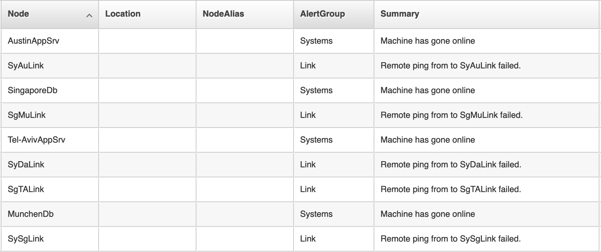
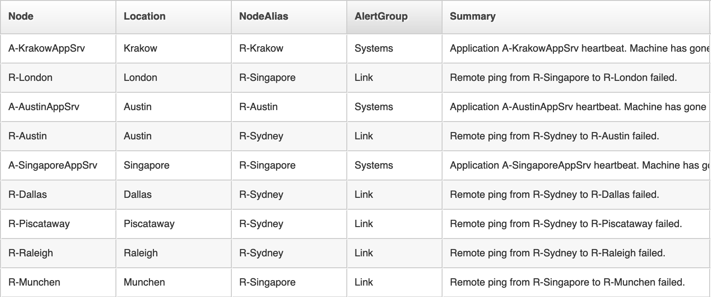
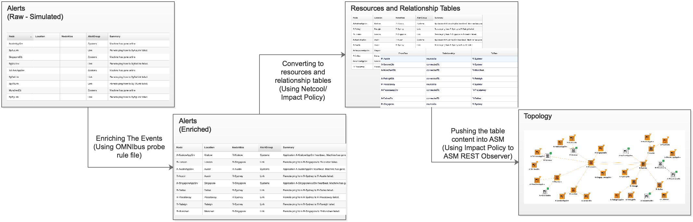
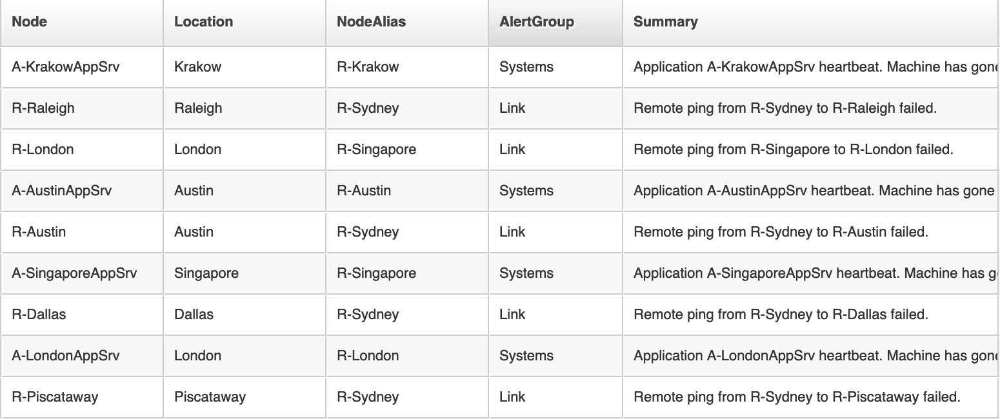
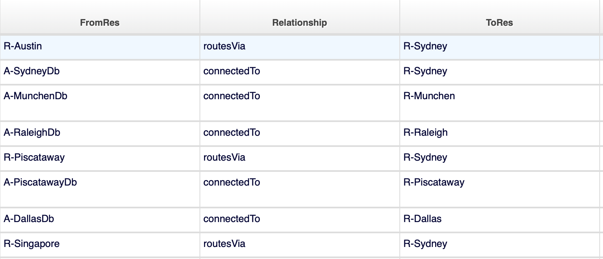

[Back to NOM Day2](/mcm/cp4mcm_nom_day2)


## Creating Topology from Alerts

*I do not have an inventory system, but I want to build the topology of my environment.  How do you do it using ASM?* That is a common question that comes up in a few of my past customer engagement with customers.  

This article will provide an approach to building a topology without an Inventory application.

<InlineNotification>

There are solutions such as the [IBM Tivoli Network Manager](https://www.ibm.com/support/knowledgecenter/en/SSSHRK_4.2.0/overview/concept/ovr_product_overview_infocenter.html) that can discover your IP Network topology by querying the network environment using SNMP.  

</InlineNotification>

This article assumes that you have some basic familiarity with building topology using ASM.
If you do not have this familiarity, you might want to read [a tutorial on topology modeling using ASM](https://medium.com/ibm-garage/topology-modelling-using-agile-service-manager-a-tutorial-2e521040ea64)
and [Building a topology using Agile Service Manager's REST Interface](https://medium.com/ibm-garage/topology-modelling-using-agile-service-managers-rest-interface-7de14a85e333).   

To build a topology from scratch, you need to come up with some way to model it.  We can use our knowledge of the environment, for example.  Can we derive the topology information from specific knowledge on how the component of the ecosystem interacts?  Can we use a specific naming convention?  In this article, we will start with the output of _a remote ping_.  To make the topology reproducible by you, we are going to use an alerts simulator.

## The model
A router typically has a feature called remote ping.  You can set up for the router to ping other network devices for availability. You can then either query the router or set up the router to send the results to an external monitoring server. Alerts normally have a field call *Node*.  It represents the object that sends the alerts.  It can be a hostname or IP address of a Server or Management Component of a Network Devices.

Let us use a fictional use case.  You just joined **AFictionalCompany** IT department and was asked your manager to create a topology of the company's main routers and servers.
AFictionalCompany has two main offices, one in Singapore and another one in Sydney.  The company also has branch offices in Europe and North America.  An Application Server and a database server are running at every office.

As a member of the IT department, you have access to the Alerts. 
You noticed that the networking team has set up the *remote ping* from the company's two main routers in Singapore and Sydney to all other routers in their branch offices.  The result of the remote ping is forwarded to your Alert Manager as alerts. You also noticed that each Application Servers and the Database Servers send Heartbeat Availability Alerts as well.  You also found out that the network team and the infrastructure team has labeled the router and the servers with location information.

To summarize, this is what available:
-    The remote ping results from 2 main routers in Sydney and Singapore.
-    Heartbeat Availability alerts from the Application Servers and Database Servers.
-    Location information in the alerts.


## The simulated alerts
OMNIbus, the Event Management component of NOI, has an alert generator called the Simnet probe.  An OMNIbus probe normally collects from a network, or network management equipment.  A simnet probe, simulate the alerts. It generates simulated alerts based on _a definition file_.  The alerts can then be parsed and transformed using _a probe rule file_.

We will setup the simnet probe to simulate random link failure and random server failure.
The random link failure simulates a failed remote ping, and the random server failure simulates the failed heartbeat.
The configuration of the probe, the probe rule file, and the Netcool/Impact policies all can be found from the [GitHub page for this article](https://github.com/jwahidin/topology_modeling).  Reading or Working with these configuration files requires certain knowledge in the Netcool Operation Insight.

To simulate the alerts, we have created all the nodes in the simnet probe definition file. Here is a sample of the Alerts using the out of the box Simnet rules file.



Now comes the modeling part.  One way to approach the model building is to extract the alerts and then apply a series of business rules and then push the result to ASM.  Another approach is to _enrich_ the alerts with information that can help our model building before we extract them.  We will be using the second approach.  We enrich the alerts using a probe rule file.
The rule file inserts into the alerts the two endpoints involved in the remote ping. 

Using the Server Alerts location information, we create a logic connecting the Server to the router in the same location. For example, we can connect an Alert from an AppServer called `SingaporeAppSrv` or from a DataBase server named `SingaporeDb` to the router responsible for the `Singapore` Office.

Here are the Alerts after being enriched using the new rules file. We have added some tags (not shown), to make the processing of it easier.  Here is the list of alerts after being enriched.



The alerts now have both the resources and the link connecting the resources.  Now we have some data that can be used to create the topology model.  We have a few options for building the topology using this information.  One way is to parse the alerts and call the ASM REST API to create the topology.  Another way is to build a framework that we can reuse.  We populate two tables, one for `resources` and another one for the `relationship.`  By creating the two tables, we can enrich the topology with other information before we build it.  It also provides us with a checkpoint to ensure the extraction logic produces the desired structure. Since we already have Omnibus as the Alerts database, we build the resource and relationship using Omnibus.

We will be using the following process flow:




## Building the tables

Here is the logic to build the resource and relationship table

```
At Every Period, 
-    scan the new "link "simulated alerts inserted into the system since the last scan, and populate the resource and relationship tables if it does not already contain the resource and the relationship.
-    Scan the new "server" simulated alerts inserted into the system since the last scan, and populate the resource and relationship tables if it does not already contain the resource and the relationship.
```

The logic has been implemented using Netcool/Impact using `OmnibusEventReader`.

```
// insertResAndEdgeFromEvent
// To be called from the OMNIbus Event Reader and hence is expecting an 
// EventContainer to be populated already.
// Expected to be call when ProcessReq = 101 or 102 and Class is Simnet 3300

function createOrUpdateResource(Resource,ResType){
  key = globalApp + Resource;
  Res = GetByKey(dtRes, key, 1);
   
  if (length(Res) > 0){
    // Maintaining the update time so state rows can be removed.
    sql="Update custom.a_res set lastUpdate = getdate() where Key = '" + key + "'";
    Log("SQL: " + sql );
    DirectSQL('defaultobjectserver', sql, false);
  } else {
    nRes = NewObject();
    nRes.Key = key;
    nRes.App = globalApp;
    nRes.UniqueId = Resource;
    nRes.entityTypes = ResType;
    nRes.insertTime = GetDate();
    nRes.lastUpdate = GetDate();
    nRes.ttl = globalTTL;
    AddDataItem(dtRes,nRes);
    Log("New Resource Entry: " + key);
  }
} // function

function createOrUpdateEdge(From,Rel,To){
  key = globalApp + From + Rel + To;
  Edge = GetByKey(dtEdge, key, 1);
 
  if (length(Edge) > 0){
    // Maintaining the update time so state rows can be removed.
    sql="Update custom.a_edge set lastUpdate = getdate() where Key = '" + key +"'";
    Log("SQL: " + sql );
    DirectSQL('defaultobjectserver', sql, false);
  } else {
    nEdge = NewObject();
    nEdge.Key = key;
    nEdge.App = globalApp;
    nEdge.FromRes = From;
    nEdge.Relationship = Rel;
    nEdge.ToRes = To;
    nEdge.insertTime = GetDate();
    nEdge.lastUpdate = GetDate();
    nEdge.ttl = globalTTL;
    AddDataItem(dtEdge,nEdge);
    Log("New Edge Entry: " + key);
  }
} // function

Log("vvvvvvvvvvvvvvvvvvvvvvvvvvvvvv Policy started vvvvvvvvvvvvvvvvvvvvvvvvvvvvvv");

// Called by OmnibusEventReader.
dtRes = "asm_Res";
dtEdge = "asm_Edge";
globalTTL = 3600;
globalApp = "Event1";

eNode1 = EventContainer.Node;
eNode2 = EventContainer.NodeAlias;

if (EventContainer.ProcessReq = 101) {
  createOrUpdateResource(eNode1,"router");
  createOrUpdateResource(eNode2,"router"); 
  createOrUpdateEdge(eNode1,"routesVia",eNode2);
} elseif (EventContainer.ProcessReq = 102) {
  createOrUpdateResource(eNode1,"server");
  createOrUpdateResource(eNode2,"router"); 
  createOrUpdateEdge(eNode1,"connectedTo",eNode2);
} else {
  // Unknown, do nothing.
}

Log("^^^^^^^^^^^^^^^^^^^^^ Policy Completed ^^^^^^^^^^^^^^^^^^^^^^^^^^^^");

```
After processing, the content of the resource and relationship table is shown below:

Resource Table:


Relationship Table:


With the two tables created, we can use the same script as written in [the Medium blog to build the topology](https://medium.com/ibm-garage/topology-modelling-using-agile-service-managers-rest-interface-7de14a85e333).  The logic is something like this:

```
At Every Period
    Check if there is at least one updated row in the resource or relationship tables.
    If there is, then call the script to create the topology from the resource and relationship table.
```

This is the code implemented in Netcool/Impact:

```
// runBulkLoadOnNew
// To be called periodically by policy activator.
// lastUpdate is for removal - if required, not currently implemented.
// 

dtRes = "asm_Res";
dtEdge = "asm_Edge";
globalApp = "Event1";

// The insertTime was done less than 60 seconds ago.

filter = "((getdate()-insertTime) < 60)";

recentRes = GetByFilter(dtRes,filter,false);
numRes = length(recentRes);
recentEdge = GetByFilter(dtEdge,filter,false);
numEdge = length(recentEdge);
Log("Number of Changed Resource: " + numRes +", Number of Changed Edge: " + numEdge);

If ((numRes>0)or(numEdge>0)){
   Log("Executing Bulk Load at: "  + GetDate());
   asmRest.bulkLoad(dtRes,dtEdge,globalApp);
}
```

The `asmRest` Function being called is as follow:

```
// asmRest
// Expected to be called by another policy with the dataTypes and App being passed as parameters.

function bulkLoad(dtRes,dtEdge,sApp) {

  hasError="no";
  Handle java.lang.Exception { 
    Log("Exception: " + ErrorMessage);
    hasError="yes";
  } 
  
  Log("vvvvvvvvvvvvvvvvvvvvvvvvvvvvvv Policy started vvvvvvvvvvvvvvvvvvvvvvvvvvvvvv");
  app_name = sApp;
  Log(2,"Parameter received: " + app_name);
  paramExist = false;
  if (app_name != NULL) {
      if (length(app_name) > 0) {
          paramExist = true;
      }
  }
  if (!paramExist) {
      Log("Parameter not specified.  Policy will exit!");
      Exit();
  }
  
  // Initialize the values of all the parameters and then start the Bulk Job it has not been started.
  asmFunctions.asm_initalize(asm_protocol,asm_host,asm_port,asm_path,HeadersToSend,HttpProperties);
  asmFunctions.asm_startBulkJob(asm_protocol,asm_host,asm_port,asm_path,HeadersToSend,HttpProperties,asm_JobId,retError);
  
  if ((retError == 'yes') or (hasError == 'yes')){
     Log("Connecting to ASM has failed");
     Exit();
  }
  
  // By this point the connection is considered established.
  app_filter = "App='"+ app_name + "'";
  RssTbl = GetByFilter(dtRes,app_filter,false);
  numRss = length(RssTbl);
  log(2,"Number of Resource found = " + numRss); 
  
  r = 0;
  while (r < numRss){
        asm_name=RssTbl[r].UniqueId;
        asm_uniqueId=RssTbl[r].UniqueId;
        asm_matchTokens=RssTbl[r].UniqueId;
        asm_mergeTokens=RssTbl[r].UniqueId;
        asm_entityTypes=RssTbl[r].EntityTypes;
        asmFunctions.asm_createResource(asm_protocol,asm_host,asm_port,asm_path,HeadersToSend,HttpProperties,asm_name,asm_uniqueId,asm_matchTokens,asm_mergeTokens,asm_entityTypes,asm_JobId);
        
        Log(2,"Creating "+ asm_entityTypes + ", id: " + asm_uniqueId);
        r = r + 1;
  } // End while
  
  // Get the Relationship table
  EdgeTbl = GetByFilter(dtEdge,app_filter,false);
  numEdge = length(EdgeTbl);
  log(2,"Number of Edge found = " + numEdge); 
  
  e = 0;
  while (e < numEdge){
      asm_fromUniqueId=EdgeTbl[e].FromRes;
      asm_edgeType=EdgeTbl[e].Relationship;
      asm_toUniqueId=EdgeTbl[e].ToRes;
        
      asmFunctions.asm_createEdge(asm_protocol,asm_host,asm_port,asm_path,HeadersToSend,HttpProperties,asm_fromUniqueId,asm_edgeType,asm_toUniqueId,asm_JobId);
      Log(2,"Connecting "+ asm_fromUniqueId +" : " + asm_edgeType + " : " + asm_toUniqueId );
      e = e + 1;
  }// End while
  
  // Synchronize the Bulk Job
  asmFunctions.asm_syncBulkJob(asm_protocol,asm_host,asm_port,asm_path,HeadersToSend,HttpProperties,asm_JobId);
  
  Log("^^^^^^^^^^^^^^^^^^^^^ Policy Completed ^^^^^^^^^^^^^^^^^^^^^^^^^^^^");
}
```

The `asmFunctions` code can be found in the [accompanying github](https://github.com/jwahidin/topology_modeling) and not listed here for brevity.


## The Topology

By running the previous Netcool/Impact policy, the content of the resource and relationship tables are pushed to ASM via the ASM's REST Interface.  You can then use **the ASM's Topology Viewer** to view the topology.

This is the topology being build by the above logic.


## Summary
We have built a topology using alerts, and some location information encoded in the alerts.  We used intermediary resource and relationship tables and periodically check for changes in the table.  If changes were detected, we pushed the tables' content into ASM through ASM's REST Interface. This simple exercise created using a simulator so the reader can recreate it.  It is simple, but hopefully, it gives you some ideas for your project.

[Back to NOM Day2](/mcm/cp4mcm_nom_day2)
