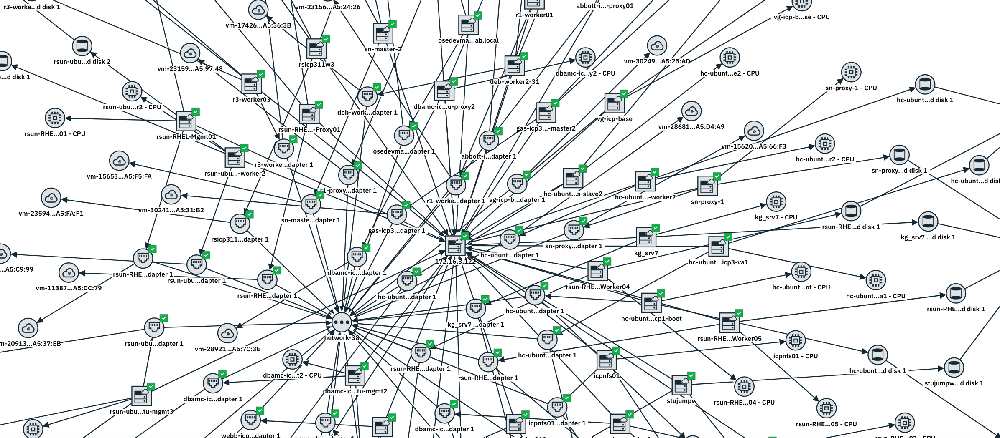

[Back to NOM Day2](/mcm/cp4mcm_nom_day2)


## Troubleshooting Agile Service Manager vCenter Observer.
ASM (Agile Service Manager) provides _Out of the Box_ integration to the managed system through its **Observer**.  One such Observer is the vCenter Observer.  The following describes an example of troubleshooting a REST interface based Observer, the vCenter Observer.


## The issue.
ASM vCenter Observer "talk" to VMWare vCenter REST interface to get the information it needs. VCenter version 6.5 is one of the supported versions by ASM. 
One problem with working with the REST interface based Observer is that you might not see an immediate error running the Observer, but nothing is displayed in ASM.
The following is the process of troubleshooting the Observer.

## The scenario.
We configure the ASM vCenter Observer and provide the relevant information, including the vCenter username and password in the ASM UI.  We run the Observer through the User Interface.  It ran to completion without error.  We try to see the topology, and no vCenter topology is displayed.

## The tool.
You can use many tools to talk to a REST interface; some tools provide a nice Graphical User Interface. This article uses **CURL**, as it is widely available in a Linux platform.  

## The troubleshooting Steps.

### Check the log files.
Checking the observer log files gives the following warning message:

```
WARN   [2019-06-19 00:39:15,344] [cfd95b7e-3bc7-4006-a4a8-a73a79c71255:LAB-vCenter/VCenterHostTask] c.i.i.t.o.v.j.r.t.VCenterHostTask -  Could not obtain Host Info data via REST
```

The observer job exited after encountering those WARNING, which explained why there is no vCenter information in ASM.  


### Ensure that the REST interface is available.
First, you need to ensure that the vCenter responded to a REST API call; you can start by querying the base address.
VCenter REST can normally be accessed via https://[hostname or ipaddress]/rest.

```
$ curl -sik -H 'Accept:application/json' -X GET https://[vcenter-address]/rest
```

The flag:
    -s (for silent), is to exclude progress meter.  This is useful for concise output.
    -i this is to include the HTTP response headers in the output. As you will see later, the response header can help in debugging.
    -k (or --insecure) allows curl to accept a self-signed SSL server connection.
    -H (or --header) for specifying the header of the query. We want a JSON formatted output.
    -X (or --request) this is where you specify your request.
    
The server responded with the following:

```
HTTP/1.1 200 OK
Date: Wed, 19 Jun 2019 00:56:24 GMT
Content-Type: application/json
Transfer-Encoding: chunked
{
  "value": {
    "components": {
      "metadata": {
        "method": "GET",
        "href": "https://[vCenter Address]/rest/com/vmware/vapi/metadata/metamodel/service/operation/id:com.vmware.vapi.rest.navigation.component/id:list"
      },
      "method": "GET",
      "href": "https://[vCenter Address]/rest/com/vmware/vapi/rest/navigation/component"
    },
    "resources": {
      "metadata": {
        "method": "GET",
        "href": "https://[vCenter Address]/rest/com/vmware/vapi/metadata/metamodel/service/operation/id:com.vmware.vapi.rest.navigation.resource/id:list"
      },
      "method": "GET",
      "href": "https://[vCenter Address]/rest/com/vmware/vapi/rest/navigation/resource"
    }
  }
}
```

With this, we know that the Server's REST Interface is working fine.

### The endpoint
As we are troubleshooting an ASM discovery, we needed to know the endpoint that ASM was querying.  One way to do this is to force an error by specifying a wrong username and password, to get the following message in the log file.

```
ERROR  [2019-06-19 00:36:31,005] [cfd95b7e-3bc7-4006-a4a8-a73a79c71255:CSPLAB-vCenter/VCenterHostTask] c.i.i.t.o.v.j.r.t.VCenterHostTask -  Could not gain access to VMware VCenter endpoint 'https://[vcenter address]/rest/vcenter/host' - check your keyStore path in job parameter. Reason:- An VMware VCenter session-id Token could not be obtained, check if the credential are correct.Cannot deserialize instance of `java.lang.String` out of START_OBJECT token
```

Just what we wanted.  The endpoint was: `https://[vcenter-address]/rest/vcenter/host`.  Checking the VMWare REST documentation and verified that indeed this was a valid endpoint.

### Verify without Authorization.
We need to specify some user information for  Authentication/Authorization before we can query more detail.  To verify, let us try without any user information first.

```
$ curl -sik -H 'Accept:application/json' -X GET https://[vcenter-address]/rest/vcenter/host

HTTP/1.1 401 Unauthorized
Date: Wed, 19 Jun 2019 01:05:00 GMT
Content-Type: application/json
Transfer-Encoding: chunked
{
  "type": "com.vmware.vapi.std.errors.unauthenticated",
  "value": {
    "messages": [
      {
        "args": [],
        "default_message": "This method requires authentication.",
        "id": "vapi.method.authentication.required"
      }
    ]
  }
}

```

As expected, we received _"This method requires authentication."_ response.  Note the header. It said the same thing: `401 - Unauthorized`. As mentioned earlier, the header can be useful.

### Get the session ID.
For vCenter, the authorization is a two steps process. First, you specify your username and password to get a Session-ID, then use the Session-ID in the query.

```
$ curl -X POST --insecure --header 'Content-Type: application/json' --header 'Accept: application/json' --header 'vmware-use-header-authn: test' --header 'vmware-api-session-id: null' -u 'username:password' 'https://[vcenter-address]/rest/com/vmware/cis/session'
```

The server responded with the session-ID:
```
{"value":"d2de956a5f0e072aa546e91fcf70f3dc"}
```

### Use the Session ID
We run the same query as in step 3, but this time, we added the session-ID.

```
$ curl -sik -H 'Accept:application/json' -H "vmware-api-session-id:d2de956a5f0e072aa546e91fcf70f3dc" -X GET https://[vcenter-address]/rest/vcenter/host
```

And we may get the following response.

```
HTTP/1.1 500 Server Error
Date: Wed, 19 Jun 2019 00:51:24 GMT
Content-Type: application/json
Transfer-Encoding: chunked
{
  "type": "com.vmware.vapi.std.errors.internal_server_error",
  "value": {
    "messages": [
      {
        "args": [
          "com.vmware.vapi.std.errors.Unauthorized"
        ],
        "default_message": "Provider method implementation threw unexpected exception: com.vmware.vapi.std.errors.Unauthorized",
        "id": "vapi.bindings.method.impl.unexpected"
      },
      {
        "args": [],
        "default_message": "Not authorized to perform this operation.",
        "id": "com.vmware.api.vcenter.unauthorized"
      }
    ]
  }
}
```

Aha! We just found out about the issue! The Session-ID and hence the username and password did not have enough privilege to run the query.

Note that, unlike the response that we got in step 3, we now have a server error response header, and the message was also different.  

### An authorized user, please.
With the above information, we can go back to the vCenter admin. Asked for a proper credential, and rerun the query with the the authorized user, and here is the query and the response, a good and valid response:

```
$curl -sik -H 'Accept:application/json' -H "vmware-api-session-id:292a717da90093ccfb46ec66e8789e65" -X GET https://[vcenter-address]/rest/vcenter/host
HTTP/1.1 200 OK
Date: Wed, 19 Jun 2019 01:52:51 GMT
Content-Type: application/json
Transfer-Encoding: chunked
{
  "value": [
    {
      "host": "host-151",
      "name": "172.16.3.133",
      "connection_state": "CONNECTED",
      "power_state": "POWERED_ON"
    },
    . . . - cut for brevity - . . .
    {
      "host": "host-89",
      "name": "172.16.3.124",
      "connection_state": "CONNECTED",
      "power_state": "POWERED_ON"
    }
  ]
}
```

### Let there be an ASM topology.
We know now that my manual query works. We can go back to ASM, rerun the vCenter Observer job, lo and behold, and display the topology.



[Back to NOM Day2](/mcm/cp4mcm_nom_day2)